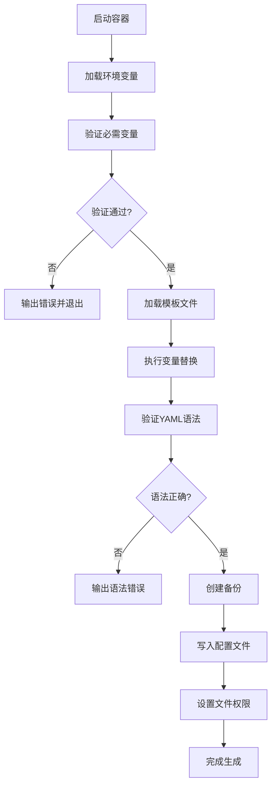
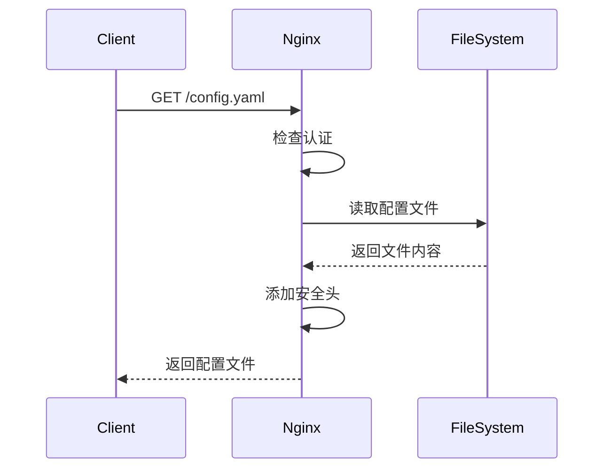
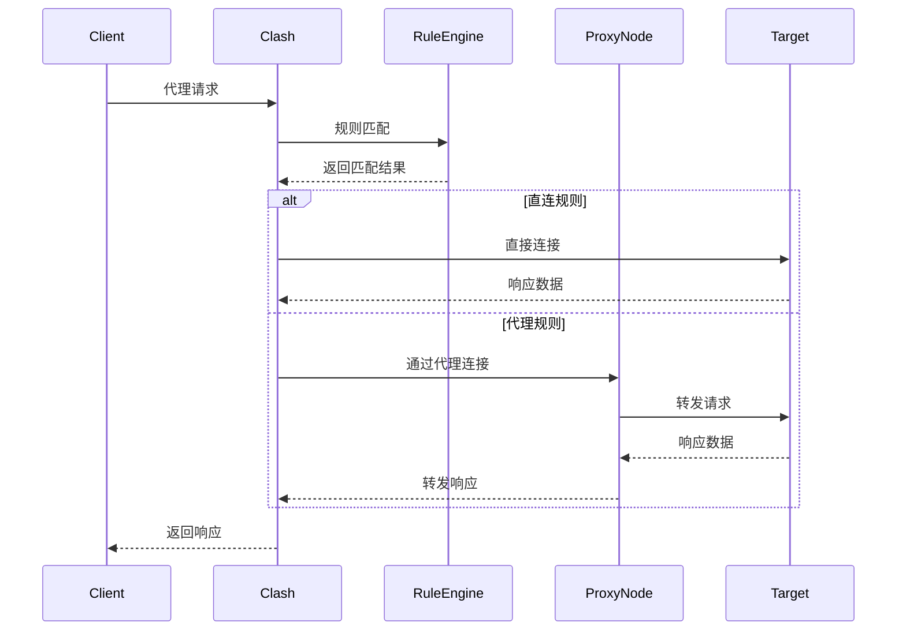
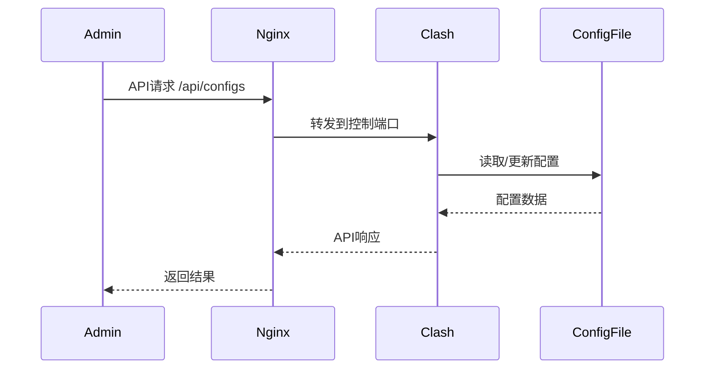
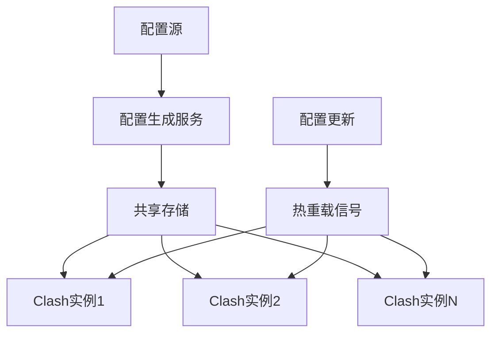
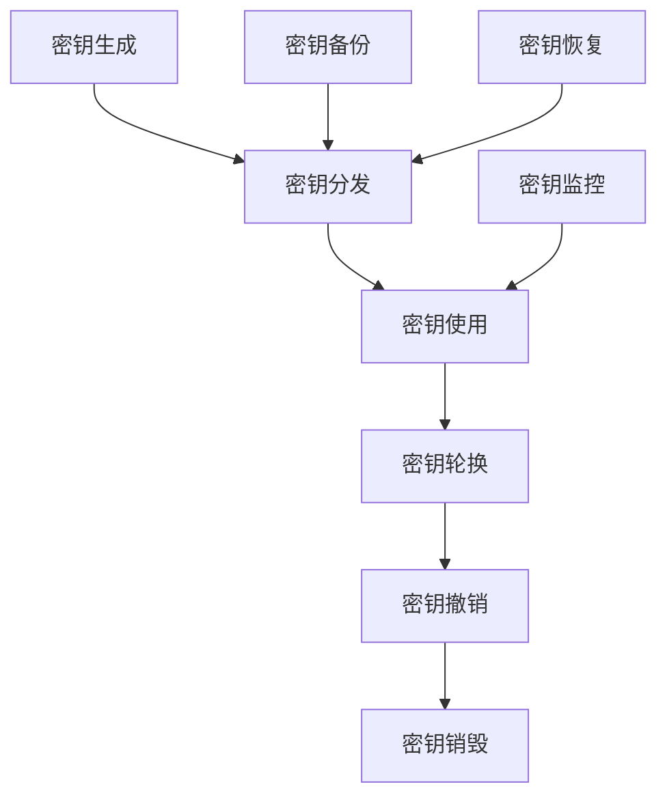
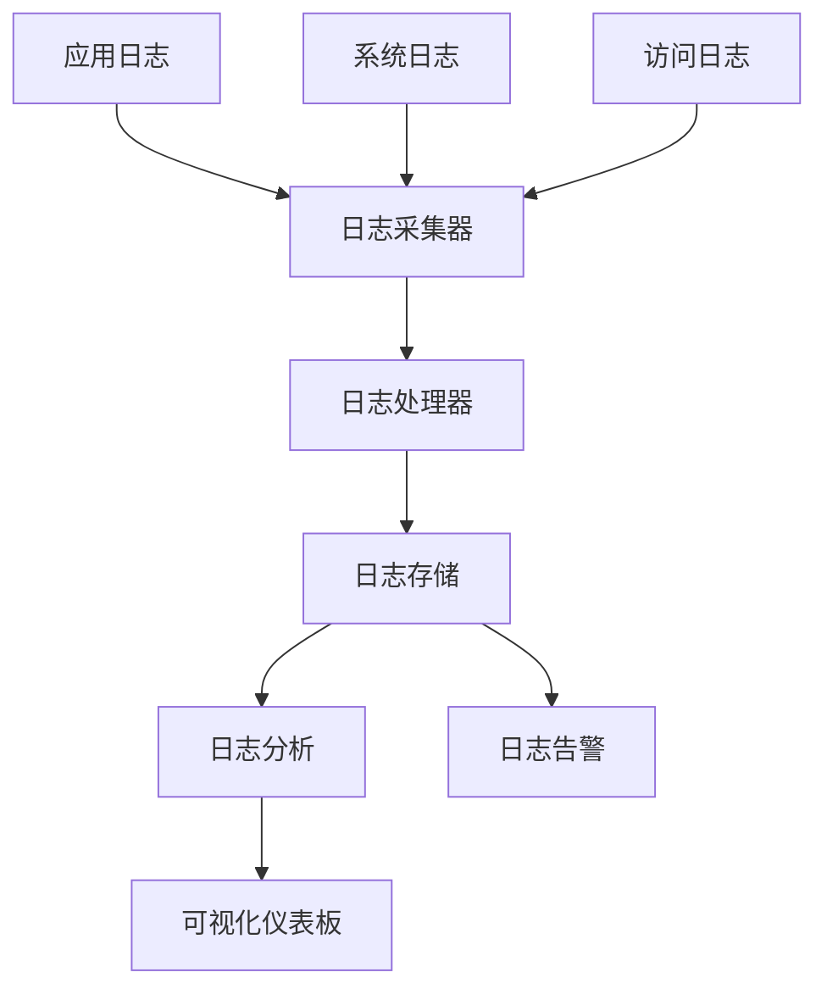
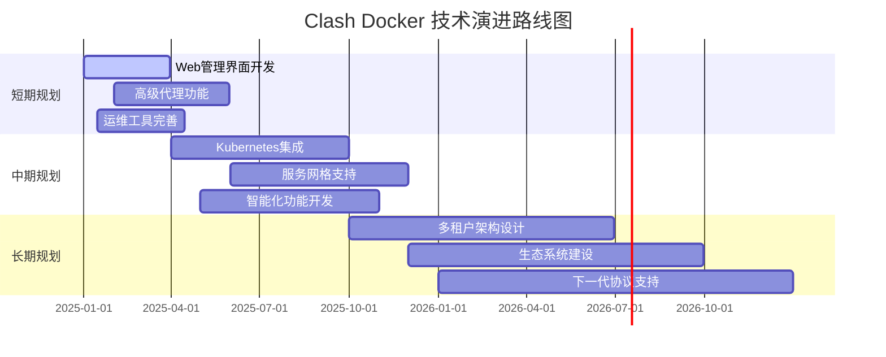

# 🏗️ 系统架构文档

## 📚 目录

1. [架构概述](#架构概述)
2. [系统组件](#系统组件)
3. [数据流和通信](#数据流和通信)
4. [部署架构](#部署架构)
5. [技术栈](#技术栈)
6. [设计决策](#设计决策)
7. [扩展性设计](#扩展性设计)
8. [安全架构](#安全架构)
9. [监控和可观测性](#监控和可观测性)
10. [未来演进规划](#未来演进规划)

---

## 架构概述

### 系统定位

Clash Docker是一个企业级的代理服务解决方案，基于容器化技术构建，提供高可用、安全可靠的代理服务和配置管理功能。

### 核心设计原则

- **容器化优先**: 所有组件均以Docker容器形式部署
- **配置即代码**: 通过环境变量和模板实现配置管理
- **安全默认**: 采用最小权限和多层防护
- **高可用性**: 支持水平扩展和故障恢复
- **可观测性**: 完善的监控、日志和追踪

### 高层架构图

```
┌─────────────────────────────────────────────────────────┐
│                    Internet                             │
└──────────────────┬──────────────────────────────────────┘
                   │
┌──────────────────▼──────────────────────────────────────┐
│                Load Balancer                            │
│              (HAProxy/Nginx)                            │
└──────────────────┬──────────────────────────────────────┘
                   │
┌──────────────────▼──────────────────────────────────────┐
│                 Web Layer                               │
│  ┌─────────────────────────────────────────────────┐    │
│  │               Nginx                              │    │
│  │  ┌─────────────┬─────────────┬─────────────┐    │    │
│  │  │    Static   │    API      │   Config    │    │    │
│  │  │   Content   │   Proxy     │  Download   │    │    │
│  │  └─────────────┴─────────────┴─────────────┘    │    │
│  └─────────────────────────────────────────────────┘    │
└──────────────────┬──────────────────────────────────────┘
                   │
┌──────────────────▼──────────────────────────────────────┐
│               Service Layer                             │
│  ┌─────────────────────────────────────────────────┐    │
│  │                 Clash Core                       │    │
│  │  ┌─────────────┬─────────────┬─────────────┐    │    │
│  │  │    HTTP     │   SOCKS5    │   Control   │    │    │
│  │  │   Proxy     │    Proxy    │     API     │    │    │
│  │  │   :7890     │    :7891    │    :9090    │    │    │
│  │  └─────────────┴─────────────┴─────────────┘    │    │
│  └─────────────────────────────────────────────────┘    │
└──────────────────┬──────────────────────────────────────┘
                   │
┌──────────────────▼──────────────────────────────────────┐
│             Configuration Layer                         │
│  ┌─────────────────────────────────────────────────┐    │
│  │            Config Generator                      │    │
│  │  ┌─────────────┬─────────────┬─────────────┐    │    │
│  │  │   Template  │ Environment │ Validation  │    │    │
│  │  │  Processing │   Variables │   Engine    │    │    │
│  │  └─────────────┴─────────────┴─────────────┘    │    │
│  └─────────────────────────────────────────────────┘    │
└──────────────────┬──────────────────────────────────────┘
                   │
┌──────────────────▼──────────────────────────────────────┐
│               Storage Layer                             │
│  ┌─────────────┬─────────────┬─────────────────────┐    │
│  │   Config    │    Logs     │      Backups        │    │
│  │  Storage    │   Storage   │     Storage         │    │
│  │ (Volumes)   │ (Volumes)   │   (External)        │    │
│  └─────────────┴─────────────┴─────────────────────┘    │
└─────────────────────────────────────────────────────────┘
```

## 系统组件

### 核心服务组件

#### 1. Clash Core Service

**功能职责**:
- HTTP/HTTPS代理服务 (端口7890)
- SOCKS5代理服务 (端口7891)
- 控制API服务 (端口9090)
- 规则匹配和流量转发
- 代理节点管理和健康检查

**技术实现**:
```yaml
# 容器配置
clash:
  image: dreamacro/clash:latest
  ports:
    - "127.0.0.1:7890:7890"  # HTTP代理
    - "127.0.0.1:7891:7891"  # SOCKS5代理
    - "127.0.0.1:9090:9090"  # 控制API
  volumes:
    - ./config:/app/config:ro
    - ./data:/app/data
  security:
    - non-root execution
    - resource limits
    - read-only filesystem
```

**关键特性**:
- 高性能异步I/O处理
- 支持多种代理协议 (SS, VMess, Trojan等)
- 智能规则匹配引擎
- 实时流量统计
- 配置热重载

#### 2. Nginx Web Service

**功能职责**:
- 静态文件服务
- API反向代理
- 配置文件下载服务
- 访问控制和认证
- 负载均衡和缓存

**技术实现**:
```nginx
# 核心配置结构
upstream clash_api {
    server clash:9090;
    keepalive 32;
}

server {
    listen 8088;
    
    # 配置下载
    location /config.yaml {
        root /var/www/html;
        add_header Content-Type "text/yaml; charset=utf-8";
        add_header Cache-Control "public, max-age=300";
    }
    
    # API代理
    location /api/ {
        proxy_pass http://clash_api/;
        proxy_http_version 1.1;
        proxy_set_header Connection "";
    }
    
    # 安全配置
    include /etc/nginx/security.conf;
}
```

**安全特性**:
- HTTP基本认证
- 请求限流和防护
- 安全响应头
- 访问日志记录

#### 3. Config Generator Service

**功能职责**:
- 环境变量验证
- YAML模板处理
- 配置文件生成
- 备份管理
- 错误处理和日志记录

**处理流程**:


### 辅助服务组件

#### 1. 监控服务 (可选)

```yaml
# Prometheus + Grafana 监控栈
monitoring:
  prometheus:
    image: prom/prometheus
    ports: ["9091:9090"]
    volumes:
      - ./monitoring/prometheus.yml:/etc/prometheus/prometheus.yml
      
  grafana:
    image: grafana/grafana
    ports: ["3000:3000"]
    environment:
      - GF_SECURITY_ADMIN_PASSWORD=admin123
```

#### 2. 日志聚合 (可选)

```yaml
# ELK Stack for log aggregation
logging:
  elasticsearch:
    image: docker.elastic.co/elasticsearch/elasticsearch:8.10.0
    environment:
      - discovery.type=single-node
      
  logstash:
    image: docker.elastic.co/logstash/logstash:8.10.0
    volumes:
      - ./logging/logstash.conf:/usr/share/logstash/pipeline/logstash.conf
      
  kibana:
    image: docker.elastic.co/kibana/kibana:8.10.0
    ports: ["5601:5601"]
```

## 数据流和通信

### 请求处理流程

#### 1. 配置下载流程



#### 2. 代理请求流程



#### 3. 控制API流程



### 网络通信架构

#### 内部网络拓扑

```
┌─────────────────────────────────────────────────┐
│              Docker Networks                    │
│                                                 │
│  ┌─────────────────┐    ┌─────────────────┐    │
│  │  clash-internal │    │  web-external   │    │
│  │   (internal)    │    │   (bridge)      │    │
│  │                 │    │                 │    │
│  │  ┌──────────┐   │    │  ┌──────────┐   │    │
│  │  │  clash   │   │    │  │  nginx   │   │    │
│  │  │:9090     │   │    │  │:8088     │   │    │
│  │  └──────────┘   │    │  └──────────┘   │    │
│  └─────────────────┘    └─────────────────┘    │
└─────────────────────────────────────────────────┘
                      │
            ┌─────────▼─────────┐
            │   Host Network    │
            │ 127.0.0.1:7890/1  │
            │ 127.0.0.1:8088    │
            └───────────────────┘
```

#### 端口分配策略

| 服务 | 内部端口 | 外部绑定 | 访问级别 |
|------|----------|----------|----------|
| Clash HTTP | 7890 | 127.0.0.1:7890 | 本地应用 |
| Clash SOCKS | 7891 | 127.0.0.1:7891 | 本地应用 |
| Clash API | 9090 | 127.0.0.1:9090 | 管理员 |
| Nginx Web | 8088 | 0.0.0.0:8088 | 公开访问 |
| Prometheus | 9090 | 127.0.0.1:9091 | 监控系统 |
| Grafana | 3000 | 127.0.0.1:3000 | 监控界面 |

## 部署架构

### 单节点部署

#### 开发环境架构

```yaml
# 简化的开发环境配置
version: '3.8'
services:
  clash:
    build: .
    ports:
      - "127.0.0.1:7890:7890"
      - "127.0.0.1:7891:7891"
      - "127.0.0.1:9090:9090"
    volumes:
      - ./config:/app/config
      - ./data:/app/data
    restart: unless-stopped

  nginx:
    build:
      context: .
      dockerfile: dockerfiles/Dockerfile.nginx
    ports:
      - "8088:8088"
    depends_on:
      - clash
    restart: unless-stopped
```

#### 生产环境架构

```yaml
# 生产环境安全配置
version: '3.8'
services:
  clash:
    image: ghcr.io/your-org/clash-docker:latest
    user: "1000:1000"
    read_only: true
    cap_drop: [ALL]
    cap_add: [NET_BIND_SERVICE]
    security_opt:
      - no-new-privileges:true
    deploy:
      resources:
        limits:
          memory: 512M
          cpus: '1.0'
    healthcheck:
      test: ["CMD", "curl", "-f", "http://localhost:9090/version"]
      interval: 30s
      timeout: 10s
      retries: 3
```

### 高可用部署

#### 负载均衡架构

```
                  ┌─────────────────┐
                  │   Load Balancer │
                  │    (HAProxy)    │
                  └─────────┬───────┘
                            │
          ┌─────────────────┼─────────────────┐
          │                 │                 │
    ┌─────▼─────┐     ┌─────▼─────┐     ┌─────▼─────┐
    │  Node 1   │     │  Node 2   │     │  Node 3   │
    │ (Primary) │     │ (Active)  │     │ (Standby) │
    └───────────┘     └───────────┘     └───────────┘
          │                 │                 │
          └─────────────────┼─────────────────┘
                            │
                  ┌─────────▼───────┐
                  │ Shared Storage  │
                  │     (NFS)       │
                  └─────────────────┘
```

#### Docker Swarm部署

```yaml
# Docker Swarm 集群配置
version: '3.8'
services:
  clash:
    image: clash-docker:latest
    deploy:
      replicas: 3
      placement:
        constraints:
          - node.role == worker
      resources:
        limits:
          memory: 512M
          cpus: '0.5'
      restart_policy:
        condition: on-failure
        delay: 5s
        max_attempts: 3
    networks:
      - clash-network

  nginx:
    image: nginx-clash:latest
    deploy:
      replicas: 2
      placement:
        constraints:
          - node.role == manager
    ports:
      - "8088:8088"
    networks:
      - clash-network

networks:
  clash-network:
    driver: overlay
    attachable: true
```

### Kubernetes部署

#### 基础资源定义

```yaml
# Kubernetes Deployment
apiVersion: apps/v1
kind: Deployment
metadata:
  name: clash-deployment
spec:
  replicas: 3
  selector:
    matchLabels:
      app: clash
  template:
    metadata:
      labels:
        app: clash
    spec:
      securityContext:
        runAsNonRoot: true
        runAsUser: 1000
        fsGroup: 1000
      containers:
      - name: clash
        image: clash-docker:latest
        ports:
        - containerPort: 7890
        - containerPort: 7891
        - containerPort: 9090
        resources:
          limits:
            memory: "512Mi"
            cpu: "500m"
          requests:
            memory: "256Mi"
            cpu: "250m"
        volumeMounts:
        - name: config-volume
          mountPath: /app/config
        - name: data-volume
          mountPath: /app/data
        livenessProbe:
          httpGet:
            path: /version
            port: 9090
          initialDelaySeconds: 30
          periodSeconds: 10
        readinessProbe:
          httpGet:
            path: /version
            port: 9090
          initialDelaySeconds: 5
          periodSeconds: 5
      volumes:
      - name: config-volume
        configMap:
          name: clash-config
      - name: data-volume
        persistentVolumeClaim:
          claimName: clash-data-pvc
---
apiVersion: v1
kind: Service
metadata:
  name: clash-service
spec:
  selector:
    app: clash
  ports:
  - name: http-proxy
    port: 7890
    targetPort: 7890
  - name: socks-proxy
    port: 7891
    targetPort: 7891
  - name: control-api
    port: 9090
    targetPort: 9090
  type: ClusterIP
```

## 技术栈

### 核心技术组件

#### 容器化技术栈

| 组件 | 版本 | 用途 | 特性 |
|------|------|------|------|
| Docker Engine | 24.0+ | 容器运行时 | 高性能容器执行 |
| Docker Compose | 2.20+ | 容器编排 | 开发和测试环境 |
| Alpine Linux | 3.18 | 基础镜像 | 轻量级、安全 |

#### 代理服务技术栈

| 组件 | 版本 | 用途 | 特性 |
|------|------|------|------|
| Clash Core | 1.18.0+ | 代理引擎 | 高性能、多协议 |
| Nginx | 1.24+ | Web服务器 | 反向代理、负载均衡 |
| OpenSSL | 3.0+ | 加密库 | TLS/SSL支持 |

#### 配置管理技术栈

| 组件 | 版本 | 用途 | 特性 |
|------|------|------|------|
| envsubst | GNU | 模板替换 | 环境变量注入 |
| YAML | 1.2 | 配置格式 | 人性化配置 |
| Bash | 5.0+ | 脚本语言 | 自动化脚本 |

#### 监控技术栈

| 组件 | 版本 | 用途 | 特性 |
|------|------|------|------|
| Prometheus | 2.45+ | 指标收集 | 时序数据库 |
| Grafana | 10.0+ | 可视化 | 仪表板和告警 |
| Node Exporter | 1.6+ | 系统指标 | 硬件监控 |
| cAdvisor | 0.47+ | 容器指标 | 容器监控 |

#### 日志技术栈

| 组件 | 版本 | 用途 | 特性 |
|------|------|------|------|
| Elasticsearch | 8.10+ | 日志存储 | 全文搜索 |
| Logstash | 8.10+ | 日志处理 | 数据管道 |
| Kibana | 8.10+ | 日志分析 | 可视化分析 |
| Fluent Bit | 2.1+ | 日志收集 | 轻量级采集 |

### 开发和测试技术栈

#### 测试框架

| 组件 | 版本 | 用途 | 特性 |
|------|------|------|------|
| BATS | 1.10+ | Shell测试 | Bash单元测试 |
| curl | 8.0+ | HTTP测试 | API接口测试 |
| ab | 2.4+ | 性能测试 | Apache压力测试 |
| nmap | 7.94+ | 安全扫描 | 网络安全测试 |

#### 代码质量工具

| 组件 | 版本 | 用途 | 特性 |
|------|------|------|------|
| ShellCheck | 0.9+ | Shell分析 | 静态代码分析 |
| yamllint | 1.32+ | YAML检查 | 语法和风格检查 |
| hadolint | 2.12+ | Dockerfile检查 | Docker最佳实践 |

## 设计决策

### 架构决策记录 (ADR)

#### ADR-001: 容器化架构选择

**状态**: 已接受  
**日期**: 2024-01-01

**背景**: 需要选择部署架构方案

**决策**: 采用Docker容器化架构

**原因**:
- 环境一致性和可移植性
- 简化部署和扩展
- 资源隔离和安全性
- 生态系统成熟

**后果**:
- 需要Docker运行环境
- 增加了容器管理复杂性
- 获得了更好的可维护性

#### ADR-002: 配置管理方案

**状态**: 已接受  
**日期**: 2024-01-15

**背景**: 需要安全灵活的配置管理方案

**决策**: 采用环境变量 + 模板系统

**原因**:
- 敏感信息与代码分离
- 支持多环境配置
- 符合12-factor应用原则
- 与容器编排工具集成

**替代方案**:
- 配置文件直接挂载: 不够灵活
- 配置管理服务: 增加复杂性

#### ADR-003: 网络安全策略

**状态**: 已接受  
**日期**: 2024-02-01

**背景**: 确保代理服务的安全性

**决策**: 多层网络隔离 + 最小权限

**实现**:
- 代理端口仅绑定localhost
- 容器间使用内部网络
- Web服务使用独立网络
- 严格的防火墙规则

#### ADR-004: 监控和可观测性

**状态**: 已接受  
**日期**: 2024-02-15

**背景**: 需要全面的系统监控

**决策**: Prometheus + Grafana监控栈

**原因**:
- 云原生监控标准
- 丰富的生态系统
- 强大的查询语言
- 灵活的告警机制

#### ADR-005: 数据持久化策略

**状态**: 已接受  
**日期**: 2024-03-01

**背景**: 确保数据持久性和备份

**决策**: Docker Volumes + 外部备份

**实现**:
- 配置文件: 只读挂载
- 数据目录: 命名卷持久化
- 日志文件: 挂载到主机目录
- 自动备份: 定期备份脚本

### 技术选型考虑

#### 为什么选择Clash

**优势**:
- 开源且活跃的社区
- 支持多种代理协议
- 高性能的Go语言实现
- 丰富的规则匹配功能
- 完善的API接口

**考虑的替代方案**:
- V2Ray: 功能强大但配置复杂
- Shadowsocks: 轻量但功能有限
- Trojan: 专注于特定协议

#### 为什么选择Docker Compose

**优势**:
- 简单直观的YAML配置
- 适合单机部署场景
- 本地开发环境友好
- 与Docker生态集成良好

**生产环境考虑**:
- 单点故障风险
- 扩展性有限
- 推荐配合Docker Swarm或Kubernetes

## 扩展性设计

### 水平扩展架构

#### 无状态服务设计

```yaml
# 无状态Clash服务设计
clash:
  stateless: true
  configuration:
    # 配置通过环境变量和挂载提供
    - environment_variables
    - config_volumes
  data_persistence:
    # 仅持久化必要的运行时数据
    - connection_cache
    - metrics_data
  scaling_strategy:
    # 支持水平扩展
    - replica_count: variable
    - load_balancing: round_robin
```

#### 配置共享机制



### 垂直扩展策略

#### 资源配置优化

```yaml
# 基于负载的资源配置
resource_profiles:
  small:
    memory: "256Mi"
    cpu: "250m"
    connections: 1000
    
  medium:
    memory: "512Mi"
    cpu: "500m"
    connections: 5000
    
  large:
    memory: "1Gi"
    cpu: "1000m"
    connections: 10000
    
  xlarge:
    memory: "2Gi"
    cpu: "2000m"
    connections: 20000
```

### 功能扩展框架

#### 模块化设计

```
┌─────────────────────────────────────┐
│            Core Services             │
├─────────────────────────────────────┤
│  ┌─────────────┬─────────────────┐  │
│  │ Proxy Core  │  Config Manager │  │
│  └─────────────┴─────────────────┘  │
├─────────────────────────────────────┤
│           Extension Layer            │
├─────────────────────────────────────┤
│  ┌─────────┬─────────┬─────────┐    │
│  │ Monitor │ Logging │ Security│    │
│  │ Module  │ Module  │ Module  │    │
│  └─────────┴─────────┴─────────┘    │
├─────────────────────────────────────┤
│          Integration Layer           │
├─────────────────────────────────────┤
│  ┌─────────┬─────────┬─────────┐    │
│  │   API   │  Web UI │ Webhook │    │
│  │Gateway  │ Module  │ Module  │    │
│  └─────────┴─────────┴─────────┘    │
└─────────────────────────────────────┘
```

#### 可插拔组件设计

```yaml
# 组件配置示例
extensions:
  monitoring:
    enabled: true
    provider: prometheus
    config:
      scrape_interval: 30s
      
  logging:
    enabled: true
    provider: elasticsearch
    config:
      index_pattern: "clash-logs-*"
      
  security:
    enabled: true
    providers:
      - name: rate_limiter
        config:
          requests_per_minute: 100
      - name: ip_whitelist
        config:
          allowed_cidrs:
            - "10.0.0.0/8"
            - "192.168.0.0/16"
```

## 安全架构

### 多层安全防护

#### 网络层安全

```
┌─────────────────────────────────────┐
│          Network Security            │
├─────────────────────────────────────┤
│  ┌─────────────────────────────┐    │
│  │        Firewall Rules        │    │
│  │  • Port restrictions         │    │
│  │  • IP whitelisting           │    │
│  │  • Rate limiting             │    │
│  └─────────────────────────────┘    │
├─────────────────────────────────────┤
│  ┌─────────────────────────────┐    │
│  │     Network Isolation        │    │
│  │  • Internal networks         │    │
│  │  • Container segmentation    │    │
│  │  • Traffic encryption        │    │
│  └─────────────────────────────┘    │
└─────────────────────────────────────┘
```

#### 容器层安全

```yaml
# 容器安全配置
security_context:
  user: "1000:1000"              # 非root用户
  read_only_root_filesystem: true # 只读文件系统
  run_as_non_root: true          # 强制非root
  capabilities:
    drop: ["ALL"]                # 删除所有capabilities
    add: ["NET_BIND_SERVICE"]    # 仅添加必需的capabilities
  security_opt:
    - "no-new-privileges:true"   # 禁止权限提升
    - "apparmor:docker-default"  # AppArmor配置
  sysctls:
    - "net.ipv4.ip_unprivileged_port_start=0"
```

#### 应用层安全

```yaml
# 应用安全配置
application_security:
  authentication:
    methods:
      - http_basic_auth
      - api_key_auth
      - jwt_tokens
    
  authorization:
    rbac:
      roles:
        - admin: ["read", "write", "config"]
        - operator: ["read", "write"]
        - viewer: ["read"]
        
  encryption:
    at_rest:
      - config_files: "AES-256"
      - logs: "AES-256"
    in_transit:
      - tls_version: "1.3"
      - cipher_suites: ["ECDHE-RSA-AES256-GCM-SHA384"]
```

### 密钥管理架构

#### 密钥生命周期



#### 密钥存储策略

```yaml
# 密钥管理配置
key_management:
  storage:
    provider: "file_system"  # 或 "vault", "k8s_secrets"
    encryption: "AES-256-GCM"
    backup:
      enabled: true
      frequency: "daily"
      retention: "30d"
      
  rotation:
    automatic: true
    frequency: "monthly"
    grace_period: "7d"
    
  access_control:
    authentication: "mutual_tls"
    authorization: "rbac"
    audit_logging: true
```

## 监控和可观测性

### 监控架构设计

#### 三层监控模型

```
┌─────────────────────────────────────┐
│        Business Metrics             │
│  • Proxy success rate              │
│  • Response time SLA               │
│  • User experience metrics         │
└─────────────┬───────────────────────┘
              │
┌─────────────▼───────────────────────┐
│       Application Metrics           │
│  • HTTP/SOCKS proxy metrics        │
│  • Config reload success rate      │
│  • Error rates and patterns        │
└─────────────┬───────────────────────┘
              │
┌─────────────▼───────────────────────┐
│      Infrastructure Metrics        │
│  • Container resource usage        │
│  • Network throughput              │
│  • System health indicators        │
└─────────────────────────────────────┘
```

#### 关键指标定义

```yaml
# 核心监控指标
metrics:
  business_level:
    - name: "proxy_success_rate"
      description: "代理请求成功率"
      target: "> 99.9%"
      alert_threshold: "< 99%"
      
    - name: "response_time_p95"
      description: "95分位响应时间"
      target: "< 200ms"
      alert_threshold: "> 500ms"
      
  application_level:
    - name: "concurrent_connections"
      description: "并发连接数"
      normal_range: "100-5000"
      alert_threshold: "> 8000"
      
    - name: "config_reload_success"
      description: "配置重载成功率"
      target: "100%"
      alert_threshold: "< 100%"
      
  infrastructure_level:
    - name: "cpu_utilization"
      description: "CPU使用率"
      normal_range: "10-70%"
      alert_threshold: "> 80%"
      
    - name: "memory_utilization"
      description: "内存使用率"
      normal_range: "20-70%"
      alert_threshold: "> 85%"
```

### 日志架构设计

#### 结构化日志格式

```json
{
  "timestamp": "2025-01-01T12:00:00Z",
  "level": "INFO",
  "service": "clash",
  "component": "proxy",
  "trace_id": "abc123-def456-ghi789",
  "message": "Proxy request processed",
  "metadata": {
    "client_ip": "192.168.1.100",
    "target_host": "example.com",
    "response_time_ms": 150,
    "bytes_transferred": 1024,
    "proxy_node": "node-1"
  }
}
```

#### 日志聚合流程



### 追踪和诊断

#### 分布式追踪

```yaml
# 追踪配置
tracing:
  enabled: true
  provider: "jaeger"
  sampling_rate: 0.1  # 10%采样率
  
  instrumentation:
    http_requests: true
    database_queries: false
    external_calls: true
    
  export:
    endpoint: "http://jaeger:14268/api/traces"
    timeout: "5s"
    batch_size: 100
```

#### 健康检查机制

```yaml
# 多层健康检查
health_checks:
  liveness:
    endpoint: "/health/live"
    interval: 30s
    timeout: 5s
    failure_threshold: 3
    
  readiness:
    endpoint: "/health/ready"
    interval: 10s
    timeout: 3s
    failure_threshold: 2
    
  startup:
    endpoint: "/health/startup"
    interval: 10s
    timeout: 5s
    failure_threshold: 30
    initial_delay: 30s
```

## 未来演进规划

### 短期规划 (3-6个月)

#### 功能增强

1. **Web管理界面**
   - 可视化配置编辑器
   - 实时监控仪表板
   - 用户管理系统

2. **高级代理功能**
   - 负载均衡算法优化
   - 智能故障转移
   - 自适应规则学习

3. **运维工具完善**
   - 自动化部署脚本
   - 一键式升级工具
   - 配置迁移助手

#### 技术债务清理

1. **代码重构**
   - 模块化脚本结构
   - 错误处理标准化
   - 配置验证增强

2. **测试覆盖率提升**
   - 单元测试完善
   - 集成测试自动化
   - 性能基准测试

### 中期规划 (6-12个月)

#### 云原生演进

1. **Kubernetes原生支持**
   - Helm Charts开发
   - Operator模式实现
   - CRD资源定义

2. **服务网格集成**
   - Istio集成方案
   - Envoy代理适配
   - 微服务架构支持

3. **多云部署支持**
   - AWS ECS/EKS适配
   - Azure ACI/AKS支持
   - GCP Cloud Run集成

#### 智能化功能

1. **AI驱动优化**
   - 流量模式分析
   - 智能路由选择
   - 预测性扩容

2. **自动化运维**
   - 故障自愈机制
   - 配置自优化
   - 安全威胁检测

### 长期规划 (1-2年)

#### 平台化发展

1. **多租户架构**
   - 租户隔离机制
   - 资源配额管理
   - 计费统计系统

2. **生态系统建设**
   - 插件市场
   - 第三方集成
   - 开发者平台

3. **企业级特性**
   - 审计合规支持
   - 高级安全特性
   - 性能优化引擎

#### 技术前瞻

1. **下一代协议支持**
   - HTTP/3集成
   - QUIC协议支持
   - WebRTC代理

2. **边缘计算适配**
   - 边缘节点部署
   - CDN集成方案
   - 5G网络优化

### 技术演进路线图



---

**文档维护**:
- **创建日期**: 2025-07-13
- **最后更新**: 2025-07-13
- **版本**: v1.0.0
- **维护者**: Clash Docker Team
- **审核者**: 架构委员会

**相关文档**:
- [部署指南](./DEPLOYMENT_GUIDE.md) - 生产环境部署详情
- [安全指南](./SECURITY_GUIDE.md) - 安全配置和最佳实践
- [API参考](./API_REFERENCE.md) - 接口文档和集成指南

---

**更新日期**: 2025-07-13  
**文档版本**: v1.0.0  
**维护者**: 系统架构团队