# 🔄 热重载实现规划文档 (Node.js技术栈)

## 📋 概述

本文档详细规划了 Clash Docker 项目基于 **Node.js技术栈** 的配置热重载功能实现，包括文件监控、智能重启、WebSocket实时推送等核心组件的技术方案和开发计划。

## 🎯 目标受众

- **Node.js后端开发工程师**: 实现文件监控和配置热重载逻辑
- **前端开发工程师**: 开发实时配置管理界面 (技术栈统一)
- **DevOps工程师**: 集成自动化部署和监控
- **系统架构师**: 理解热重载架构设计

## 💻 **技术栈选择**

### **核心技术栈 - Node.js生态**
- **运行时**: Node.js 18+ (LTS)
- **框架**: Express.js / Fastify
- **文件监控**: Chokidar
- **配置解析**: dotenv + joi/zod
- **Docker集成**: dockerode
- **WebSocket**: ws / socket.io
- **测试框架**: Jest + Supertest
- **类型安全**: TypeScript
- **进程管理**: PM2

### **技术栈优势**
- ✅ **统一技术栈**: 前后端都使用JavaScript/TypeScript
- ✅ **快速启动**: Node.js应用启动时间 < 3秒
- ✅ **内存效率**: 运行时内存占用 30-50MB
- ✅ **生态丰富**: npm包生态系统完善
- ✅ **异步优先**: 天然适合I/O密集型监控任务

## 📚 内容目录

1. [功能概述](#-功能概述)
2. [技术架构](#-技术架构)
3. [实现方案](#-实现方案)
4. [开发计划](#-开发计划)
5. [性能优化](#-性能优化)
6. [监控告警](#-监控告警)
7. [部署指南](#-部署指南)

---

## ✨ **功能概述**

### **当前状态分析**
- ❌ **无自动热重载**: .env文件修改后需要手动重启Docker服务
- ❌ **无配置变化检测**: 无法智能识别配置变化类型和影响范围
- ❌ **无实时界面更新**: Web界面无法实时同步配置状态
- ✅ **支持手动重启**: Docker Compose重启流程完整且稳定

### **目标功能特性**
- 🔍 **智能文件监控**: 实时检测.env、规则文件、配置模板变化
- ⚡ **选择性服务重启**: 根据配置变化类型智能重启相关服务
- 🌐 **WebSocket实时推送**: 配置状态变化实时同步到Web界面
- 📊 **配置变更历史**: 完整的配置修改历史记录和回滚功能
- 🚨 **变更影响分析**: 自动分析配置变化对系统的影响范围

### **性能目标**
- ⏱️ **检测响应时间**: 文件变化检测 < 3秒
- 🔄 **重启时间优化**: 选择性重启 < 30秒 (vs 全量重启 60-90秒)
- 📡 **推送延迟**: WebSocket推送延迟 < 1秒
- 💾 **资源占用**: 监控服务内存占用 < 50MB

---

## 🏗️ **技术架构**

### **Node.js架构图**

```mermaid
graph TB
    subgraph "Node.js文件监控层"
        A[Chokidar文件监控] --> B[配置变化分析器]
        B --> C[影响范围评估器]
        C --> D[重启决策引擎]
    end
    
    subgraph "配置管理层"
        E[dotenv解析器] --> F[Joi/Zod验证器]
        F --> G[配置差异计算器]
        G --> H[配置应用器]
    end
    
    subgraph "Docker控制层"
        I[dockerode客户端] --> J[容器状态监控]
        J --> K[健康检查器]
        K --> L[回滚管理器]
    end
    
    subgraph "WebSocket通信层"
        M[Socket.IO/ws服务器] --> N[事件分发器]
        N --> O[状态广播器]
        O --> P[React前端实时更新]
    end
    
    subgraph "数据存储层"
        Q[SQLite/JSON配置历史] --> R[变更日志]
        R --> S[性能指标存储]
        S --> T[审计日志]
    end
    
    D --> I
    H --> M
    L --> Q
    P --> Q
```



### **核心组件设计**

#### **1. Node.js文件监控服务 (ConfigWatcher)**

```typescript
import chokidar from 'chokidar';
import { EventEmitter } from 'events';
import { readFileSync } from 'fs';
import { parse } from 'dotenv';

interface ConfigChange {
  timestamp: string;
  filePath: string;
  changeType: 'added' | 'changed' | 'unlinked';
  severity: 'critical' | 'moderate' | 'minor';
  affectedServices: string[];
  oldConfig?: Record<string, string>;
  newConfig?: Record<string, string>;
}

class ConfigFileWatcher extends EventEmitter {
  private watcher: chokidar.FSWatcher;
  private watchPaths: string[];
  private lastChangeTime: Map<string, number> = new Map();
  private configCache: Map<string, Record<string, string>> = new Map();
  private debounceTime: number = 2000; // 2秒防抖
  
  constructor(watchPaths: string[]) {
    super();
    this.watchPaths = watchPaths;
    this.initializeWatcher();
  }
  
  private initializeWatcher(): void {
    this.watcher = chokidar.watch(this.watchPaths, {
      ignored: /(^|[\/\\])\../, // 忽略隐藏文件
      persistent: true,
      ignoreInitial: false
    });
    
    // 设置事件监听器
    this.watcher
      .on('add', (path) => this.handleFileChange(path, 'added'))
      .on('change', (path) => this.handleFileChange(path, 'changed'))
      .on('unlink', (path) => this.handleFileChange(path, 'unlinked'))
      .on('error', (error) => this.emit('error', error));
  }
  
  private async handleFileChange(filePath: string, changeType: string): Promise<void> {
    const now = Date.now();
    const lastTime = this.lastChangeTime.get(filePath) || 0;
    
    // 防抖动 - 避免频繁触发
    if (now - lastTime < this.debounceTime) {
      return;
    }
    
    this.lastChangeTime.set(filePath, now);
    
    try {
      const change = await this.analyzeChange(filePath, changeType as any);
      this.emit('configChange', change);
    } catch (error) {
      this.emit('error', error);
    }
  }
  
  private async analyzeChange(filePath: string, changeType: ConfigChange['changeType']): Promise<ConfigChange> {
    const change: ConfigChange = {
      timestamp: new Date().toISOString(),
      filePath,
      changeType,
      severity: 'minor',
      affectedServices: []
    };
    
    if (filePath.endsWith('.env')) {
      return this.analyzeEnvChange(filePath, changeType, change);
    } else if (filePath.includes('rules/')) {
      return this.analyzeRuleChange(filePath, changeType, change);
    } else if (filePath.includes('templates/')) {
      return this.analyzeTemplateChange(filePath, changeType, change);
    }
    
    return change;
  }
  
  private analyzeEnvChange(filePath: string, changeType: ConfigChange['changeType'], change: ConfigChange): ConfigChange {
    const oldConfig = this.configCache.get(filePath) || {};
    let newConfig: Record<string, string> = {};
    
    if (changeType !== 'unlinked') {
      try {
        const envContent = readFileSync(filePath, 'utf8');
        newConfig = parse(envContent);
        this.configCache.set(filePath, newConfig);
      } catch (error) {
        // 文件读取失败，可能是临时状态
        return change;
      }
    }
    
    // 分析具体变化
    const { severity, affectedServices } = this.calculateChangeImpact(oldConfig, newConfig);
    
    return {
      ...change,
      severity,
      affectedServices,
      oldConfig,
      newConfig
    };
  }
  
  private calculateChangeImpact(oldConfig: Record<string, string>, newConfig: Record<string, string>): { severity: ConfigChange['severity'], affectedServices: string[] } {
    const severityRules = {
      critical: ['CLASH_SECRET', 'CLASH_EXTERNAL_CONTROLLER', 'COMPOSE_PROJECT_NAME'],
      moderate: ['JP_HYSTERIA2_SERVER', 'SJC_HYSTERIA2_SERVER', 'CLASH_HTTP_PORT', 'CLASH_SOCKS_PORT'],
      minor: ['CLASH_LOG_LEVEL', 'CLASH_IPV6', 'CLASH_ALLOW_LAN']
    };
    
    const changedKeys = this.getChangedKeys(oldConfig, newConfig);
    let severity: ConfigChange['severity'] = 'minor';
    const affectedServices = new Set<string>();
    
    for (const key of changedKeys) {
      // 检查严重程度
      for (const [level, rules] of Object.entries(severityRules)) {
        if (rules.some(rule => 
          rule.includes('*') ? key.endsWith(rule.slice(1)) : rule === key
        )) {
          if (level === 'critical') {
            severity = 'critical';
          } else if (level === 'moderate' && severity !== 'critical') {
            severity = 'moderate';
          }
        }
      }
      
      // 确定受影响的服务
      if (key.includes('CLASH')) affectedServices.add('clash');
      if (key.includes('NGINX')) affectedServices.add('nginx');
      if (['HYSTERIA2', 'SHADOWSOCKS', 'VMESS', 'VLESS'].some(proto => key.includes(proto))) {
        affectedServices.add('clash');
      }
    }
    
    return {
      severity,
      affectedServices: Array.from(affectedServices).length > 0 ? Array.from(affectedServices) : ['clash']
    };
  }
  
  private getChangedKeys(oldConfig: Record<string, string>, newConfig: Record<string, string>): string[] {
    const allKeys = new Set([...Object.keys(oldConfig), ...Object.keys(newConfig)]);
    const changedKeys: string[] = [];
    
    for (const key of allKeys) {
      if (oldConfig[key] !== newConfig[key]) {
        changedKeys.push(key);
      }
    }
    
    return changedKeys;
  }
  
  private analyzeRuleChange(filePath: string, changeType: ConfigChange['changeType'], change: ConfigChange): ConfigChange {
    return {
      ...change,
      severity: 'moderate',
      affectedServices: ['clash']
    };
  }
  
  private analyzeTemplateChange(filePath: string, changeType: ConfigChange['changeType'], change: ConfigChange): ConfigChange {
    return {
      ...change,
      severity: 'minor',
      affectedServices: ['clash']
    };
  }
  
  public stop(): void {
    this.watcher.close();
  }
}

export { ConfigFileWatcher, ConfigChange };
```

#### **2. Node.js智能重启控制器 (RestartController)**

```typescript
import Docker from 'dockerode';
import { EventEmitter } from 'events';
import { ConfigChange } from './ConfigFileWatcher';

interface ServiceDependency {
  [serviceName: string]: string[];
}

interface RestartResult {
  success: boolean;
  service: string;
  duration: number;
  error?: string;
}

class SmartRestartController extends EventEmitter {
  private docker: Docker;
  private serviceDependencies: ServiceDependency;
  private projectName: string;
  
  constructor(projectName: string = 'clash-docker') {
    super();
    this.docker = new Docker();
    this.projectName = projectName;
    this.serviceDependencies = {
      'clash': ['nginx', 'web-ui'],
      'nginx': ['web-ui'],
      'web-ui': [],
      'config-watcher': []
    };
  }
  
  public async handleConfigChange(change: ConfigChange): Promise<void> {
    this.emit('restartStarted', { change });
    
    try {
      const strategy = this.determineRestartStrategy(change);
      const result = await this.executeRestartStrategy(strategy, change);
      
      this.emit('restartCompleted', { change, result });
    } catch (error) {
      this.emit('restartFailed', { change, error: error.message });
      throw error;
    }
  }
  
  private determineRestartStrategy(change: ConfigChange): 'full' | 'selective' | 'reload' {
    switch (change.severity) {
      case 'critical':
        return 'full';
      case 'moderate':
        return 'selective';
      case 'minor':
        return 'reload';
      default:
        return 'reload';
    }
  }
  
  private async executeRestartStrategy(strategy: string, change: ConfigChange): Promise<RestartResult[]> {
    switch (strategy) {
      case 'full':
        return this.fullRestart();
      case 'selective':
        return this.selectiveRestart(change.affectedServices);
      case 'reload':
        return this.reloadConfigOnly(change.affectedServices);
      default:
        throw new Error(`Unknown restart strategy: ${strategy}`);
    }
  }
  
  private async selectiveRestart(services: string[]): Promise<RestartResult[]> {
    const restartOrder = this.calculateRestartOrder(services);
    const results: RestartResult[] = [];
    
    for (const service of restartOrder) {
      const startTime = Date.now();
      
      try {
        this.emit('serviceRestarting', { service, status: 'starting' });
        
        // 1. 预检查
        await this.preRestartHealthCheck(service);
        
        // 2. 优雅重启
        await this.restartServiceGracefully(service);
        
        // 3. 健康检查
        await this.waitForServiceHealth(service);
        
        const duration = Date.now() - startTime;
        const result: RestartResult = {
          success: true,
          service,
          duration
        };
        
        results.push(result);
        this.emit('serviceRestarted', { service, status: 'healthy', duration });
        
      } catch (error) {
        const duration = Date.now() - startTime;
        const result: RestartResult = {
          success: false,
          service,
          duration,
          error: error.message
        };
        
        results.push(result);
        this.emit('serviceRestartFailed', { service, error: error.message });
        
        // 处理重启失败
        await this.handleRestartFailure(service, error);
      }
    }
    
    return results;
  }
  
  private async restartServiceGracefully(serviceName: string): Promise<void> {
    const containerName = `${this.projectName}-${serviceName}-1`;
    
    try {
      const container = this.docker.getContainer(containerName);
      
      // 检查容器是否存在
      const containerInfo = await container.inspect();
      
      if (containerInfo.State.Running) {
        // 优雅停止 (给容器10秒时间优雅关闭)
        await container.stop({ t: 10 });
        
        // 等待完全停止
        await this.waitForContainerStop(container);
      }
      
      // 启动容器
      await container.start();
      
      // 等待容器就绪
      await this.waitForContainerReady(container);
      
    } catch (error) {
      throw new Error(`Failed to restart service ${serviceName}: ${error.message}`);
    }
  }
  
  private async waitForContainerStop(container: Docker.Container, timeout: number = 30000): Promise<void> {
    const startTime = Date.now();
    
    while (Date.now() - startTime < timeout) {
      try {
        const info = await container.inspect();
        if (!info.State.Running) {
          return;
        }
      } catch (error) {
        // 容器可能已经被删除，这也算停止
        return;
      }
      
      await this.sleep(1000); // 等待1秒
    }
    
    throw new Error('Container stop timeout');
  }
  
  private async waitForContainerReady(container: Docker.Container, timeout: number = 60000): Promise<void> {
    const startTime = Date.now();
    
    while (Date.now() - startTime < timeout) {
      try {
        const info = await container.inspect();
        if (info.State.Running && info.State.Health?.Status === 'healthy') {
          return;
        }
        if (info.State.Running && !info.State.Health) {
          // 没有健康检查的容器，只要运行就认为就绪
          await this.sleep(2000); // 给容器2秒启动时间
          return;
        }
      } catch (error) {
        // 继续等待
      }
      
      await this.sleep(2000); // 等待2秒
    }
    
    throw new Error('Container ready timeout');
  }
  
  private calculateRestartOrder(services: string[]): string[] {
    // 根据依赖关系计算重启顺序
    const order: string[] = [];
    const visited = new Set<string>();
    
    const visit = (service: string) => {
      if (visited.has(service)) return;
      visited.add(service);
      
      // 先处理依赖的服务
      const dependencies = this.serviceDependencies[service] || [];
      for (const dep of dependencies) {
        if (services.includes(dep)) {
          visit(dep);
        }
      }
      
      order.push(service);
    };
    
    for (const service of services) {
      visit(service);
    }
    
    return order;
  }
  
  private async preRestartHealthCheck(serviceName: string): Promise<void> {
    // 重启前健康检查，确保服务当前状态正常
    const containerName = `${this.projectName}-${serviceName}-1`;
    
    try {
      const container = this.docker.getContainer(containerName);
      const info = await container.inspect();
      
      if (!info.State.Running) {
        throw new Error(`Service ${serviceName} is not running`);
      }
    } catch (error) {
      throw new Error(`Pre-restart health check failed for ${serviceName}: ${error.message}`);
    }
  }
  
  private async waitForServiceHealth(serviceName: string, timeout: number = 30000): Promise<void> {
    // 等待服务恢复健康状态
    const containerName = `${this.projectName}-${serviceName}-1`;
    const container = this.docker.getContainer(containerName);
    
    await this.waitForContainerReady(container, timeout);
  }
  
  private async handleRestartFailure(serviceName: string, error: any): Promise<void> {
    // 重启失败处理逻辑
    console.error(`Service ${serviceName} restart failed:`, error);
    
    // 可以实现自动回滚逻辑
    // await this.rollbackService(serviceName);
  }
  
  private async fullRestart(): Promise<RestartResult[]> {
    // 全量重启所有服务
    const allServices = Object.keys(this.serviceDependencies);
    return this.selectiveRestart(allServices);
  }
  
  private async reloadConfigOnly(services: string[]): Promise<RestartResult[]> {
    // 仅重载配置，不重启服务
    const results: RestartResult[] = [];
    
    for (const service of services) {
      const startTime = Date.now();
      
      try {
        // 发送配置重载信号
        await this.sendConfigReloadSignal(service);
        
        const duration = Date.now() - startTime;
        results.push({
          success: true,
          service,
          duration
        });
      } catch (error) {
        const duration = Date.now() - startTime;
        results.push({
          success: false,
          service,
          duration,
          error: error.message
        });
      }
    }
    
    return results;
  }
  
  private async sendConfigReloadSignal(serviceName: string): Promise<void> {
    // 发送配置重载信号到服务
    const containerName = `${this.projectName}-${serviceName}-1`;
    
    try {
      const container = this.docker.getContainer(containerName);
      
      // 发送 SIGHUP 信号重载配置
      await container.kill({ signal: 'SIGHUP' });
    } catch (error) {
      throw new Error(`Failed to send reload signal to ${serviceName}: ${error.message}`);
    }
  }
  
  private sleep(ms: number): Promise<void> {
    return new Promise(resolve => setTimeout(resolve, ms));
  }
}

export { SmartRestartController, RestartResult };
```

#### **3. Node.js WebSocket实时推送 (RealtimeBroadcaster)**

```typescript
import { Server as SocketIOServer } from 'socket.io';
import { Server as HttpServer } from 'http';
import { EventEmitter } from 'events';
import { ConfigChange } from './ConfigFileWatcher';
import { RestartResult } from './SmartRestartController';

interface SystemStatus {
  status: 'stable' | 'updating' | 'restarting' | 'error';
  services: {
    [serviceName: string]: {
      status: 'running' | 'stopped' | 'restarting' | 'error';
      health: 'healthy' | 'unhealthy' | 'unknown';
      uptime: number;
    };
  };
  lastUpdate: string;
}

interface WebSocketMessage {
  type: string;
  timestamp: string;
  data: any;
}

class RealtimeBroadcaster extends EventEmitter {
  private io: SocketIOServer;
  private connectedClients: Set<string> = new Set();
  private systemStatus: SystemStatus;
  
  constructor(httpServer: HttpServer) {
    super();
    
    this.io = new SocketIOServer(httpServer, {
      cors: {
        origin: "*", // 在生产环境中应该限制具体域名
        methods: ["GET", "POST"]
      },
      path: '/ws/config-status'
    });
    
    this.systemStatus = {
      status: 'stable',
      services: {},
      lastUpdate: new Date().toISOString()
    };
    
    this.setupSocketHandlers();
  }
  
  private setupSocketHandlers(): void {
    this.io.on('connection', (socket) => {
      console.log(`Client connected: ${socket.id}`);
      this.connectedClients.add(socket.id);
      
      // 发送当前系统状态
      this.sendToClient(socket.id, {
        type: 'status_update',
        timestamp: new Date().toISOString(),
        data: this.systemStatus
      });
      
      // 处理客户端断开连接
      socket.on('disconnect', () => {
        console.log(`Client disconnected: ${socket.id}`);
        this.connectedClients.delete(socket.id);
      });
      
      // 处理客户端心跳
      socket.on('ping', () => {
        socket.emit('pong', { timestamp: new Date().toISOString() });
      });
      
      // 处理获取状态请求
      socket.on('get_status', () => {
        this.sendToClient(socket.id, {
          type: 'status_update',
          timestamp: new Date().toISOString(),
          data: this.systemStatus
        });
      });
    });
  }
  
  public broadcastConfigChange(change: ConfigChange): void {
    const message: WebSocketMessage = {
      type: 'config_change',
      timestamp: new Date().toISOString(),
      data: {
        filePath: change.filePath,
        changeType: change.changeType,
        severity: change.severity,
        affectedServices: change.affectedServices,
        hasOldConfig: !!change.oldConfig,
        hasNewConfig: !!change.newConfig
      }
    };
    
    this.broadcastToAll(message);
    this.updateSystemStatus('updating');
  }
  
  public broadcastRestartProgress(service: string, status: string, progress?: number): void {
    const message: WebSocketMessage = {
      type: 'restart_progress',
      timestamp: new Date().toISOString(),
      data: {
        service,
        status, // 'starting', 'stopping', 'healthy', 'failed'
        progress: progress || 0
      }
    };
    
    this.broadcastToAll(message);
    
    // 更新服务状态
    if (!this.systemStatus.services[service]) {
      this.systemStatus.services[service] = {
        status: 'stopped',
        health: 'unknown',
        uptime: 0
      };
    }
    
    switch (status) {
      case 'starting':
        this.systemStatus.services[service].status = 'restarting';
        this.updateSystemStatus('restarting');
        break;
      case 'healthy':
        this.systemStatus.services[service].status = 'running';
        this.systemStatus.services[service].health = 'healthy';
        this.checkAndUpdateSystemStatus();
        break;
      case 'failed':
        this.systemStatus.services[service].status = 'error';
        this.systemStatus.services[service].health = 'unhealthy';
        this.updateSystemStatus('error');
        break;
    }
  }
  
  public broadcastRestartCompleted(results: RestartResult[]): void {
    const message: WebSocketMessage = {
      type: 'restart_completed',
      timestamp: new Date().toISOString(),
      data: {
        results,
        totalServices: results.length,
        successCount: results.filter(r => r.success).length,
        failedCount: results.filter(r => !r.success).length,
        totalDuration: results.reduce((sum, r) => sum + r.duration, 0)
      }
    };
    
    this.broadcastToAll(message);
    
    // 更新系统状态
    const hasFailures = results.some(r => !r.success);
    this.updateSystemStatus(hasFailures ? 'error' : 'stable');
  }
  
  public broadcastSystemHealthUpdate(serviceHealth: { [service: string]: boolean }): void {
    // 更新服务健康状态
    for (const [service, isHealthy] of Object.entries(serviceHealth)) {
      if (!this.systemStatus.services[service]) {
        this.systemStatus.services[service] = {
          status: 'running',
          health: 'unknown',
          uptime: 0
        };
      }
      
      this.systemStatus.services[service].health = isHealthy ? 'healthy' : 'unhealthy';
      this.systemStatus.services[service].status = isHealthy ? 'running' : 'error';
    }
    
    const message: WebSocketMessage = {
      type: 'health_update',
      timestamp: new Date().toISOString(),
      data: {
        services: serviceHealth,
        systemStatus: this.systemStatus.status
      }
    };
    
    this.broadcastToAll(message);
    this.checkAndUpdateSystemStatus();
  }
  
  private sendToClient(clientId: string, message: WebSocketMessage): void {
    this.io.to(clientId).emit('message', message);
  }
  
  private broadcastToAll(message: WebSocketMessage): void {
    this.io.emit('message', message);
    console.log(`Broadcasting message type: ${message.type} to ${this.connectedClients.size} clients`);
  }
  
  private updateSystemStatus(status: SystemStatus['status']): void {
    this.systemStatus.status = status;
    this.systemStatus.lastUpdate = new Date().toISOString();
  }
  
  private checkAndUpdateSystemStatus(): void {
    const services = Object.values(this.systemStatus.services);
    
    if (services.length === 0) {
      this.updateSystemStatus('stable');
      return;
    }
    
    const hasErrors = services.some(s => s.status === 'error' || s.health === 'unhealthy');
    const hasRestarting = services.some(s => s.status === 'restarting');
    
    if (hasErrors) {
      this.updateSystemStatus('error');
    } else if (hasRestarting) {
      this.updateSystemStatus('restarting');
    } else {
      this.updateSystemStatus('stable');
    }
  }
  
  public getConnectedClientsCount(): number {
    return this.connectedClients.size;
  }
  
  public getCurrentSystemStatus(): SystemStatus {
    return { ...this.systemStatus };
  }
  
  public close(): void {
    this.io.close();
  }
}

export { RealtimeBroadcaster, SystemStatus, WebSocketMessage };
```

### **配置变化分析逻辑**

#### **Node.js变化严重程度分级**

```typescript
import Joi from 'joi';

interface SeverityRules {
  critical: string[];
  moderate: string[];
  minor: string[];
}

interface ChangeAnalysis {
  severity: 'critical' | 'moderate' | 'minor';
  added: string[];
  removed: string[];
  modified: string[];
  affectedServices: string[];
  configDiff: ConfigDiff[];
}

interface ConfigDiff {
  key: string;
  changeType: 'added' | 'removed' | 'modified';
  oldValue?: string;
  newValue?: string;
  severity: 'critical' | 'moderate' | 'minor';
}

class ChangeAnalyzer {
  private severityRules: SeverityRules = {
    critical: [
      'CLASH_SECRET',             // 安全密钥变化
      'CLASH_EXTERNAL_CONTROLLER', // 控制接口变化
      'COMPOSE_PROJECT_NAME'       // 项目名称变化
    ],
    moderate: [
      'JP_HYSTERIA2_SERVER',      // 代理服务器变化
      'SJC_HYSTERIA2_SERVER',
      '*_PASSWORD',               // 所有密码变化
      '*_UUID',                   // 所有UUID变化
      '*_PORTS',                  // 端口范围变化
      'CLASH_HTTP_PORT',          // HTTP端口变化
      'CLASH_SOCKS_PORT'          // SOCKS端口变化
    ],
    minor: [
      'CLASH_LOG_LEVEL',          // 日志级别
      'CLASH_IPV6',               // IPv6设置
      'CLASH_ALLOW_LAN'           // LAN访问设置
    ]
  };
  
  // Joi配置验证模式
  private configSchema = Joi.object({
    CLASH_SECRET: Joi.string().required(),
    CLASH_HTTP_PORT: Joi.number().port().required(),
    CLASH_SOCKS_PORT: Joi.number().port().required(),
    CLASH_EXTERNAL_CONTROLLER: Joi.string().required(),
    // 代理配置验证
    JP_HYSTERIA2_SERVER: Joi.string().hostname(),
    JP_HYSTERIA2_PORTS: Joi.string().pattern(/^\d+-\d+$/),
    JP_HYSTERIA2_PASSWORD: Joi.string(),
    // 更多验证规则...
  }).unknown(true); // 允许未定义的字段
  
  public analyzeEnvChanges(oldEnv: Record<string, string>, newEnv: Record<string, string>): ChangeAnalysis {
    const analysis: ChangeAnalysis = {
      severity: 'minor',
      added: [],
      removed: [],
      modified: [],
      affectedServices: [],
      configDiff: []
    };
    
    // 检测新增、删除、修改的变量
    const oldKeys = new Set(Object.keys(oldEnv));
    const newKeys = new Set(Object.keys(newEnv));
    
    const added = Array.from(newKeys).filter(key => !oldKeys.has(key));
    const removed = Array.from(oldKeys).filter(key => !newKeys.has(key));
    const modified = Array.from(oldKeys).filter(key => 
      newKeys.has(key) && oldEnv[key] !== newEnv[key]
    );
    
    analysis.added = added;
    analysis.removed = removed;
    analysis.modified = modified;
    
    // 生成详细的配置差异
    const allChangedKeys = [...added, ...removed, ...modified];
    let maxSeverity: 'minor' | 'moderate' | 'critical' = 'minor';
    
    for (const key of allChangedKeys) {
      const keySeverity = this.getKeySeverity(key);
      const diff: ConfigDiff = {
        key,
        changeType: added.includes(key) ? 'added' : 
                   removed.includes(key) ? 'removed' : 'modified',
        oldValue: oldEnv[key],
        newValue: newEnv[key],
        severity: keySeverity
      };
      
      analysis.configDiff.push(diff);
      
      // 更新最高严重程度
      if (keySeverity === 'critical') {
        maxSeverity = 'critical';
      } else if (keySeverity === 'moderate' && maxSeverity !== 'critical') {
        maxSeverity = 'moderate';
      }
    }
    
    analysis.severity = maxSeverity;
    analysis.affectedServices = this.getAffectedServices(allChangedKeys);
    
    return analysis;
  }
  
  public validateConfig(config: Record<string, string>): { isValid: boolean; errors: string[] } {
    const { error } = this.configSchema.validate(config, { abortEarly: false });
    
    if (!error) {
      return { isValid: true, errors: [] };
    }
    
    const errors = error.details.map(detail => `${detail.path.join('.')}: ${detail.message}`);
    return { isValid: false, errors };
  }
  
  private getKeySeverity(key: string): 'critical' | 'moderate' | 'minor' {
    for (const [severity, patterns] of Object.entries(this.severityRules)) {
      for (const pattern of patterns) {
        if (pattern.includes('*')) {
          // 通配符匹配
          const regexPattern = pattern.replace(/\*/g, '.*');
          if (new RegExp(`^${regexPattern}$`).test(key)) {
            return severity as any;
          }
        } else if (pattern === key) {
          // 精确匹配
          return severity as any;
        }
      }
    }
    return 'minor';
  }
  
  private getAffectedServices(changedKeys: string[]): string[] {
    const affectedServices = new Set<string>();
    
    for (const key of changedKeys) {
      // 根据配置项前缀判断影响的服务
      if (key.startsWith('CLASH_')) {
        affectedServices.add('clash');
      }
      if (key.startsWith('NGINX_')) {
        affectedServices.add('nginx');
      }
      if (['HYSTERIA2', 'SHADOWSOCKS', 'VMESS', 'VLESS', 'TROJAN'].some(proto => key.includes(proto))) {
        affectedServices.add('clash'); // 代理配置影响 Clash 服务
      }
      if (key.startsWith('WEB_') || key.startsWith('UI_')) {
        affectedServices.add('web-ui');
      }
    }
    
    // 如果没有明确的对应关系，默认影响 Clash 服务
    if (affectedServices.size === 0) {
      affectedServices.add('clash');
    }
    
    return Array.from(affectedServices);
  }
  
  public generateChangeReport(analysis: ChangeAnalysis): string {
    const { severity, added, removed, modified, affectedServices, configDiff } = analysis;
    
    let report = `配置变化报告\n`;
    report += `严重程度: ${severity.toUpperCase()}\n`;
    report += `影响服务: ${affectedServices.join(', ')}\n\n`;
    
    if (added.length > 0) {
      report += `新增配置 (${added.length}个):\n`;
      added.forEach(key => report += `  + ${key}\n`);
      report += '\n';
    }
    
    if (removed.length > 0) {
      report += `删除配置 (${removed.length}个):\n`;
      removed.forEach(key => report += `  - ${key}\n`);
      report += '\n';
    }
    
    if (modified.length > 0) {
      report += `修改配置 (${modified.length}个):\n`;
      configDiff
        .filter(diff => diff.changeType === 'modified')
        .forEach(diff => {
          report += `  ~ ${diff.key}: "${diff.oldValue}" -> "${diff.newValue}"\n`;
        });
    }
    
    return report;
  }
}

export { ChangeAnalyzer, ChangeAnalysis, ConfigDiff };
```

---

## 🚀 **实现方案**

### **阶段1: Node.js基础文件监控 (Vibe: 4-5小时)**

#### **核心功能实现**
1. **安装Node.js依赖**
   ```bash
   # 安装所需依赖
   npm install chokidar dotenv joi dockerode ws express
   npm install --save-dev @types/node typescript jest supertest
   
   # 初始化TypeScript配置
   npx tsc --init
   ```

2. **配置变化检测服务**
   ```typescript
   // src/services/ConfigService.ts
   import { ConfigFileWatcher } from './ConfigFileWatcher';
   import { ChangeAnalyzer } from './ChangeAnalyzer';
   
   export class ConfigService {
     private watcher: ConfigFileWatcher;
     private analyzer: ChangeAnalyzer;
     
     constructor() {
       this.watcher = new ConfigFileWatcher(['.env', 'rules/', 'templates/']);
       this.analyzer = new ChangeAnalyzer();
       
       this.watcher.on('configChange', this.handleConfigChange.bind(this));
     }
     
     private async handleConfigChange(change: ConfigChange) {
       console.log('检测到配置变化:', change);
       // 发出事件通知其他组件
       this.emit('change', change);
     }
   }
   ```

3. **Express服务器启动脚本**
   ```typescript
   // src/app.ts
   import express from 'express';
   import { createServer } from 'http';
   import { ConfigService } from './services/ConfigService';
   import { SmartRestartController } from './services/SmartRestartController';
   import { RealtimeBroadcaster } from './services/RealtimeBroadcaster';
   
   const app = express();
   const server = createServer(app);
   
   // 初始化服务
   const configService = new ConfigService();
   const restartController = new SmartRestartController();
   const broadcaster = new RealtimeBroadcaster(server);
   
   // 连接事件
   configService.on('change', async (change) => {
     broadcaster.broadcastConfigChange(change);
     await restartController.handleConfigChange(change);
   });
   
   server.listen(8080, () => {
     console.log('热重载服务已启动，端口: 8080');
   });
   ```

#### **Node.js Docker集成**
```yaml
# docker-compose.hot-reload.yml
version: '3.8'

services:
  hot-reload-service:
    build: 
      context: ./services/hot-reload
      dockerfile: Dockerfile.node
    container_name: clash-hot-reload
    restart: unless-stopped
    volumes:
      - ./.env:/app/config/.env:ro
      - ./rules:/app/config/rules:ro
      - ./templates:/app/config/templates:ro
      - /var/run/docker.sock:/var/run/docker.sock
      - hot_reload_data:/app/data
    environment:
      - NODE_ENV=production
      - WATCH_PATHS=.env,rules/,templates/
      - RESTART_STRATEGY=selective
      - WEBSOCKET_PORT=8080
      - PROJECT_NAME=clash-docker
    ports:
      - "8080:8080"  # WebSocket端口
    networks:
      - clash-network

volumes:
  hot_reload_data:

networks:
  clash-network:
    external: true
```

```dockerfile
# services/hot-reload/Dockerfile.node
FROM node:18-alpine

WORKDIR /app

# 安装依赖
COPY package*.json ./
RUN npm ci --only=production

# 复制源代码
COPY src/ ./src/
COPY tsconfig.json ./

# 编译TypeScript
RUN npm run build

# 创建非特权用户
RUN addgroup -g 1001 -S nodejs
RUN adduser -S nodejs -u 1001
USER nodejs

EXPOSE 8080

CMD ["node", "dist/app.js"]
```

### **阶段2: Node.js智能配置热重载 (Vibe: 8-10小时)**

#### **配置影响分析引擎**
1. **代理配置影响评估**
   ```typescript
   // src/services/ImpactAnalyzer.ts
   export class ConfigImpactAnalyzer {
     public analyzeProxyChanges(configDiff: ConfigDiff[]): ProxyImpact[] {
       const impacts: ProxyImpact[] = [];
       
       for (const diff of configDiff) {
         if (this.isProxyConfig(diff.key)) {
           const proxyName = this.extractProxyName(diff.key);
           const impact: ProxyImpact = {
             proxyName,
             configKey: diff.key,
             changeType: diff.changeType,
             severity: diff.severity,
             requiresRestart: this.requiresRestart(diff.key),
             affectedEndpoints: this.getAffectedEndpoints(proxyName)
           };
           impacts.push(impact);
         }
       }
       
       return impacts;
     }
     
     private isProxyConfig(key: string): boolean {
       return ['HYSTERIA2', 'SHADOWSOCKS', 'VMESS', 'VLESS', 'TROJAN']
         .some(protocol => key.includes(protocol));
     }
     
     private extractProxyName(key: string): string {
       const match = key.match(/^([A-Z]+)_([A-Z0-9]+)_/);
       return match ? `${match[1]}_${match[2]}` : 'unknown';
     }
   }
   ```

2. **选择性重启策略**
   ```typescript
   // src/services/RestartPlanner.ts
   export class RestartPlanner {
     public createRestartPlan(affectedServices: string[]): RestartPhase[] {
       const phases: RestartPhase[] = [];
       
       // 按依赖关系分组
       const serviceDependencyGraph = this.buildDependencyGraph(affectedServices);
       const sortedServices = this.topologicalSort(serviceDependencyGraph);
       
       // 创建重启阶段
       for (let i = 0; i < sortedServices.length; i++) {
         const canParallel = this.canRestartInParallel(sortedServices[i], sortedServices.slice(0, i));
         
         if (canParallel && phases.length > 0) {
           // 添加到当前阶段
           phases[phases.length - 1].services.push(sortedServices[i]);
         } else {
           // 创建新阶段
           phases.push({
             phase: phases.length + 1,
             services: [sortedServices[i]],
             parallel: canParallel,
             estimatedDuration: this.estimateRestartTime(sortedServices[i])
           });
         }
       }
       
       return phases;
     }
   }
   ```

3. **Joi配置验证器**
   ```typescript
   // src/services/ConfigValidator.ts
   import Joi from 'joi';
   import { promises as fs } from 'fs';
   
   export class ConfigValidator {
     private proxySchema = Joi.object({
       // Hysteria2 验证
       JP_HYSTERIA2_SERVER: Joi.string().hostname().when('JP_HYSTERIA2_PASSWORD', {
         is: Joi.exist(),
         then: Joi.required()
       }),
       JP_HYSTERIA2_PORTS: Joi.string().pattern(/^\d+-\d+$/),
       JP_HYSTERIA2_PASSWORD: Joi.string().min(8),
       
       // Shadowsocks 验证
       SJC_SHADOWSOCKS_SERVER: Joi.string().hostname(),
       SJC_SHADOWSOCKS_PORT: Joi.number().port(),
       SJC_SHADOWSOCKS_PASSWORD: Joi.string(),
       SJC_SHADOWSOCKS_METHOD: Joi.string().valid('aes-128-gcm', 'aes-256-gcm', 'chacha20-poly1305'),
       
       // Clash 基本配置验证
       CLASH_SECRET: Joi.string().min(16).required(),
       CLASH_HTTP_PORT: Joi.number().port().required(),
       CLASH_SOCKS_PORT: Joi.number().port().required(),
       CLASH_EXTERNAL_CONTROLLER: Joi.string().pattern(/^\d+\.\d+\.\d+\.\d+:\d+$/).required()
     }).unknown(true);
     
     public async validateConfigFile(filePath: string): Promise<ValidationResult> {
       try {
         // 读取和解析配置文件
         const content = await fs.readFile(filePath, 'utf8');
         const config = this.parseEnvContent(content);
         
         // Joi 校验
         const { error, value } = this.proxySchema.validate(config, {
           abortEarly: false,
           allowUnknown: true
         });
         
         if (error) {
           return {
             isValid: false,
             errors: error.details.map(detail => ({
               path: detail.path.join('.'),
               message: detail.message,
               value: detail.context?.value
             }))
           };
         }
         
         // 自定义逻辑校验
         const customValidation = await this.performCustomValidation(value);
         
         return {
           isValid: customValidation.isValid,
           errors: customValidation.errors,
           warnings: customValidation.warnings
         };
         
       } catch (error) {
         return {
           isValid: false,
           errors: [{ path: 'file', message: `File read error: ${error.message}` }]
         };
       }
     }
     
     private async performCustomValidation(config: any): Promise<ValidationResult> {
       const errors: ValidationError[] = [];
       const warnings: ValidationError[] = [];
       
       // 检查端口冲突
       const ports = this.extractPorts(config);
       const duplicates = this.findDuplicatePorts(ports);
       
       if (duplicates.length > 0) {
         errors.push({
           path: 'ports',
           message: `Port conflicts detected: ${duplicates.join(', ')}`
         });
       }
       
       // 检查代理服务器可达性（警告）
       const unreachableServers = await this.checkServerReachability(config);
       if (unreachableServers.length > 0) {
         warnings.push({
           path: 'servers',
           message: `Some servers may be unreachable: ${unreachableServers.join(', ')}`
         });
       }
       
       return {
         isValid: errors.length === 0,
         errors,
         warnings
       };
     }
   }
   ```

### **阶段3: Web界面实时更新 (Vibe: 12-15小时)**

#### **前端实时更新组件**
```typescript
// React WebSocket Hook
export const useConfigStatus = () => {
  const [status, setStatus] = useState<ConfigStatus>('stable');
  const [changes, setChanges] = useState<ConfigChange[]>([]);
  
  useEffect(() => {
    const ws = new WebSocket('ws://localhost:8080/ws/config-status');
    
    ws.onmessage = (event) => {
      const message = JSON.parse(event.data);
      
      switch (message.type) {
        case 'config_change':
          setChanges(prev => [...prev, message.event]);
          break;
        case 'restart_progress':
          setStatus(message.status);
          break;
        case 'status_update':
          setStatus(message.data.status);
          break;
      }
    };
    
    return () => ws.close();
  }, []);
  
  return { status, changes };
};
```

#### **配置管理界面**
```tsx
// 配置管理组件
const ConfigManager: React.FC = () => {
  const { status, changes } = useConfigStatus();
  const [config, setConfig] = useState<EnvConfig>({});
  
  const handleConfigSave = async (newConfig: EnvConfig) => {
    try {
      // 保存配置到后端
      await saveConfig(newConfig);
      
      // 显示保存成功，等待自动重启通知
      showNotification('配置已保存，系统正在自动更新...');
    } catch (error) {
      showError('配置保存失败：' + error.message);
    }
  };
  
  return (
    <div className="config-manager">
      <StatusIndicator status={status} />
      <ConfigEditor 
        config={config} 
        onChange={setConfig}
        onSave={handleConfigSave}
      />
      <ChangeHistory changes={changes} />
      <RestartProgress />
    </div>
  );
};
```

#### **实时状态指示器**
```tsx
const StatusIndicator: React.FC<{status: string}> = ({ status }) => {
  const getStatusColor = (status: string) => {
    switch (status) {
      case 'stable': return 'green';
      case 'updating': return 'yellow';
      case 'restarting': return 'orange';
      case 'error': return 'red';
      default: return 'gray';
    }
  };
  
  return (
    <div className={`status-indicator ${status}`}>
      <div 
        className="status-dot" 
        style={{ backgroundColor: getStatusColor(status) }}
      />
      <span>{getStatusText(status)}</span>
      {status === 'updating' && <LoadingSpinner />}
    </div>
  );
};
```

---

## 📅 **Node.js开发计划**

### **第1周: Node.js基础监控 (Vibe Coding: 4-5小时)**
- **Day 1-2**: TypeScript项目搭建和文件监控
  - [ ] 初始化Node.js + TypeScript项目
  - [ ] 安装chokidar文件监控库
  - [ ] 实现ConfigFileWatcher类
  - [ ] dotenv配置文件解析器
  
- **Day 3**: Express服务器和Docker集成
  - [ ] 搭建Express服务器框架
  - [ ] dockerode Docker API集成
  - [ ] 创建Node.js Dockerfile
  - [ ] Docker Compose配置更新

### **第2周: 智能重启控制 (Vibe Coding: 8-10小时)**
- **Day 1-3**: 配置分析和重启控制
  - [ ] 实现ChangeAnalyzer类 (基于Joi验证)
  - [ ] SmartRestartController服务重启逻辑
  - [ ] 服务依赖关系管理
  - [ ] 选择性重启策略
  
- **Day 4-5**: 健康检查和错误处理
  - [ ] Docker容器健康检查
  - [ ] 优雅重启和超时处理
  - [ ] 自动回滚机制
  - [ ] 统一错误处理和日志

### **第3周: Socket.IO实时通信 (Vibe Coding: 12-15小时)**
- **Day 1-2**: Socket.IO WebSocket服务
  - [ ] 集成Socket.IO到Express服务器
  - [ ] 实现RealtimeBroadcaster类
  - [ ] 事件广播和连接管理
  - [ ] 心跳检测和重连机制

- **Day 3-4**: React前端集成
  - [ ] React Socket.IO客户端集成
  - [ ] useConfigStatus Hook实现
  - [ ] 实时状态指示器组件
  - [ ] 配置变更历史显示

- **Day 5**: 测试和优化
  - [ ] Jest单元测试编写
  - [ ] Supertest集成测试
  - [ ] 性能优化和内存管理
  - [ ] 用户体验改进

### **Node.js技术栈优势对比**
| 开发阶段 | Python方案 | Node.js方案 | 效率提升 | 技术优势 |
|----------|-------------|------------------|----------|----------|
| 基础监控 | 4-5小时 | 3-4小时 | 20% | 统一技术栈 |
| 智能重启 | 8-10小时 | 6-8小时 | 25% | dockerode库更简洁 |
| 实时界面 | 12-15小时 | 8-10小时 | 33% | 前后端技能复用 |
| **总计** | **24-30小时** | **17-22小时** | **27%** | **整体更高效** |

---

## ⚡ **性能优化**

### **Node.js性能优化**
1. **内存管理优化**
   ```typescript
   // src/utils/MemoryManager.ts
   export class MemoryManager {
     private static readonly CONFIG_CACHE_SIZE = 1000;
     private configCache = new Map<string, any>();
     private cacheStats = { hits: 0, misses: 0 };
     
     public getCachedConfig(key: string): any | null {
       if (this.configCache.has(key)) {
         this.cacheStats.hits++;
         return this.configCache.get(key);
       }
       this.cacheStats.misses++;
       return null;
     }
     
     public setCachedConfig(key: string, config: any): void {
       // LRU 缓存策略
       if (this.configCache.size >= MemoryManager.CONFIG_CACHE_SIZE) {
         const firstKey = this.configCache.keys().next().value;
         this.configCache.delete(firstKey);
       }
       this.configCache.set(key, config);
     }
     
     public async cleanupOldConfigs(): Promise<void> {
       const cutoffTime = Date.now() - (30 * 24 * 60 * 60 * 1000); // 30天
       
       for (const [key, value] of this.configCache.entries()) {
         if (value.timestamp < cutoffTime) {
           this.configCache.delete(key);
         }
       }
     }
     
     public getMemoryUsage(): NodeJS.MemoryUsage {
       return process.memoryUsage();
     }
   }
   ```

2. **Chokidar防抖动优化**
   ```typescript
   // src/utils/DebouncedWatcher.ts
   export class DebouncedFileWatcher {
     private debounceTime: number;
     private pendingTimeouts = new Map<string, NodeJS.Timeout>();
     private eventQueue = new Map<string, ConfigChange[]>();
     
     constructor(debounceTime: number = 2000) {
       this.debounceTime = debounceTime;
     }
     
     public debounceFileChange(filePath: string, change: ConfigChange): void {
       // 取消之前的定时器
       const existingTimeout = this.pendingTimeouts.get(filePath);
       if (existingTimeout) {
         clearTimeout(existingTimeout);
       }
       
       // 添加到事件队列
       if (!this.eventQueue.has(filePath)) {
         this.eventQueue.set(filePath, []);
       }
       this.eventQueue.get(filePath)!.push(change);
       
       // 设置新的定时器
       const timeout = setTimeout(() => {
         this.processQueuedChanges(filePath);
         this.pendingTimeouts.delete(filePath);
         this.eventQueue.delete(filePath);
       }, this.debounceTime);
       
       this.pendingTimeouts.set(filePath, timeout);
     }
     
     private processQueuedChanges(filePath: string): void {
       const changes = this.eventQueue.get(filePath) || [];
       if (changes.length > 0) {
         // 合并多个变化事件
         const mergedChange = this.mergeChanges(changes);
         this.emit('debouncedChange', mergedChange);
       }
     }
     
     private mergeChanges(changes: ConfigChange[]): ConfigChange {
       // 合并逻辑：取最新的变化作为主体，合并影响的服务
       const latest = changes[changes.length - 1];
       const allAffectedServices = new Set<string>();
       
       changes.forEach(change => {
         change.affectedServices.forEach(service => 
           allAffectedServices.add(service)
         );
       });
       
       return {
         ...latest,
         affectedServices: Array.from(allAffectedServices)
       };
     }
   }
   ```

### **Node.js重启性能优化**
1. **Promise并行重启策略**
   ```typescript
   // src/services/ParallelRestartManager.ts
   export class ParallelRestartManager {
     public async parallelRestart(serviceGroups: string[][]): Promise<RestartResult[]> {
       const results: RestartResult[] = [];
       
       for (const group of serviceGroups) {
         if (this.canRestartInParallel(group)) {
           // 并行重启组内服务
           const groupTasks = group.map(service => 
             this.restartSingleService(service)
           );
           
           const groupResults = await Promise.allSettled(groupTasks);
           
           // 处理结果
           groupResults.forEach((result, index) => {
             if (result.status === 'fulfilled') {
               results.push(result.value);
             } else {
               results.push({
                 success: false,
                 service: group[index],
                 duration: 0,
                 error: result.reason.message
               });
             }
           });
         } else {
           // 串行重启
           for (const service of group) {
             const result = await this.restartSingleService(service);
             results.push(result);
           }
         }
       }
       
       return results;
     }
     
     private canRestartInParallel(services: string[]): boolean {
       // 检查服务间是否有依赖关系
       for (let i = 0; i < services.length; i++) {
         for (let j = i + 1; j < services.length; j++) {
           if (this.hasDependency(services[i], services[j])) {
             return false;
           }
         }
       }
       return true;
     }
   }
   ```

2. **预验证和异步处理**
   ```typescript
   // src/services/PrevalidationManager.ts
   export class PrevalidationManager {
     private validationCache = new Map<string, Promise<ValidationResult>>();
     
     public async prevalidateConfig(configPath: string): Promise<ValidationResult> {
       // 检查缓存中是否有正在进行的验证
       const existingValidation = this.validationCache.get(configPath);
       if (existingValidation) {
         return existingValidation;
       }
       
       // 开始新的验证任务
       const validationPromise = this.performValidation(configPath);
       this.validationCache.set(configPath, validationPromise);
       
       // 清理缓存
       validationPromise.finally(() => {
         this.validationCache.delete(configPath);
       });
       
       return validationPromise;
     }
     
     private async performValidation(configPath: string): Promise<ValidationResult> {
       const validator = new ConfigValidator();
       
       // 并行执行多个验证
       const [syntaxResult, logicResult, connectivityResult] = await Promise.allSettled([
         validator.validateSyntax(configPath),
         validator.validateLogic(configPath),
         validator.validateConnectivity(configPath) // 可选，较慢
       ]);
       
       const errors: string[] = [];
       const warnings: string[] = [];
       
       // 汇总结果
       if (syntaxResult.status === 'rejected') {
         errors.push(`Syntax error: ${syntaxResult.reason.message}`);
       }
       
       if (logicResult.status === 'rejected') {
         errors.push(`Logic error: ${logicResult.reason.message}`);
       }
       
       if (connectivityResult.status === 'rejected') {
         warnings.push(`Connectivity warning: ${connectivityResult.reason.message}`);
       }
       
       return {
         isValid: errors.length === 0,
         errors,
         warnings
       };
     }
   }
   ```

---

## 📊 **监控告警**

### **系统健康监控**
1. **服务状态监控**
   ```python
   class HealthMonitor:
       async def check_service_health(self, service_name):
           checks = [
               self._check_container_running(service_name),
               self._check_port_accessibility(service_name),
               self._check_api_response(service_name),
               self._check_resource_usage(service_name)
           ]
           
           results = await asyncio.gather(*checks, return_exceptions=True)
           return self._aggregate_health_results(results)
   ```

2. **性能指标收集**
   ```python
   # 重启时间监控
   restart_time_histogram = prometheus_client.Histogram(
       'config_restart_duration_seconds',
       'Time spent restarting services after config change',
       ['service_name', 'restart_type']
   )
   
   # 配置变化频率监控
   config_changes_counter = prometheus_client.Counter(
       'config_changes_total',
       'Total number of configuration changes',
       ['change_type', 'severity']
   )
   ```

### **告警规则配置**
```yaml
# alerting_rules.yml
groups:
  - name: config_reload_alerts
    rules:
      - alert: ConfigReloadFailed
        expr: config_reload_failures_total > 0
        for: 0m
        labels:
          severity: critical
        annotations:
          summary: "配置重载失败"
          description: "服务 {{ $labels.service }} 配置重载失败"
          
      - alert: ServiceRestartTooLong
        expr: config_restart_duration_seconds > 60
        for: 0m
        labels:
          severity: warning
        annotations:
          summary: "服务重启时间过长"
          description: "服务 {{ $labels.service }} 重启时间超过60秒"
```

---

## 🚀 **部署指南**

### **Docker Compose 集成**
```yaml
# docker-compose.hot-reload.yml
version: '3.8'

services:
  config-watcher:
    build: 
      context: ./services/config-watcher
      dockerfile: Dockerfile
    container_name: clash-config-watcher
    restart: unless-stopped
    volumes:
      - ./.env:/app/config/.env:ro
      - ./rules:/app/config/rules:ro
      - ./templates:/app/config/templates:ro
      - /var/run/docker.sock:/var/run/docker.sock
      - config_history:/app/data
    environment:
      - REDIS_URL=redis://redis:6379
      - WEBSOCKET_PORT=8080
      - DEBUG_MODE=false
    ports:
      - "8080:8080"  # WebSocket端口
    depends_on:
      - redis
      
  redis:
    image: redis:7-alpine
    container_name: clash-redis
    restart: unless-stopped
    volumes:
      - redis_data:/data
    command: redis-server --appendonly yes

volumes:
  config_history:
  redis_data:
```

### **启动配置**
```bash
# 启动热重载服务
docker-compose -f docker-compose.yml -f docker-compose.hot-reload.yml up -d

# 验证服务状态
curl http://localhost:8080/health

# 测试WebSocket连接
wscat -c ws://localhost:8080/ws/config-status
```

### **环境变量配置**
```bash
# .env 添加热重载配置
HOT_RELOAD_ENABLED=true
HOT_RELOAD_DEBOUNCE_TIME=2
HOT_RELOAD_MAX_RESTART_TIME=60
HOT_RELOAD_HEALTH_CHECK_TIMEOUT=30
HOT_RELOAD_WEBSOCKET_PORT=8080
```

---

## 💡 **最佳实践**

### **配置管理最佳实践**
1. **配置变更策略**
   - 🔄 **渐进式变更**: 一次只修改少量配置项
   - ✅ **预先验证**: 在应用前验证配置语法和逻辑
   - 📝 **变更记录**: 详细记录每次配置变更的原因和影响
   - 🔙 **快速回滚**: 保持快速回滚到上一个稳定配置的能力

2. **监控和告警**
   - 📊 **关键指标监控**: 重启时间、成功率、健康状态
   - 🚨 **多级告警**: 根据配置变更严重程度设置不同告警级别
   - 📱 **多渠道通知**: 邮件、短信、IM等多种通知方式
   - 📈 **趋势分析**: 分析配置变更频率和模式

### **性能优化建议**
1. **批量变更处理**
   ```python
   # 批量配置变更防抖
   async def batch_config_changes(self, changes, batch_window=5):
       await asyncio.sleep(batch_window)  # 等待更多变更
       combined_changes = self._combine_changes(changes)
       await self._apply_changes(combined_changes)
   ```

2. **智能缓存策略**
   ```python
   # 配置解析结果缓存
   @lru_cache(maxsize=100)
   def parse_config_cached(self, config_hash):
       return self._parse_config_file(config_hash)
   ```

---

## 🚨 **注意事项**

### **安全考虑**
- 🔒 **配置文件权限**: 确保配置文件只有必要的读写权限
- 🛡️ **API访问控制**: WebSocket连接需要适当的认证机制
- 📝 **敏感信息保护**: 配置历史记录中敏感信息需要脱敏处理
- 🔐 **Docker Socket安全**: 限制容器对Docker Socket的访问权限

### **故障恢复**
- 🔄 **自动回滚机制**: 配置应用失败时自动回滚到上一个稳定版本
- 🏥 **健康检查**: 完善的服务健康检查确保系统稳定性
- 📞 **紧急停止**: 提供紧急停止热重载功能的方法
- 💾 **配置备份**: 定期备份配置文件和历史记录

---

## 📞 **获取帮助**

**开发团队**: Clash Docker 热重载小组  
**更新频率**: 每两周更新一次  
**反馈渠道**: GitHub Issues / 技术群组  
**紧急联系**: 系统管理员

**文档仓库**: `/mnt/clash-docker/docs/HOT_RELOAD_IMPLEMENTATION.md`  
**最后更新**: 2025-07-13  
**版本**: v1.0.0