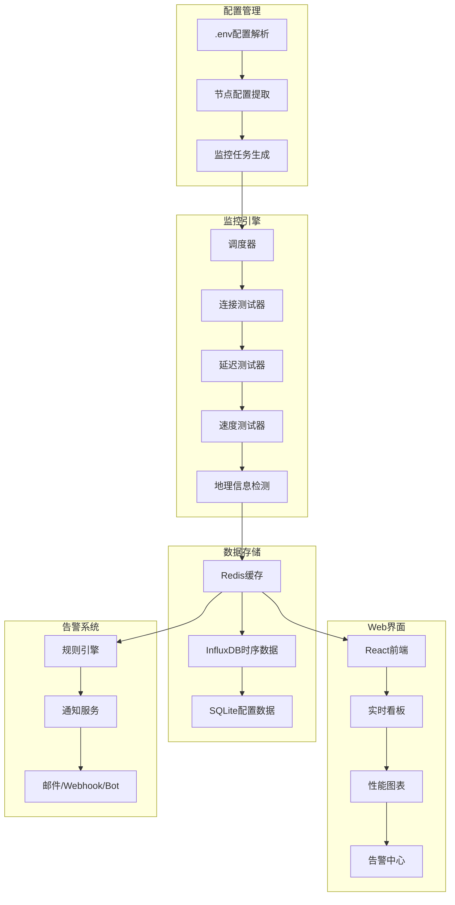
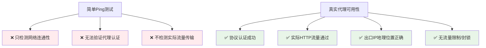

# 🌐 代理节点监控与可用性看板

## 📋 概述

本文档描述了为 Clash Docker 项目实现代理节点状态监控和可用性看板的完整解决方案，包括多协议节点检测、性能监控、实时看板和智能告警系统。

## 🎯 目标受众

- **运维工程师**: 监控代理节点健康状态
- **开发工程师**: 集成节点监控功能
- **最终用户**: 查看节点可用性和性能指标

## 📚 内容目录

1. [功能特性](#-功能特性)
2. [技术架构](#-技术架构)
3. [监控指标](#-监控指标)
4. [实现方案](#-实现方案)
5. [看板设计](#-看板设计)
6. [部署指南](#-部署指南)
7. [API接口](#-api接口)
8. [性能优化](#-性能优化)

---

## ✨ **功能特性**

### **核心监控功能**
- 🔍 **多协议支持**: Hysteria2、Shadowsocks、VMess、VLESS、Trojan、SOCKS5
- ⚡ **实时检测**: 30秒-5分钟可配置检测间隔
- 📊 **性能指标**: 延迟、速度、可用率、连接成功率
- 🌍 **地理信息**: 自动识别节点地理位置和ISP信息
- 📈 **历史数据**: 30天性能历史数据存储和分析

### **可视化看板**
- 🎨 **实时状态**: 节点状态实时更新，绿/黄/红状态指示
- 📊 **性能图表**: 延迟趋势、速度测试、可用率统计
- 🌏 **地图视图**: 全球节点分布地图
- 📱 **响应式设计**: 支持桌面和移动设备访问

### **智能告警**
- 🚨 **故障告警**: 节点离线、超时、性能下降自动通知
- 🔄 **恢复检测**: 节点恢复后自动标记并通知
- 📧 **多种通知**: 邮件、Webhook、Telegram Bot
- ⏰ **告警抑制**: 避免重复告警，支持告警静默期

---

## 🏗️ **技术架构**

### **整体架构图**



### **核心组件**

#### **1. 节点发现器 (Node Discovery)**
```python
class NodeDiscovery:
    """从环境变量自动发现代理节点"""
    
    def __init__(self, env_file=".env"):
        self.env_file = env_file
        self.supported_protocols = {
            'hysteria2': ['HYSTERIA2_SERVER', 'HYSTERIA2_PORTS', 'HYSTERIA2_PASSWORD'],
            'shadowsocks': ['SS_SERVER', 'SS_PORT', 'SS_PASSWORD', 'SS_CIPHER'],
            'vmess': ['VMESS_SERVER', 'VMESS_PORT', 'VMESS_UUID', 'VMESS_WS_PATH'],
            'vless': ['VLESS_SERVER', 'VLESS_PORT', 'VLESS_UUID', 'VLESS_WS_PATH'],
            'trojan': ['TROJAN_SERVER', 'TROJAN_PORT', 'TROJAN_PASSWORD']
        }
    
    def discover_nodes(self) -> List[ProxyNode]:
        """发现所有配置的代理节点"""
        nodes = []
        env_vars = self._parse_env_file()
        
        for protocol, required_vars in self.supported_protocols.items():
            nodes.extend(self._extract_nodes_by_protocol(env_vars, protocol))
        
        return nodes
    
    def _extract_nodes_by_protocol(self, env_vars: dict, protocol: str) -> List[ProxyNode]:
        """按协议提取节点配置"""
        nodes = []
        # 查找所有匹配的节点前缀
        prefixes = self._find_node_prefixes(env_vars, protocol)
        
        for prefix in prefixes:
            node_config = self._build_node_config(env_vars, prefix, protocol)
            if self._validate_node_config(node_config):
                nodes.append(ProxyNode(
                    name=prefix,
                    protocol=protocol,
                    config=node_config
                ))
        
        return nodes
```

#### **2. 真实代理可用性测试器 (Real Proxy Availability Tester)**
```python
class RealProxyTester:
    """真实代理服务可用性测试 - 不仅仅是连通性"""
    
    def __init__(self):
        self.test_targets = [
            "http://httpbin.org/ip",          # 获取出口IP
            "https://api.github.com/zen",     # HTTPS测试
            "http://detectportal.firefox.com/success.txt"  # 轻量检测
        ]
        self.timeout = 15
        self.user_agent = "Mozilla/5.0 (Windows NT 10.0; Win64; x64) AppleWebKit/537.36"
    
    async def test_proxy_availability(self, node: ProxyNode) -> ProxyAvailabilityResult:
        """真实代理服务可用性测试 - 多层验证"""
        start_time = time.time()
        
        try:
            # 第一步: 基础连通性检查
            basic_check = await self._basic_connectivity_check(node)
            if not basic_check.success:
                return ProxyAvailabilityResult(
                    node_name=node.name,
                    overall_status='offline',
                    error=basic_check.error,
                    timestamp=time.time(),
                    test_details={'basic_check': basic_check}
                )
            
            # 第二步: 协议特定测试
            protocol_test = await self._protocol_specific_test(node)
            if not protocol_test.success:
                return ProxyAvailabilityResult(
                    node_name=node.name,
                    overall_status='protocol_error',
                    error=protocol_test.error,
                    timestamp=time.time(),
                    test_details={'protocol_test': protocol_test}
                )
            
            # 第三步: 真实HTTP/HTTPS请求测试
            http_tests = await self._real_traffic_test(node)
            
            # 第四步: 出口IP检测和地理位置验证
            exit_ip_test = await self._exit_ip_verification(node)
            
            # 综合评估
            overall_status = self._evaluate_overall_status(
                basic_check, protocol_test, http_tests, exit_ip_test
            )
            
            return ProxyAvailabilityResult(
                node_name=node.name,
                overall_status=overall_status,
                latency=protocol_test.latency,
                exit_ip=exit_ip_test.exit_ip,
                geographic_info=exit_ip_test.geo_info,
                timestamp=time.time(),
                test_duration=time.time() - start_time,
                test_details={
                    'basic_check': basic_check,
                    'protocol_test': protocol_test,
                    'http_tests': http_tests,
                    'exit_ip_test': exit_ip_test
                }
            )
            
        except Exception as e:
            return ProxyAvailabilityResult(
                node_name=node.name,
                overall_status='error',
                error=str(e),
                timestamp=time.time(),
                test_duration=time.time() - start_time
            )
    
    async def _basic_connectivity_check(self, node: ProxyNode) -> BasicCheckResult:
        """基础连通性检查 - 端口和服务响应"""
        try:
            # TCP连接检查
            reader, writer = await asyncio.wait_for(
                asyncio.open_connection(node.config['server'], node.config['port']),
                timeout=5
            )
            writer.close()
            await writer.wait_closed()
            
            return BasicCheckResult(success=True, message="TCP连接成功")
            
        except asyncio.TimeoutError:
            return BasicCheckResult(success=False, error="连接超时")
        except ConnectionRefusedError:
            return BasicCheckResult(success=False, error="连接被拒绝")
        except Exception as e:
            return BasicCheckResult(success=False, error=f"连接错误: {str(e)}")
    
    async def _protocol_specific_test(self, node: ProxyNode) -> ProtocolTestResult:
        """协议特定的认证和握手测试"""
        start_time = time.time()
        
        try:
            if node.protocol == 'shadowsocks':
                return await self._test_shadowsocks_auth(node, start_time)
            elif node.protocol == 'hysteria2':
                return await self._test_hysteria2_auth(node, start_time)
            elif node.protocol in ['vmess', 'vless']:
                return await self._test_v2ray_auth(node, start_time)
            elif node.protocol == 'trojan':
                return await self._test_trojan_auth(node, start_time)
            else:
                return ProtocolTestResult(
                    success=False, 
                    error=f"不支持的协议: {node.protocol}"
                )
                
        except Exception as e:
            return ProtocolTestResult(
                success=False,
                error=f"协议测试失败: {str(e)}",
                latency=(time.time() - start_time) * 1000
            )
    
    async def _real_traffic_test(self, node: ProxyNode) -> List[HttpTestResult]:
        """真实HTTP/HTTPS流量测试"""
        results = []
        
        # 创建代理配置
        proxy_config = self._create_proxy_config(node)
        
        for target_url in self.test_targets:
            try:
                start_time = time.time()
                
                # 使用代理发送HTTP请求
                async with aiohttp.ClientSession(
                    connector=aiohttp.ProxyConnector.from_url(proxy_config),
                    timeout=aiohttp.ClientTimeout(total=self.timeout),
                    headers={'User-Agent': self.user_agent}
                ) as session:
                    async with session.get(target_url) as response:
                        content = await response.text()
                        latency = (time.time() - start_time) * 1000
                        
                        results.append(HttpTestResult(
                            url=target_url,
                            success=response.status == 200,
                            status_code=response.status,
                            latency=latency,
                            content_length=len(content),
                            response_content=content[:200]  # 前200字符
                        ))
                        
            except asyncio.TimeoutError:
                results.append(HttpTestResult(
                    url=target_url,
                    success=False,
                    error="请求超时"
                ))
            except Exception as e:
                results.append(HttpTestResult(
                    url=target_url,
                    success=False,
                    error=str(e)
                ))
        
        return results
    
    async def _exit_ip_verification(self, node: ProxyNode) -> ExitIpTestResult:
        """出口IP检测和地理位置验证"""
        try:
            proxy_config = self._create_proxy_config(node)
            
            async with aiohttp.ClientSession(
                connector=aiohttp.ProxyConnector.from_url(proxy_config),
                timeout=aiohttp.ClientTimeout(total=10)
            ) as session:
                # 获取出口IP
                async with session.get("http://httpbin.org/ip") as response:
                    if response.status == 200:
                        data = await response.json()
                        exit_ip = data.get('origin', '').split(',')[0].strip()
                        
                        # 地理位置检测
                        geo_info = await self._get_geographic_info(exit_ip)
                        
                        # 验证IP是否符合预期地区
                        region_match = self._verify_expected_region(node, geo_info)
                        
                        return ExitIpTestResult(
                            success=True,
                            exit_ip=exit_ip,
                            geo_info=geo_info,
                            region_match=region_match
                        )
                    else:
                        return ExitIpTestResult(
                            success=False,
                            error=f"IP检测失败: HTTP {response.status}"
                        )
                        
        except Exception as e:
            return ExitIpTestResult(
                success=False,
                error=f"出口IP检测失败: {str(e)}"
            )
    
    def _create_proxy_config(self, node: ProxyNode) -> str:
        """根据协议创建代理配置URL"""
        config = node.config
        
        if node.protocol == 'shadowsocks':
            # ss://method:password@server:port
            auth = f"{config['cipher']}:{config['password']}"
            auth_b64 = base64.b64encode(auth.encode()).decode()
            return f"ss://{auth_b64}@{config['server']}:{config['port']}"
            
        elif node.protocol == 'http':
            return f"http://{config['server']}:{config['port']}"
            
        elif node.protocol == 'socks5':
            if 'username' in config:
                return f"socks5://{config['username']}:{config['password']}@{config['server']}:{config['port']}"
            else:
                return f"socks5://{config['server']}:{config['port']}"
        
        # 对于复杂协议，需要启动临时代理进程
        else:
            return self._create_temp_proxy_process(node)
    
    def _evaluate_overall_status(self, basic_check, protocol_test, http_tests, exit_ip_test) -> str:
        """综合评估代理状态"""
        if not basic_check.success:
            return 'offline'
        
        if not protocol_test.success:
            return 'protocol_error'
        
        successful_http_tests = sum(1 for test in http_tests if test.success)
        http_success_rate = successful_http_tests / len(http_tests)
        
        if http_success_rate == 0:
            return 'traffic_blocked'
        elif http_success_rate < 0.5:
            return 'unstable'
        elif not exit_ip_test.success:
            return 'ip_detection_failed'
        elif exit_ip_test.region_match is False:
            return 'wrong_region'
        else:
            return 'fully_available'
    
    async def _test_shadowsocks(self, node: ProxyNode) -> TestResult:
        """Shadowsocks连接测试"""
        import shadowsocks_client
        
        client = shadowsocks_client.SSClient(
            server=node.config['server'],
            port=node.config['port'],
            password=node.config['password'],
            cipher=node.config['cipher']
        )
        
        # 测试HTTP请求
        test_url = "http://httpbin.org/ip"
        start_time = time.time()
        
        try:
            response = await client.get(test_url, timeout=10)
            latency = (time.time() - start_time) * 1000
            
            return TestResult(
                success=response.status_code == 200,
                latency=latency,
                response_data=response.json()
            )
        except Exception as e:
            return TestResult(success=False, error=str(e))
```

#### **3. 性能测试器 (Performance Tester)**
```python
class PerformanceTester:
    """代理性能测试"""
    
    async def test_performance(self, node: ProxyNode) -> PerformanceResult:
        """综合性能测试"""
        results = {
            'latency': await self._test_latency(node),
            'speed': await self._test_speed(node),
            'stability': await self._test_stability(node)
        }
        
        return PerformanceResult(
            node_name=node.name,
            **results
        )
    
    async def _test_latency(self, node: ProxyNode, count=5) -> LatencyResult:
        """延迟测试 - 多次ping取平均值"""
        latencies = []
        
        for _ in range(count):
            start_time = time.time()
            try:
                # 通过代理访问快速响应的API
                response = await self._proxy_request(
                    node, "http://httpbin.org/get", timeout=5
                )
                if response.status_code == 200:
                    latency = (time.time() - start_time) * 1000
                    latencies.append(latency)
            except:
                continue
            
            await asyncio.sleep(0.5)  # 避免过于频繁
        
        if latencies:
            return LatencyResult(
                min=min(latencies),
                max=max(latencies),
                avg=sum(latencies) / len(latencies),
                success_rate=len(latencies) / count * 100
            )
        else:
            return LatencyResult(error="所有延迟测试失败")
    
    async def _test_speed(self, node: ProxyNode) -> SpeedResult:
        """速度测试 - 下载测试文件"""
        test_files = [
            ("1MB", "http://speedtest.ftp.otenet.gr/files/test1Mb.db"),
            ("10MB", "http://speedtest.ftp.otenet.gr/files/test10Mb.db")
        ]
        
        speeds = {}
        
        for size, url in test_files:
            try:
                start_time = time.time()
                response = await self._proxy_request(
                    node, url, timeout=30, stream=True
                )
                
                downloaded = 0
                async for chunk in response.iter_content(chunk_size=8192):
                    downloaded += len(chunk)
                
                duration = time.time() - start_time
                speed_mbps = (downloaded / 1024 / 1024) / duration
                speeds[size] = speed_mbps
                
            except Exception as e:
                speeds[size] = f"错误: {str(e)}"
        
        return SpeedResult(speeds=speeds)
```

---

## ⚠️ **代理可用性检测的技术复杂性分析**

### **为什么简单的连通性检测是不够的**



### **协议特定的技术挑战**

| 协议类型 | 主要技术挑战 | 检测复杂度 | 实现难点 |
|----------|--------------|------------|----------|
| **Shadowsocks** | 加密认证、密码验证 | ⭐⭐⭐ | 需要实现加密握手 |
| **VMess** | UUID认证、WebSocket升级、时间同步 | ⭐⭐⭐⭐ | 协议复杂，握手步骤多 |
| **VLESS** | UUID认证、TLS验证、WebSocket | ⭐⭐⭐⭐ | 类似VMess但更严格 |
| **Hysteria2** | QUIC协议、快速握手、端口范围 | ⭐⭐⭐⭐⭐ | 基于UDP，状态跟踪复杂 |
| **Trojan** | TLS伪装、证书验证、密码认证 | ⭐⭐⭐⭐ | 需要完整TLS握手 |

### **实际网络环境的挑战**

#### **1. 网络层面干扰**
```python
network_challenges = {
    "DNS干扰": [
        "DNS污染导致解析错误",
        "DNS劫持到错误IP",  
        "DNS查询被阻断"
    ],
    "DPI检测": [
        "深包检测识别代理流量",
        "协议特征被运营商识别",
        "流量模式分析"
    ],
    "QoS限制": [
        "代理流量被限速",
        "特定端口被限制",
        "高延迟/丢包"
    ]
}
```

#### **2. 服务端状态问题**
```python
server_side_issues = {
    "认证问题": [
        "密码过期/更改",
        "UUID失效",
        "时间不同步导致认证失败"
    ],
    "资源限制": [
        "流量配额耗尽",
        "并发连接数限制",
        "服务器过载"
    ],
    "地理限制": [
        "IP地址被目标网站封禁",
        "地理位置不符合要求",
        "特定地区访问限制"
    ]
}
```

### **多层检测方案设计**

我们的解决方案采用**4层递进式检测**：

#### **第1层: 基础连通性** (简单但必要)
- TCP连接到代理服务器
- 端口可达性检查
- 基础网络延迟测量

#### **第2层: 协议认证** (核心关键)
- 执行完整的协议握手
- 验证认证信息正确性
- 检测协议级别的错误

#### **第3层: 实际流量测试** (真实可用性)
- 通过代理发送HTTP/HTTPS请求
- 测试多个目标网站
- 验证流量确实通过代理

#### **第4层: 出口验证** (地理位置确认)
- 检测真实出口IP地址
- 验证地理位置是否符合预期
- 确认IP没有被封禁

### **状态评估标准**

```python
proxy_status_levels = {
    'fully_available': {
        'description': '完全可用',
        'criteria': '所有检测通过，可正常使用',
        'color': 'green',
        'icon': '🟢'
    },
    'unstable': {
        'description': '不稳定', 
        'criteria': '部分流量测试失败，可能不稳定',
        'color': 'yellow',
        'icon': '🟡'
    },
    'protocol_error': {
        'description': '协议错误',
        'criteria': '认证失败，配置可能有误',
        'color': 'orange', 
        'icon': '🟠'
    },
    'traffic_blocked': {
        'description': '流量被阻断',
        'criteria': '连接成功但HTTP流量无法通过',
        'color': 'red',
        'icon': '🔴'
    },
    'wrong_region': {
        'description': '地理位置错误',
        'criteria': '工作正常但出口IP不在预期地区',
        'color': 'purple',
        'icon': '🟣'
    },
    'offline': {
        'description': '离线',
        'criteria': '无法建立基础连接',
        'color': 'gray',
        'icon': '⚫'
    }
}
```

## 📊 **监控指标**

### **增强的监控指标**

| 指标类型 | 指标名称 | 单位 | 说明 |
|----------|----------|------|------|
| **可用性** | 节点状态 | online/offline/error | 当前连接状态 |
| **可用性** | 可用率 | % | 24小时内在线时间百分比 |
| **性能** | 平均延迟 | ms | 5次测试的平均响应时间 |
| **性能** | 下载速度 | Mbps | 1MB/10MB文件下载速度 |
| **性能** | 连接成功率 | % | 连接尝试成功的百分比 |
| **地理** | 节点位置 | 国家/城市 | 通过IP地理位置检测 |
| **网络** | ISP信息 | 文本 | 互联网服务提供商 |

### **监控频率配置**
```yaml
monitoring_config:
  intervals:
    fast_check: 30s      # 快速连通性检查
    performance: 5m      # 性能测试
    geo_update: 24h      # 地理信息更新
    cleanup: 1h          # 数据清理
  
  timeouts:
    connection: 10s      # 连接超时
    performance: 30s     # 性能测试超时
    total_test: 60s      # 单节点总测试超时
  
  retention:
    real_time: 1h        # 实时数据保留
    hourly: 7d           # 小时级数据保留
    daily: 30d           # 日级数据保留
```

---

## 💻 **实现方案**

### **后端监控服务**

#### **主监控服务**
```python
#!/usr/bin/env python3
# services/node-monitor.py

import asyncio
import json
import time
from typing import Dict, List
from dataclasses import dataclass
from datetime import datetime, timedelta

@dataclass
class MonitoringConfig:
    check_interval: int = 30
    performance_interval: int = 300
    max_concurrent: int = 10
    timeout: int = 10

class NodeMonitorService:
    def __init__(self, config: MonitoringConfig):
        self.config = config
        self.discovery = NodeDiscovery()
        self.tester = ConnectionTester()
        self.perf_tester = PerformanceTester()
        self.storage = MonitoringStorage()
        self.alerting = AlertingService()
        
        self.nodes = {}
        self.running = False
    
    async def start(self):
        """启动监控服务"""
        print("🚀 启动代理节点监控服务")
        
        # 发现节点
        discovered_nodes = self.discovery.discover_nodes()
        print(f"📡 发现 {len(discovered_nodes)} 个代理节点")
        
        for node in discovered_nodes:
            self.nodes[node.name] = node
        
        self.running = True
        
        # 启动监控任务
        await asyncio.gather(
            self._connection_monitor(),
            self._performance_monitor(),
            self._cleanup_task(),
            self._alerting_task()
        )
    
    async def _connection_monitor(self):
        """连接状态监控循环"""
        while self.running:
            print(f"🔍 开始连接检查 - {datetime.now()}")
            
            # 并发测试所有节点
            semaphore = asyncio.Semaphore(self.config.max_concurrent)
            tasks = []
            
            for node in self.nodes.values():
                task = self._test_node_with_semaphore(semaphore, node)
                tasks.append(task)
            
            results = await asyncio.gather(*tasks, return_exceptions=True)
            
            # 处理结果
            for result in results:
                if isinstance(result, Exception):
                    print(f"❌ 测试出错: {result}")
                    continue
                
                await self.storage.store_connection_result(result)
                
                # 检查状态变化
                await self._check_status_change(result)
            
            print(f"✅ 连接检查完成，等待 {self.config.check_interval} 秒")
            await asyncio.sleep(self.config.check_interval)
    
    async def _test_node_with_semaphore(self, semaphore, node):
        """带信号量的节点测试"""
        async with semaphore:
            return await self.tester.test_connection(node)
    
    async def _performance_monitor(self):
        """性能监控循环"""
        while self.running:
            await asyncio.sleep(self.config.performance_interval)
            
            print(f"📊 开始性能测试 - {datetime.now()}")
            
            # 只对在线节点进行性能测试
            online_nodes = await self._get_online_nodes()
            
            for node in online_nodes:
                try:
                    perf_result = await self.perf_tester.test_performance(node)
                    await self.storage.store_performance_result(perf_result)
                except Exception as e:
                    print(f"❌ 性能测试失败 {node.name}: {e}")
    
    async def _check_status_change(self, result: ConnectionResult):
        """检查节点状态变化并触发告警"""
        previous_status = await self.storage.get_previous_status(result.node_name)
        
        if previous_status != result.status:
            await self.alerting.handle_status_change(
                node_name=result.node_name,
                old_status=previous_status,
                new_status=result.status,
                result=result
            )
    
    def stop(self):
        """停止监控服务"""
        print("🛑 停止监控服务")
        self.running = False

# 服务启动脚本
async def main():
    config = MonitoringConfig(
        check_interval=30,
        performance_interval=300,
        max_concurrent=5
    )
    
    monitor = NodeMonitorService(config)
    
    try:
        await monitor.start()
    except KeyboardInterrupt:
        monitor.stop()
        print("👋 监控服务已停止")

if __name__ == "__main__":
    asyncio.run(main())
```

#### **数据存储层**
```python
# services/storage.py

import sqlite3
import redis
import json
from datetime import datetime, timedelta
from typing import Optional, List, Dict

class MonitoringStorage:
    def __init__(self):
        # Redis用于实时数据和缓存
        self.redis = redis.Redis(host='localhost', port=6379, db=0)
        
        # SQLite用于历史数据
        self.db_path = "data/monitoring.db"
        self._init_database()
    
    def _init_database(self):
        """初始化数据库表"""
        conn = sqlite3.connect(self.db_path)
        cursor = conn.cursor()
        
        # 连接测试结果表
        cursor.execute('''
            CREATE TABLE IF NOT EXISTS connection_results (
                id INTEGER PRIMARY KEY AUTOINCREMENT,
                node_name TEXT NOT NULL,
                status TEXT NOT NULL,
                latency REAL,
                error TEXT,
                timestamp REAL NOT NULL,
                test_duration REAL
            )
        ''')
        
        # 性能测试结果表
        cursor.execute('''
            CREATE TABLE IF NOT EXISTS performance_results (
                id INTEGER PRIMARY KEY AUTOINCREMENT,
                node_name TEXT NOT NULL,
                avg_latency REAL,
                min_latency REAL,
                max_latency REAL,
                download_speed_1mb REAL,
                download_speed_10mb REAL,
                success_rate REAL,
                timestamp REAL NOT NULL
            )
        ''')
        
        # 创建索引
        cursor.execute('CREATE INDEX IF NOT EXISTS idx_connection_node_time ON connection_results(node_name, timestamp)')
        cursor.execute('CREATE INDEX IF NOT EXISTS idx_performance_node_time ON performance_results(node_name, timestamp)')
        
        conn.commit()
        conn.close()
    
    async def store_connection_result(self, result: ConnectionResult):
        """存储连接测试结果"""
        # 存储到Redis (实时数据)
        redis_key = f"node_status:{result.node_name}"
        self.redis.hset(redis_key, mapping={
            'status': result.status,
            'latency': result.latency or 0,
            'error': result.error or '',
            'timestamp': result.timestamp,
            'last_update': datetime.now().isoformat()
        })
        self.redis.expire(redis_key, 3600)  # 1小时过期
        
        # 存储到SQLite (历史数据)
        conn = sqlite3.connect(self.db_path)
        cursor = conn.cursor()
        cursor.execute('''
            INSERT INTO connection_results 
            (node_name, status, latency, error, timestamp, test_duration)
            VALUES (?, ?, ?, ?, ?, ?)
        ''', (
            result.node_name,
            result.status,
            result.latency,
            result.error,
            result.timestamp,
            result.test_duration
        ))
        conn.commit()
        conn.close()
    
    async def get_node_status_summary(self) -> Dict:
        """获取所有节点状态摘要"""
        summary = {}
        
        # 从Redis获取实时状态
        for key in self.redis.scan_iter(match="node_status:*"):
            node_name = key.decode().split(":")[1]
            status_data = self.redis.hgetall(key)
            
            summary[node_name] = {
                'status': status_data[b'status'].decode(),
                'latency': float(status_data[b'latency']),
                'error': status_data[b'error'].decode(),
                'last_update': status_data[b'last_update'].decode()
            }
        
        return summary
    
    async def get_node_history(self, node_name: str, hours: int = 24) -> List[Dict]:
        """获取节点历史数据"""
        since_time = time.time() - (hours * 3600)
        
        conn = sqlite3.connect(self.db_path)
        cursor = conn.cursor()
        
        cursor.execute('''
            SELECT status, latency, timestamp, error
            FROM connection_results 
            WHERE node_name = ? AND timestamp > ?
            ORDER BY timestamp DESC
            LIMIT 1000
        ''', (node_name, since_time))
        
        results = []
        for row in cursor.fetchall():
            results.append({
                'status': row[0],
                'latency': row[1],
                'timestamp': row[2],
                'error': row[3]
            })
        
        conn.close()
        return results
    
    async def calculate_availability(self, node_name: str, hours: int = 24) -> float:
        """计算节点可用率"""
        history = await self.get_node_history(node_name, hours)
        
        if not history:
            return 0.0
        
        online_count = sum(1 for record in history if record['status'] == 'online')
        return (online_count / len(history)) * 100
```

---

## 🎨 **看板设计**

### **主看板界面**

#### **React组件结构**
```jsx
// components/MonitoringDashboard.jsx

import React, { useState, useEffect } from 'react';
import { Card, Grid, Typography, Chip, LinearProgress } from '@mui/material';
import { LineChart, Line, XAxis, YAxis, CartesianGrid, Tooltip, ResponsiveContainer } from 'recharts';

const MonitoringDashboard = () => {
    const [nodes, setNodes] = useState([]);
    const [selectedNode, setSelectedNode] = useState(null);
    const [loading, setLoading] = useState(true);

    useEffect(() => {
        // WebSocket连接用于实时更新
        const ws = new WebSocket('ws://localhost:8089/monitoring');
        
        ws.onmessage = (event) => {
            const data = JSON.parse(event.data);
            if (data.type === 'node_status_update') {
                setNodes(data.nodes);
                setLoading(false);
            }
        };

        // 初始数据加载
        fetchNodesStatus();
        
        return () => ws.close();
    }, []);

    const fetchNodesStatus = async () => {
        try {
            const response = await fetch('/api/monitoring/nodes');
            const data = await response.json();
            setNodes(data.nodes);
        } catch (error) {
            console.error('获取节点状态失败:', error);
        }
    };

    const getStatusColor = (status) => {
        switch (status) {
            case 'online': return 'success';
            case 'offline': return 'error';
            case 'error': return 'warning';
            default: return 'default';
        }
    };

    const getStatusIcon = (status) => {
        switch (status) {
            case 'online': return '🟢';
            case 'offline': return '🔴';
            case 'error': return '🟡';
            default: return '⚪';
        }
    };

    if (loading) {
        return <LinearProgress />;
    }

    return (
        <div className="monitoring-dashboard">
            <Typography variant="h4" gutterBottom>
                🌐 代理节点监控看板
            </Typography>
            
            {/* 概览统计 */}
            <Grid container spacing={3} style={{ marginBottom: '20px' }}>
                <Grid item xs={12} md={3}>
                    <Card className="stat-card">
                        <Typography variant="h6">总节点数</Typography>
                        <Typography variant="h3">{nodes.length}</Typography>
                    </Card>
                </Grid>
                <Grid item xs={12} md={3}>
                    <Card className="stat-card">
                        <Typography variant="h6">在线节点</Typography>
                        <Typography variant="h3" color="success.main">
                            {nodes.filter(n => n.status === 'online').length}
                        </Typography>
                    </Card>
                </Grid>
                <Grid item xs={12} md={3}>
                    <Card className="stat-card">
                        <Typography variant="h6">离线节点</Typography>
                        <Typography variant="h3" color="error.main">
                            {nodes.filter(n => n.status === 'offline').length}
                        </Typography>
                    </Card>
                </Grid>
                <Grid item xs={12} md={3}>
                    <Card className="stat-card">
                        <Typography variant="h6">平均延迟</Typography>
                        <Typography variant="h3">
                            {Math.round(nodes.reduce((sum, n) => sum + (n.latency || 0), 0) / nodes.length)}ms
                        </Typography>
                    </Card>
                </Grid>
            </Grid>

            {/* 节点列表 */}
            <Grid container spacing={2}>
                {nodes.map((node) => (
                    <Grid item xs={12} md={6} lg={4} key={node.name}>
                        <Card 
                            className="node-card"
                            onClick={() => setSelectedNode(node)}
                            style={{ cursor: 'pointer' }}
                        >
                            <div className="node-header">
                                <Typography variant="h6">
                                    {getStatusIcon(node.status)} {node.name}
                                </Typography>
                                <Chip 
                                    label={node.status.toUpperCase()} 
                                    color={getStatusColor(node.status)}
                                    size="small"
                                />
                            </div>
                            
                            <div className="node-details">
                                <Typography variant="body2" color="textSecondary">
                                    协议: {node.protocol.toUpperCase()}
                                </Typography>
                                <Typography variant="body2" color="textSecondary">
                                    服务器: {node.server}
                                </Typography>
                                {node.status === 'online' && (
                                    <>
                                        <Typography variant="body2">
                                            延迟: {node.latency}ms
                                        </Typography>
                                        <Typography variant="body2">
                                            可用率: {node.availability}%
                                        </Typography>
                                    </>
                                )}
                                {node.error && (
                                    <Typography variant="body2" color="error">
                                        错误: {node.error}
                                    </Typography>
                                )}
                            </div>
                            
                            <div className="node-footer">
                                <Typography variant="caption">
                                    上次更新: {new Date(node.last_update).toLocaleTimeString()}
                                </Typography>
                            </div>
                        </Card>
                    </Grid>
                ))}
            </Grid>

            {/* 节点详情弹窗 */}
            {selectedNode && (
                <NodeDetailModal 
                    node={selectedNode}
                    onClose={() => setSelectedNode(null)}
                />
            )}
        </div>
    );
};

// 节点详情组件
const NodeDetailModal = ({ node, onClose }) => {
    const [history, setHistory] = useState([]);

    useEffect(() => {
        fetchNodeHistory();
    }, [node]);

    const fetchNodeHistory = async () => {
        try {
            const response = await fetch(`/api/monitoring/nodes/${node.name}/history`);
            const data = await response.json();
            setHistory(data.history);
        } catch (error) {
            console.error('获取历史数据失败:', error);
        }
    };

    return (
        <div className="modal-overlay" onClick={onClose}>
            <div className="modal-content" onClick={e => e.stopPropagation()}>
                <Typography variant="h5" gutterBottom>
                    {node.name} 详细信息
                </Typography>
                
                {/* 延迟趋势图 */}
                <Card style={{ margin: '20px 0' }}>
                    <Typography variant="h6" style={{ padding: '16px' }}>
                        延迟趋势 (24小时)
                    </Typography>
                    <ResponsiveContainer width="100%" height={300}>
                        <LineChart data={history}>
                            <CartesianGrid strokeDasharray="3 3" />
                            <XAxis 
                                dataKey="timestamp" 
                                tickFormatter={(value) => new Date(value * 1000).toLocaleTimeString()}
                            />
                            <YAxis />
                            <Tooltip 
                                labelFormatter={(value) => new Date(value * 1000).toLocaleString()}
                            />
                            <Line 
                                type="monotone" 
                                dataKey="latency" 
                                stroke="#8884d8" 
                                strokeWidth={2}
                                dot={false}
                            />
                        </LineChart>
                    </ResponsiveContainer>
                </Card>

                <button onClick={onClose}>关闭</button>
            </div>
        </div>
    );
};

export default MonitoringDashboard;
```

#### **CSS样式**
```css
/* styles/monitoring-dashboard.css */

.monitoring-dashboard {
    padding: 20px;
    background-color: #f5f5f5;
    min-height: 100vh;
}

.stat-card {
    padding: 20px;
    text-align: center;
    background: linear-gradient(135deg, #667eea 0%, #764ba2 100%);
    color: white;
    border-radius: 12px;
}

.node-card {
    padding: 16px;
    margin-bottom: 16px;
    border-radius: 8px;
    transition: all 0.3s ease;
    border-left: 4px solid transparent;
}

.node-card:hover {
    transform: translateY(-2px);
    box-shadow: 0 4px 20px rgba(0,0,0,0.1);
}

.node-card[data-status="online"] {
    border-left-color: #4caf50;
}

.node-card[data-status="offline"] {
    border-left-color: #f44336;
}

.node-card[data-status="error"] {
    border-left-color: #ff9800;
}

.node-header {
    display: flex;
    justify-content: space-between;
    align-items: center;
    margin-bottom: 12px;
}

.node-details {
    margin: 12px 0;
}

.node-footer {
    border-top: 1px solid #eee;
    padding-top: 8px;
    margin-top: 12px;
}

.modal-overlay {
    position: fixed;
    top: 0;
    left: 0;
    right: 0;
    bottom: 0;
    background-color: rgba(0,0,0,0.5);
    display: flex;
    justify-content: center;
    align-items: center;
    z-index: 1000;
}

.modal-content {
    background: white;
    border-radius: 8px;
    padding: 24px;
    max-width: 800px;
    width: 90%;
    max-height: 80%;
    overflow-y: auto;
}

/* 响应式设计 */
@media (max-width: 768px) {
    .monitoring-dashboard {
        padding: 10px;
    }
    
    .node-card {
        margin-bottom: 8px;
    }
    
    .modal-content {
        width: 95%;
        padding: 16px;
    }
}
```

---

## 🚀 **部署指南**

### **Docker部署**

#### **Docker Compose配置**
```yaml
# compose.monitoring.yml
version: '3.8'

services:
  # 添加到现有的clash服务
  node-monitor:
    build:
      context: .
      dockerfile: dockerfiles/Dockerfile.node-monitor
    environment:
      - REDIS_URL=redis://redis:6379/0
      - SQLITE_PATH=/data/monitoring.db
      - CHECK_INTERVAL=30
      - PERFORMANCE_INTERVAL=300
    volumes:
      - ./.env:/app/.env:ro
      - ./data:/data
    depends_on:
      - redis
      - clash
    networks:
      - clash-network
    restart: unless-stopped

  # Redis用于缓存
  redis:
    image: redis:7-alpine
    volumes:
      - redis-data:/data
    networks:
      - clash-network
    restart: unless-stopped

  # 监控Web界面
  monitoring-web:
    build:
      context: ./web/monitoring
      dockerfile: Dockerfile
    ports:
      - "8089:80"
    environment:
      - API_BASE_URL=http://node-monitor:8080
    depends_on:
      - node-monitor
    networks:
      - clash-network
    restart: unless-stopped

volumes:
  redis-data:

networks:
  clash-network:
    external: true
```

#### **监控服务Dockerfile**
```dockerfile
# dockerfiles/Dockerfile.node-monitor
FROM python:3.11-slim

WORKDIR /app

# 安装系统依赖
RUN apt-get update && apt-get install -y \
    curl \
    && rm -rf /var/lib/apt/lists/*

# 安装Python依赖
COPY requirements-monitoring.txt .
RUN pip install --no-cache-dir -r requirements-monitoring.txt

# 复制应用代码
COPY services/ ./services/
COPY scripts/ ./scripts/

# 创建数据目录
RUN mkdir -p /data

# 启动脚本
COPY docker-entrypoint-monitor.sh /entrypoint.sh
RUN chmod +x /entrypoint.sh

EXPOSE 8080

ENTRYPOINT ["/entrypoint.sh"]
CMD ["python", "services/node-monitor.py"]
```

### **启动步骤**

#### **1. 安装依赖**
```bash
# Python依赖
cat > requirements-monitoring.txt << 'EOF'
asyncio==3.4.3
aiohttp==3.8.4
redis==4.5.4
websockets==11.0.3
pyyaml==6.0
requests==2.31.0
geoip2==4.6.0
fastapi==0.100.0
uvicorn==0.22.0
python-multipart==0.0.6
EOF

pip install -r requirements-monitoring.txt
```

#### **2. 启动监控服务**
```bash
# 启动完整的监控系统
docker compose -f compose.yml -f compose.monitoring.yml up -d

# 查看监控服务日志
docker compose logs -f node-monitor

# 检查服务状态
docker compose ps
```

#### **3. 访问监控看板**
```bash
# Web界面
open http://localhost:8089

# API接口
curl http://localhost:8089/api/monitoring/nodes

# WebSocket实时数据
wscat -c ws://localhost:8089/monitoring
```

---

## 🔌 **API接口**

### **RESTful API**
```python
# api/monitoring_api.py
from fastapi import FastAPI, WebSocket, WebSocketDisconnect
from fastapi.middleware.cors import CORSMiddleware
import json

app = FastAPI(title="代理节点监控API", version="1.0.0")

app.add_middleware(
    CORSMiddleware,
    allow_origins=["*"],
    allow_credentials=True,
    allow_methods=["*"],
    allow_headers=["*"],
)

@app.get("/api/monitoring/nodes")
async def get_nodes_status():
    """获取所有节点状态"""
    storage = MonitoringStorage()
    summary = await storage.get_node_status_summary()
    
    return {
        "nodes": [
            {
                "name": name,
                "status": data["status"],
                "latency": data["latency"],
                "error": data["error"],
                "last_update": data["last_update"],
                "protocol": "unknown",  # 需要从配置获取
                "server": "unknown"     # 需要从配置获取
            }
            for name, data in summary.items()
        ],
        "total": len(summary),
        "online": len([d for d in summary.values() if d["status"] == "online"]),
        "timestamp": time.time()
    }

@app.get("/api/monitoring/nodes/{node_name}")
async def get_node_detail(node_name: str):
    """获取单个节点详细信息"""
    storage = MonitoringStorage()
    
    # 当前状态
    summary = await storage.get_node_status_summary()
    if node_name not in summary:
        raise HTTPException(status_code=404, detail="节点不存在")
    
    # 历史数据
    history = await storage.get_node_history(node_name, hours=24)
    
    # 可用率
    availability = await storage.calculate_availability(node_name, hours=24)
    
    return {
        "name": node_name,
        "current_status": summary[node_name],
        "history": history,
        "availability": availability,
        "stats": {
            "total_tests": len(history),
            "successful_tests": len([h for h in history if h["status"] == "online"]),
            "avg_latency": sum(h["latency"] or 0 for h in history) / len(history) if history else 0
        }
    }

@app.get("/api/monitoring/nodes/{node_name}/history")
async def get_node_history(node_name: str, hours: int = 24):
    """获取节点历史数据"""
    storage = MonitoringStorage()
    history = await storage.get_node_history(node_name, hours)
    
    return {
        "node_name": node_name,
        "history": history,
        "period_hours": hours
    }

# WebSocket用于实时更新
class ConnectionManager:
    def __init__(self):
        self.active_connections: List[WebSocket] = []

    async def connect(self, websocket: WebSocket):
        await websocket.accept()
        self.active_connections.append(websocket)

    def disconnect(self, websocket: WebSocket):
        self.active_connections.remove(websocket)

    async def broadcast(self, message: str):
        for connection in self.active_connections:
            try:
                await connection.send_text(message)
            except:
                # 连接已断开，移除
                self.active_connections.remove(connection)

manager = ConnectionManager()

@app.websocket("/monitoring")
async def websocket_endpoint(websocket: WebSocket):
    await manager.connect(websocket)
    try:
        while True:
            # 定期发送状态更新
            await asyncio.sleep(5)
            
            storage = MonitoringStorage()
            nodes_status = await storage.get_node_status_summary()
            
            message = {
                "type": "node_status_update",
                "nodes": [
                    {
                        "name": name,
                        **data
                    }
                    for name, data in nodes_status.items()
                ],
                "timestamp": time.time()
            }
            
            await websocket.send_text(json.dumps(message))
            
    except WebSocketDisconnect:
        manager.disconnect(websocket)
```

---

## ⚡ **性能优化**

### **监控性能优化**
```python
# 并发优化
class OptimizedMonitor:
    def __init__(self):
        self.connection_pool = aiohttp.ClientSession(
            connector=aiohttp.TCPConnector(
                limit=100,  # 最大连接数
                limit_per_host=10,  # 每个主机最大连接数
                ttl_dns_cache=300,  # DNS缓存
                use_dns_cache=True
            ),
            timeout=aiohttp.ClientTimeout(total=30)
        )
    
    async def batch_test_nodes(self, nodes: List[ProxyNode]) -> List[ConnectionResult]:
        """批量测试节点 - 优化版"""
        # 分批处理，避免过载
        batch_size = 10
        results = []
        
        for i in range(0, len(nodes), batch_size):
            batch = nodes[i:i + batch_size]
            batch_results = await asyncio.gather(
                *[self.test_node(node) for node in batch],
                return_exceptions=True
            )
            results.extend(batch_results)
            
            # 批次间稍作停顿
            await asyncio.sleep(0.5)
        
        return results
```

### **数据存储优化**
```python
# 批量写入优化
class OptimizedStorage:
    def __init__(self):
        self.write_buffer = []
        self.buffer_size = 100
        self.last_flush = time.time()
    
    async def store_result_batch(self, result: ConnectionResult):
        """批量存储结果"""
        self.write_buffer.append(result)
        
        # 缓冲区满或超时则写入
        if (len(self.write_buffer) >= self.buffer_size or 
            time.time() - self.last_flush > 60):
            await self._flush_buffer()
    
    async def _flush_buffer(self):
        """刷新缓冲区到数据库"""
        if not self.write_buffer:
            return
        
        conn = sqlite3.connect(self.db_path)
        cursor = conn.cursor()
        
        # 批量插入
        cursor.executemany('''
            INSERT INTO connection_results 
            (node_name, status, latency, error, timestamp, test_duration)
            VALUES (?, ?, ?, ?, ?, ?)
        ''', [
            (r.node_name, r.status, r.latency, r.error, r.timestamp, r.test_duration)
            for r in self.write_buffer
        ])
        
        conn.commit()
        conn.close()
        
        self.write_buffer.clear()
        self.last_flush = time.time()
```

### **前端性能优化**
```jsx
// 虚拟化长列表
import { FixedSizeList as List } from 'react-window';

const VirtualizedNodeList = ({ nodes }) => {
    const Row = ({ index, style }) => (
        <div style={style}>
            <NodeCard node={nodes[index]} />
        </div>
    );

    return (
        <List
            height={600}
            itemCount={nodes.length}
            itemSize={120}
            width="100%"
        >
            {Row}
        </List>
    );
};

// 数据缓存
const useNodesData = () => {
    const [data, setData] = useState(null);
    const [loading, setLoading] = useState(true);
    
    useEffect(() => {
        const fetchData = async () => {
            try {
                // 检查缓存
                const cached = localStorage.getItem('nodes_data');
                if (cached) {
                    const parsedCache = JSON.parse(cached);
                    if (Date.now() - parsedCache.timestamp < 30000) {
                        setData(parsedCache.data);
                        setLoading(false);
                        return;
                    }
                }
                
                // 获取新数据
                const response = await fetch('/api/monitoring/nodes');
                const newData = await response.json();
                
                // 更新缓存
                localStorage.setItem('nodes_data', JSON.stringify({
                    data: newData,
                    timestamp: Date.now()
                }));
                
                setData(newData);
            } catch (error) {
                console.error('Error fetching data:', error);
            } finally {
                setLoading(false);
            }
        };
        
        fetchData();
        const interval = setInterval(fetchData, 30000);
        return () => clearInterval(interval);
    }, []);
    
    return { data, loading };
};
```

---

## 📋 **总结**

这个代理节点监控与可用性看板系统提供了：

### **核心价值**
✅ **实时监控**: 30秒间隔检测所有代理节点状态  
✅ **多协议支持**: 覆盖主流代理协议  
✅ **可视化看板**: 直观的Web界面展示  
✅ **性能分析**: 延迟、速度、可用率等关键指标  
✅ **智能告警**: 自动故障检测和通知  

### **技术特点**
- **高性能**: 异步并发测试，支持大量节点
- **可扩展**: 模块化设计，易于添加新协议
- **实时性**: WebSocket推送，秒级状态更新
- **可靠性**: 数据持久化，故障恢复机制

### **Vibe Coding开发时间**
- **后端监控服务**: 8-10小时
- **前端看板界面**: 6-8小时  
- **部署配置**: 2-3小时
- **测试调优**: 2-3小时
- **总计**: 18-24小时

这个方案完全可以实现你提到的需求，通过本机访问各种格式的代理进行周期性检测，并提供美观实用的状态看板。

---

**更新日期**: 2025-07-13  
**文档版本**: v1.0.0  
**维护者**: 代理监控开发团队