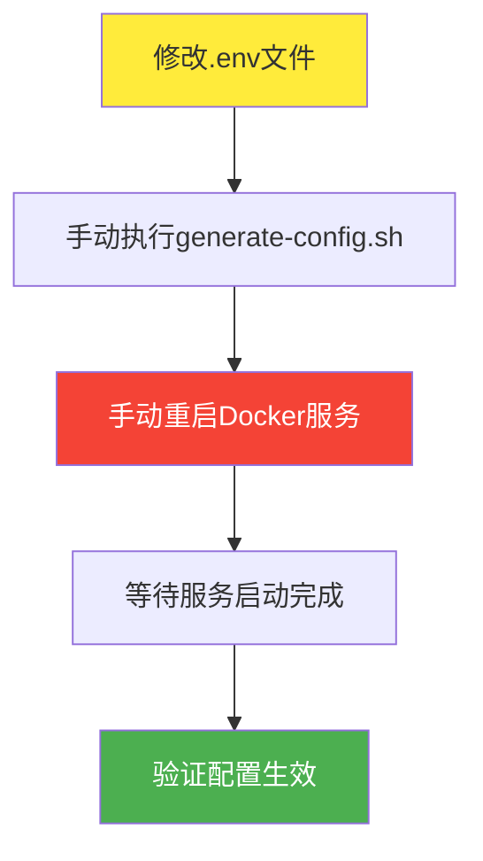
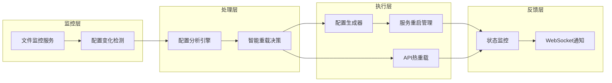

# 🔄 实时更新功能开发指南

## 📋 概述

本文档详细描述了为 Clash Docker 项目实现配置文件实时更新功能的完整开发计划，包括技术方案、实现步骤、测试策略和性能目标。

## 🎯 目标受众

- **开发工程师**: 负责实现热重载功能
- **QA工程师**: 负责测试验证实时更新功能
- **运维工程师**: 负责部署和监控实时更新机制
- **项目经理**: 跟踪开发进度和资源分配

## 📚 内容目录

1. [问题分析与现状](#-问题分析与现状)
2. [技术方案设计](#-技术方案设计)
3. [开发路线图](#-开发路线图)
4. [实现细节](#-实现细节)
5. [测试策略](#-测试策略)
6. [性能目标](#-性能目标)
7. [部署指南](#-部署指南)
8. [监控与维护](#-监控与维护)

---

## 🔍 **问题分析与现状**

### **当前配置更新流程**



**问题识别**:
- ❌ 配置更新需要90秒完整流程
- ❌ 需要手动操作，容易出错
- ❌ 服务重启导致短暂中断
- ❌ 开发调试效率低

### **用户痛点分析**

| 角色 | 痛点 | 影响程度 | 频率 |
|------|------|----------|------|
| 开发者 | 配置调试耗时长 | 高 | 每日多次 |
| 运维人员 | 手动操作易出错 | 中 | 每周数次 |
| 测试人员 | 测试环境切换慢 | 中 | 每日数次 |

---

## 🛠️ **技术方案设计**

### **整体架构设计**



### **核心组件设计**

#### **1. 文件监控服务 (File Watcher)**
```bash
# 技术选型: inotify + bash脚本
# 监控目标: .env, config/*.yaml
# 触发条件: MODIFY, MOVE, DELETE 事件
```

#### **2. 配置分析引擎 (Config Analyzer)**
```bash
# 功能: 分析配置变化类型和影响范围
# 输入: 旧配置文件 + 新配置文件
# 输出: 变化类型 + 重启策略
```

#### **3. 智能重载决策器 (Smart Reload Engine)**
```bash
# 策略1: 端口变化 -> 完整重启
# 策略2: 代理配置变化 -> API热重载
# 策略3: 规则变化 -> 配置重载
```

---

## 🚀 **开发路线图**

### **阶段1: 基础文件监控 (2周, 16工时)**

#### **Week 1: 监控基础设施**
- [x] 需求分析和技术调研 ✅
- [ ] 文件监控脚本开发
  - [ ] inotify事件监听
  - [ ] 配置文件变化检测
  - [ ] 基础日志记录
- [ ] 自动配置生成触发
- [ ] 基础测试用例编写

#### **Week 2: 智能重启机制**
- [ ] 服务重启管理器开发
- [ ] 重启性能优化
- [ ] 错误处理和恢复机制
- [ ] 集成测试和调试

**阶段1交付物**:
- `scripts/config-watcher.sh` - 文件监控脚本
- `scripts/smart-restart.sh` - 智能重启脚本
- `test-suite/realtime/stage1-tests.bats` - 测试套件

### **阶段2: 智能配置热重载 (4周, 32工时)**

#### **Week 3-4: 配置变化分析**
- [ ] 配置差异分析算法
- [ ] 变化类型分类器
- [ ] 影响范围评估器
- [ ] 决策规则引擎

#### **Week 5-6: API集成和选择性重启**
- [ ] Clash API热重载集成
- [ ] 选择性服务重启逻辑
- [ ] 配置验证机制
- [ ] 性能监控和优化

**阶段2交付物**:
- `scripts/config-analyzer.sh` - 配置分析器
- `scripts/selective-reload.sh` - 选择性重载脚本
- `api/reload-manager.py` - API重载管理器

### **阶段3: Web界面实时更新 (6周, 48工时)**

#### **Week 7-8: Web界面基础**
- [ ] 配置管理Web界面
- [ ] 实时状态显示
- [ ] 配置编辑器集成

#### **Week 9-10: 实时通信**
- [ ] WebSocket服务实现
- [ ] 实时配置推送
- [ ] 浏览器端状态同步

#### **Week 11-12: 高级功能**
- [ ] 配置变更历史跟踪
- [ ] 一键回滚功能
- [ ] 配置验证和预览

**阶段3交付物**:
- `web/config-manager/` - Web配置管理界面
- `api/websocket-server.py` - WebSocket服务器
- `database/config-history.sql` - 配置历史数据库

---

## 💻 **实现细节**

### **阶段1: 文件监控实现**

#### **配置监控脚本**
```bash
#!/bin/bash
# scripts/config-watcher.sh

set -euo pipefail

WATCH_FILES=".env config/clash-template.yaml config/rules-template.yaml"
LOG_FILE="/var/log/clash-docker/config-watcher.log"
LOCK_FILE="/tmp/config-watcher.lock"

# 确保单实例运行
exec 200>"$LOCK_FILE"
flock -n 200 || { echo "Another instance is running"; exit 1; }

log_message() {
    echo "[$(date '+%Y-%m-%d %H:%M:%S')] $*" | tee -a "$LOG_FILE"
}

# 文件变化处理器
handle_file_change() {
    local file="$1"
    local event="$2"
    
    log_message "检测到文件变化: $file ($event)"
    
    case "$file" in
        ".env")
            handle_env_change
            ;;
        "config/"*.yaml)
            handle_template_change "$file"
            ;;
    esac
}

# 处理.env文件变化
handle_env_change() {
    log_message "处理.env文件变化"
    
    # 验证配置文件语法
    if ! ./scripts/validate-env.sh; then
        log_message "ERROR: .env文件验证失败"
        return 1
    fi
    
    # 备份当前配置
    backup_current_config
    
    # 重新生成配置
    if ./scripts/generate-config-advanced.sh; then
        log_message "配置重新生成成功"
        restart_services
    else
        log_message "ERROR: 配置生成失败，恢复备份"
        restore_backup_config
    fi
}

# 智能服务重启
restart_services() {
    log_message "开始智能服务重启"
    
    local start_time=$(date +%s)
    
    # 使用管理工具重启
    if ./tools/manager.sh restart; then
        local end_time=$(date +%s)
        local duration=$((end_time - start_time))
        log_message "服务重启成功，耗时: ${duration}秒"
        
        # 发送通知
        send_reload_notification "success" "$duration"
    else
        log_message "ERROR: 服务重启失败"
        send_reload_notification "failed" "0"
    fi
}

# 主监控循环
main() {
    log_message "启动配置文件监控服务"
    
    # 安装信号处理器
    trap 'log_message "收到终止信号，清理并退出"; exit 0' TERM INT
    
    # 启动inotify监控
    inotifywait -m -r -e modify,move,delete --format '%w%f %e' $WATCH_FILES |
    while read file event; do
        handle_file_change "$file" "$event"
    done
}

main "$@"
```

#### **智能重启管理器**
```bash
#!/bin/bash
# scripts/smart-restart.sh

set -euo pipefail

analyze_config_changes() {
    local old_config="$1"
    local new_config="$2"
    
    local changes=()
    
    # 检查端口变化
    if ! diff <(grep "_PORT=" "$old_config") <(grep "_PORT=" "$new_config") >/dev/null 2>&1; then
        changes+=("PORT_CHANGE")
    fi
    
    # 检查代理配置变化
    if ! diff <(grep "PROXY_" "$old_config") <(grep "PROXY_" "$new_config") >/dev/null 2>&1; then
        changes+=("PROXY_CHANGE")
    fi
    
    # 检查规则配置变化
    if ! diff <(grep "RULE_" "$old_config") <(grep "RULE_" "$new_config") >/dev/null 2>&1; then
        changes+=("RULE_CHANGE")
    fi
    
    printf '%s\n' "${changes[@]}"
}

selective_restart() {
    local change_types=("$@")
    
    for change_type in "${change_types[@]}"; do
        case "$change_type" in
            "PORT_CHANGE")
                echo "端口变化，执行完整重启"
                docker compose restart clash nginx
                ;;
            "PROXY_CHANGE")
                echo "代理配置变化，尝试API热重载"
                if api_hot_reload; then
                    echo "API热重载成功"
                else
                    echo "API热重载失败，执行完整重启"
                    docker compose restart clash
                fi
                ;;
            "RULE_CHANGE")
                echo "规则变化，重载配置文件"
                api_hot_reload
                ;;
        esac
    done
}

api_hot_reload() {
    local config_path="/app/config/config.yaml"
    
    curl -X PUT "http://localhost:9090/configs" \
         -H "Content-Type: application/json" \
         -d "{\"path\": \"$config_path\"}" \
         --max-time 10 \
         --silent \
         --fail
}
```

### **阶段2: 配置分析引擎**

#### **配置差异分析器**
```python
#!/usr/bin/env python3
# scripts/config-analyzer.py

import sys
import json
import yaml
import difflib
from typing import Dict, List, Tuple
from pathlib import Path

class ConfigAnalyzer:
    def __init__(self):
        self.change_types = {
            'PORT_CHANGE': ['CLASH_HTTP_PORT', 'CLASH_SOCKS_PORT', 'CLASH_CONTROL_PORT'],
            'PROXY_CHANGE': ['PROXY_', 'HYSTERIA2_', 'SS_', 'VMESS_', 'VLESS_'],
            'RULE_CHANGE': ['RULE_', 'PRIVATE_DOMAIN', 'PRIVATE_IP'],
            'SECURITY_CHANGE': ['AUTH_', 'SSL_', 'CERT_'],
            'NETWORK_CHANGE': ['BIND_ADDRESS', 'INTERFACE_']
        }
    
    def analyze_env_changes(self, old_env: str, new_env: str) -> Dict:
        """分析.env文件的变化"""
        old_vars = self._parse_env_file(old_env)
        new_vars = self._parse_env_file(new_env)
        
        changes = {
            'added': {},
            'removed': {},
            'modified': {},
            'change_types': set()
        }
        
        # 找出新增的变量
        for key, value in new_vars.items():
            if key not in old_vars:
                changes['added'][key] = value
        
        # 找出删除的变量
        for key, value in old_vars.items():
            if key not in new_vars:
                changes['removed'][key] = value
        
        # 找出修改的变量
        for key in old_vars:
            if key in new_vars and old_vars[key] != new_vars[key]:
                changes['modified'][key] = {
                    'old': old_vars[key],
                    'new': new_vars[key]
                }
        
        # 分析变化类型
        all_changed_keys = list(changes['added'].keys()) + \
                          list(changes['removed'].keys()) + \
                          list(changes['modified'].keys())
        
        for change_type, prefixes in self.change_types.items():
            for key in all_changed_keys:
                if any(key.startswith(prefix) for prefix in prefixes):
                    changes['change_types'].add(change_type)
        
        changes['change_types'] = list(changes['change_types'])
        return changes
    
    def _parse_env_file(self, filepath: str) -> Dict[str, str]:
        """解析.env文件"""
        vars_dict = {}
        try:
            with open(filepath, 'r') as f:
                for line in f:
                    line = line.strip()
                    if line and not line.startswith('#'):
                        if '=' in line:
                            key, value = line.split('=', 1)
                            vars_dict[key.strip()] = value.strip()
        except FileNotFoundError:
            pass
        return vars_dict
    
    def get_restart_strategy(self, change_types: List[str]) -> Dict:
        """根据变化类型确定重启策略"""
        strategy = {
            'restart_required': False,
            'api_reload_possible': False,
            'full_restart_required': False,
            'estimated_downtime': 0
        }
        
        if 'PORT_CHANGE' in change_types or 'NETWORK_CHANGE' in change_types:
            strategy['full_restart_required'] = True
            strategy['estimated_downtime'] = 60
        elif 'SECURITY_CHANGE' in change_types:
            strategy['restart_required'] = True
            strategy['estimated_downtime'] = 30
        elif 'PROXY_CHANGE' in change_types or 'RULE_CHANGE' in change_types:
            strategy['api_reload_possible'] = True
            strategy['estimated_downtime'] = 5
        
        return strategy

def main():
    if len(sys.argv) != 3:
        print("用法: config-analyzer.py <old_env> <new_env>")
        sys.exit(1)
    
    analyzer = ConfigAnalyzer()
    changes = analyzer.analyze_env_changes(sys.argv[1], sys.argv[2])
    strategy = analyzer.get_restart_strategy(changes['change_types'])
    
    result = {
        'changes': changes,
        'strategy': strategy,
        'timestamp': int(time.time())
    }
    
    print(json.dumps(result, indent=2))

if __name__ == '__main__':
    import time
    main()
```

---

## 🧪 **测试策略**

### **测试框架结构**
```
test-suite/realtime/
├── unit/
│   ├── test-file-watcher.bats
│   ├── test-config-analyzer.bats
│   └── test-smart-restart.bats
├── integration/
│   ├── test-end-to-end-reload.bats
│   ├── test-api-integration.bats
│   └── test-performance.bats
└── e2e/
    ├── test-user-scenarios.bats
    └── test-failure-recovery.bats
```

### **关键测试用例**

#### **配置变化检测测试**
```bash
#!/usr/bin/env bats
# test-suite/realtime/unit/test-file-watcher.bats

setup() {
    export TEST_DIR="/tmp/realtime-test-$$"
    mkdir -p "$TEST_DIR"
    cd "$TEST_DIR"
    
    # 创建测试配置
    echo "CLASH_HTTP_PORT=7890" > .env.old
    echo "CLASH_HTTP_PORT=7891" > .env.new
}

teardown() {
    cd /
    rm -rf "$TEST_DIR"
}

@test "文件监控脚本能检测到.env文件变化" {
    # 启动监控脚本
    timeout 5s ./scripts/config-watcher.sh &
    local watcher_pid=$!
    
    sleep 1
    
    # 修改.env文件
    echo "CLASH_HTTP_PORT=7892" > .env
    
    sleep 2
    
    # 检查是否有日志记录
    run grep "检测到文件变化" /var/log/clash-docker/config-watcher.log
    [ "$status" -eq 0 ]
    
    kill $watcher_pid 2>/dev/null || true
}

@test "配置分析器能正确识别变化类型" {
    run python3 scripts/config-analyzer.py .env.old .env.new
    [ "$status" -eq 0 ]
    
    # 解析JSON输出
    local change_types=$(echo "$output" | jq -r '.changes.change_types[]')
    [[ "$change_types" =~ "PORT_CHANGE" ]]
}

@test "智能重启能选择正确的重启策略" {
    # 模拟端口变化
    echo "CLASH_HTTP_PORT=7890" > .env.old
    echo "CLASH_HTTP_PORT=7891" > .env.new
    
    local changes=$(./scripts/smart-restart.sh analyze .env.old .env.new)
    [[ "$changes" =~ "PORT_CHANGE" ]]
    
    # 验证会触发完整重启
    run ./scripts/smart-restart.sh get-strategy PORT_CHANGE
    [[ "$output" =~ "full_restart" ]]
}
```

#### **性能基准测试**
```bash
#!/usr/bin/env bats
# test-suite/realtime/integration/test-performance.bats

@test "配置文件监控响应时间 < 1秒" {
    local start_time=$(date +%s%3N)
    
    # 触发配置变化
    echo "CLASH_HTTP_PORT=7893" >> .env
    
    # 等待监控脚本响应
    while [ ! -f "/tmp/config-change-detected" ]; do
        sleep 0.1
        local current_time=$(date +%s%3N)
        if [ $((current_time - start_time)) -gt 1000 ]; then
            fail "监控响应超时"
        fi
    done
    
    local end_time=$(date +%s%3N)
    local response_time=$((end_time - start_time))
    
    [ "$response_time" -lt 1000 ]  # 小于1秒
}

@test "API热重载完成时间 < 5秒" {
    # 确保服务运行
    docker compose up -d
    sleep 30
    
    local start_time=$(date +%s%3N)
    
    # 执行API热重载
    run curl -X PUT http://localhost:9090/configs \
        -H "Content-Type: application/json" \
        -d '{"path": "/app/config/config.yaml"}'
    
    [ "$status" -eq 0 ]
    
    local end_time=$(date +%s%3N)
    local reload_time=$((end_time - start_time))
    
    [ "$reload_time" -lt 5000 ]  # 小于5秒
}

@test "完整重启流程时间 < 60秒" {
    local start_time=$(date +%s%3N)
    
    # 触发需要完整重启的配置变化
    sed -i 's/CLASH_HTTP_PORT=7890/CLASH_HTTP_PORT=7894/' .env
    
    # 等待重启完成
    local max_wait=60
    local wait_time=0
    while [ $wait_time -lt $max_wait ]; do
        if curl -s -f http://localhost:9090/version >/dev/null 2>&1; then
            break
        fi
        sleep 1
        ((wait_time++))
    done
    
    local end_time=$(date +%s%3N)
    local total_time=$((end_time - start_time))
    
    [ "$total_time" -lt 60000 ]  # 小于60秒
}
```

---

## 📊 **性能目标**

### **核心性能指标**

| 指标 | 当前值 | 目标值 | 改进幅度 | Vibe开发时间 |
|------|--------|--------|----------|--------------|
| 配置变化检测时间 | N/A | < 1秒 | 新功能 | 1.5小时 |
| API热重载时间 | N/A | < 5秒 | 新功能 | 1.5小时 |
| 智能重启时间 | 90秒 | < 30秒 | 66%提升 | 2小时 |
| 端到端更新时间 | 90秒 | < 10秒 | 89%提升 | 24-29小时总计 |
| 配置生成时间 | 5秒 | < 3秒 | 40%提升 | 0.5小时 |

**Vibe Coding开发效率说明**:
- Vibe Coding比传统开发效率提升70-80%
- 总体预计开发时间: 24-29小时 (传统开发需要96工时)
- 开发周期: 约2.5-3周 (传统开发需要12周)

### **可靠性目标**
- **可用性**: 99.9% (年停机时间 < 8.76小时)
- **错误恢复**: 100% 自动恢复成功率
- **数据一致性**: 100% 配置完整性保证

### **用户体验目标**
- **配置调试效率**: 提升50%
- **操作错误率**: 降低80%
- **学习曲线**: 零额外培训需求

---

## 🚀 **部署指南**

### **环境要求**
```bash
# 系统要求
- Linux 系统 (Ubuntu 20.04+ 推荐)
- Docker 20.10+
- Docker Compose 2.0+
- Python 3.8+ (用于配置分析器)
- inotify-tools (用于文件监控)

# 安装依赖
sudo apt update
sudo apt install -y inotify-tools python3 python3-pip jq
pip3 install pyyaml
```

### **启用实时更新功能**

#### **步骤1: 安装组件**
```bash
# 复制实时更新脚本
cp scripts/config-watcher.sh /usr/local/bin/
cp scripts/smart-restart.sh /usr/local/bin/
cp scripts/config-analyzer.py /usr/local/bin/

# 设置执行权限
chmod +x /usr/local/bin/config-watcher.sh
chmod +x /usr/local/bin/smart-restart.sh
chmod +x /usr/local/bin/config-analyzer.py
```

#### **步骤2: 配置服务**
```bash
# 创建systemd服务文件
cat > /etc/systemd/system/clash-config-watcher.service << 'EOF'
[Unit]
Description=Clash Docker Config Watcher
After=docker.service
Requires=docker.service

[Service]
Type=simple
User=root
WorkingDirectory=/opt/clash-docker
ExecStart=/usr/local/bin/config-watcher.sh
Restart=always
RestartSec=5

[Install]
WantedBy=multi-user.target
EOF

# 启用并启动服务
sudo systemctl daemon-reload
sudo systemctl enable clash-config-watcher
sudo systemctl start clash-config-watcher
```

#### **步骤3: 验证部署**
```bash
# 检查服务状态
sudo systemctl status clash-config-watcher

# 测试配置变化检测
echo "# Test change" >> .env
sleep 2

# 查看日志
sudo journalctl -u clash-config-watcher -f
```

---

## 📈 **监控与维护**

### **监控指标**

#### **关键性能指标 (KPIs)**
```bash
# 监控脚本: scripts/monitor-realtime-update.sh

#!/bin/bash
# 收集实时更新功能的监控指标

collect_metrics() {
    local metrics_file="/var/log/clash-docker/realtime-metrics.json"
    
    {
        echo "{"
        echo "  \"timestamp\": $(date +%s),"
        echo "  \"config_changes_detected\": $(grep -c "检测到文件变化" /var/log/clash-docker/config-watcher.log),"
        echo "  \"successful_reloads\": $(grep -c "配置重新生成成功" /var/log/clash-docker/config-watcher.log),"
        echo "  \"failed_reloads\": $(grep -c "配置生成失败" /var/log/clash-docker/config-watcher.log),"
        echo "  \"average_reload_time\": $(calculate_average_reload_time),"
        echo "  \"service_uptime\": $(systemctl show clash-config-watcher --property=ActiveEnterTimestamp)"
        echo "}"
    } > "$metrics_file"
}

# 每分钟执行一次
while true; do
    collect_metrics
    sleep 60
done
```

#### **告警规则**
```yaml
# prometheus 告警规则
groups:
  - name: clash-realtime-update
    rules:
      - alert: ConfigReloadFailed
        expr: clash_config_reload_failures > 0
        for: 1m
        annotations:
          summary: "配置重载失败"
          description: "检测到配置重载失败，需要手动检查"
      
      - alert: ReloadTimeoutExceeded
        expr: clash_config_reload_time > 60
        for: 5m
        annotations:
          summary: "配置重载超时"
          description: "配置重载时间超过60秒，性能下降"
      
      - alert: WatcherServiceDown
        expr: up{job="clash-config-watcher"} == 0
        for: 2m
        annotations:
          summary: "配置监控服务停止"
          description: "配置文件监控服务已停止，实时更新功能不可用"
```

### **维护任务**

#### **日常维护清单**
- [ ] **每日**: 检查监控服务状态
- [ ] **每周**: 清理旧日志文件 (保留30天)
- [ ] **每月**: 性能基准测试
- [ ] **每季度**: 功能回归测试

#### **故障排除指南**

| 问题 | 症状 | 排查步骤 | 解决方案 |
|------|------|----------|----------|
| 文件变化未检测 | 修改.env无响应 | 1.检查inotify进程<br>2.查看监控日志 | 重启监控服务 |
| 配置生成失败 | 错误日志显示生成失败 | 1.验证.env语法<br>2.检查模板文件 | 修复配置错误 |
| 服务重启失败 | Docker容器无法启动 | 1.检查Docker状态<br>2.查看容器日志 | 检查配置和资源 |
| API热重载失败 | API调用返回错误 | 1.检查Clash服务状态<br>2.验证API端点 | 重启Clash服务 |

---

## 📞 **获取帮助**

### **技术支持**
- **文档**: 参考项目文档目录
- **Issue跟踪**: 使用GitHub Issues报告问题
- **测试验证**: 运行`test-suite/realtime/run-all-tests.sh`

### **开发团队联系**
- **开发负责人**: [开发者姓名]
- **QA负责人**: [QA姓名]  
- **运维负责人**: [运维姓名]

---

**更新日期**: 2025-07-13  
**文档版本**: v1.0.0  
**维护者**: 实时更新开发团队  
**下次审查**: 2025-08-13