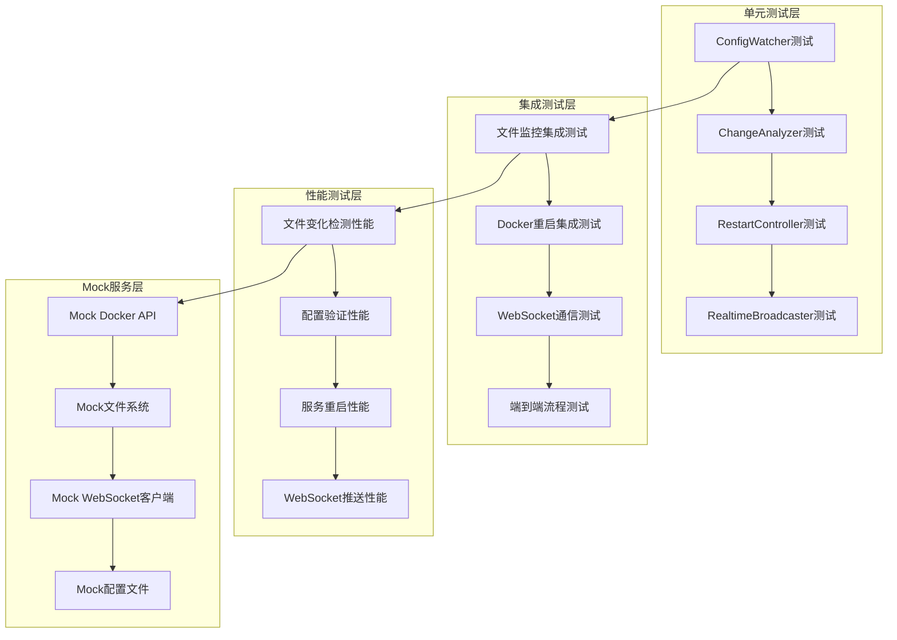

# 🧪 Node.js热重载测试框架文档

## 📋 概述

本文档详细描述了基于 **Node.js技术栈** 的Clash Docker热重载功能测试框架，包括Jest单元测试、Supertest集成测试、文件监控测试、性能基准测试等完整的测试解决方案。

## 🎯 目标受众

- **Node.js测试工程师**: 编写和维护热重载测试用例
- **QA工程师**: 执行自动化测试和性能验证
- **DevOps工程师**: 集成测试到CI/CD流水线
- **开发工程师**: 理解测试覆盖范围和测试策略

## 💻 **技术栈**

### **测试技术栈 - Node.js生态**
- **测试运行器**: Jest 29+
- **HTTP测试**: Supertest
- **Mock工具**: Jest Mocks + MSW
- **类型检查**: TypeScript + @types/jest
- **覆盖率**: Istanbul (Jest内置)
- **性能测试**: Benchmark.js
- **Docker测试**: Testcontainers Node.js
- **文件系统**: memfs (内存文件系统)

## 📚 内容目录

1. [测试架构设计](#-测试架构设计)
2. [环境搭建](#-环境搭建)
3. [单元测试套件](#-单元测试套件)
4. [集成测试框架](#-集成测试框架)
5. [性能基准测试](#-性能基准测试)
6. [测试数据管理](#-测试数据管理)
7. [CI/CD集成](#-cicd集成)
8. [测试报告](#-测试报告)

---

## 🏗️ **测试架构设计**

### **整体测试架构**



### **测试分层策略**

```typescript
// tests/架构结构
tests/
├── unit/                    // 单元测试
│   ├── services/
│   │   ├── ConfigWatcher.test.ts
│   │   ├── ChangeAnalyzer.test.ts
│   │   ├── RestartController.test.ts
│   │   └── RealtimeBroadcaster.test.ts
│   └── utils/
│       ├── MemoryManager.test.ts
│       └── DebouncedWatcher.test.ts
├── integration/             // 集成测试
│   ├── file-monitoring.test.ts
│   ├── docker-restart.test.ts
│   ├── websocket-communication.test.ts
│   └── end-to-end.test.ts
├── performance/             // 性能测试
│   ├── file-detection.bench.ts
│   ├── config-validation.bench.ts
│   └── restart-timing.bench.ts
├── fixtures/                // 测试数据
│   ├── configs/
│   └── mocks/
└── utils/                   // 测试工具
    ├── test-helpers.ts
    ├── docker-mock.ts
    └── file-system-mock.ts
```

---

## 🛠️ **环境搭建**

### **依赖安装**

```json
{
  "name": "clash-docker-hot-reload-tests",
  "version": "1.0.0",
  "scripts": {
    "test": "jest",
    "test:watch": "jest --watch",
    "test:coverage": "jest --coverage",
    "test:integration": "jest --testMatch='**/integration/**/*.test.ts'",
    "test:unit": "jest --testMatch='**/unit/**/*.test.ts'",
    "test:performance": "node tests/performance/run-benchmarks.js",
    "test:e2e": "jest --testMatch='**/end-to-end.test.ts'",
    "test:ci": "jest --ci --coverage --watchAll=false"
  },
  "devDependencies": {
    "@types/jest": "^29.5.0",
    "@types/node": "^18.15.0",
    "@types/supertest": "^2.0.12",
    "benchmark": "^2.1.4",
    "jest": "^29.5.0",
    "memfs": "^4.2.0",
    "msw": "^1.2.0",
    "supertest": "^6.3.0",
    "testcontainers": "^9.7.0",
    "ts-jest": "^29.1.0",
    "typescript": "^5.0.0"
  },
  "dependencies": {
    "chokidar": "^3.5.3",
    "dockerode": "^3.3.5",
    "dotenv": "^16.0.3",
    "express": "^4.18.2",
    "joi": "^17.9.0",
    "socket.io": "^4.6.0",
    "socket.io-client": "^4.6.0"
  }
}
```

### **Jest配置**

```typescript
// jest.config.ts
import type { Config } from 'jest';

const config: Config = {
  preset: 'ts-jest',
  testEnvironment: 'node',
  roots: ['<rootDir>/src', '<rootDir>/tests'],
  testMatch: [
    '**/__tests__/**/*.ts',
    '**/?(*.)+(spec|test).ts'
  ],
  transform: {
    '^.+\\.ts$': 'ts-jest',
  },
  collectCoverageFrom: [
    'src/**/*.ts',
    '!src/**/*.d.ts',
    '!src/**/*.test.ts',
    '!src/**/index.ts'
  ],
  coverageDirectory: 'coverage',
  coverageReporters: [
    'text',
    'text-summary',
    'html',
    'lcov'
  ],
  coverageThreshold: {
    global: {
      branches: 80,
      functions: 80,
      lines: 80,
      statements: 80
    }
  },
  setupFilesAfterEnv: ['<rootDir>/tests/setup.ts'],
  testTimeout: 30000,
  verbose: true,
  // 性能测试单独配置
  projects: [
    {
      displayName: 'unit',
      testMatch: ['<rootDir>/tests/unit/**/*.test.ts']
    },
    {
      displayName: 'integration',
      testMatch: ['<rootDir>/tests/integration/**/*.test.ts'],
      testTimeout: 60000
    }
  ]
};

export default config;
```

### **测试环境设置**

```typescript
// tests/setup.ts
import { jest } from '@jest/globals';

// 设置测试环境变量
process.env.NODE_ENV = 'test';
process.env.CLASH_SECRET = 'test-secret-123';
process.env.CLASH_HTTP_PORT = '17890';
process.env.CLASH_SOCKS_PORT = '17891';

// 全局测试超时
jest.setTimeout(30000);

// Mock Docker Socket (避免真实Docker操作)
jest.mock('dockerode', () => {
  return jest.fn().mockImplementation(() => ({
    getContainer: jest.fn().mockReturnValue({
      inspect: jest.fn(),
      start: jest.fn(),
      stop: jest.fn(),
      restart: jest.fn()
    }),
    listContainers: jest.fn().mockResolvedValue([])
  }));
});

// 全局清理
afterEach(() => {
  jest.clearAllMocks();
});
```

---

## 🧪 **单元测试套件**

### **ConfigWatcher测试**

```typescript
// tests/unit/services/ConfigWatcher.test.ts
import { ConfigFileWatcher, ConfigChange } from '../../../src/services/ConfigFileWatcher';
import { vol } from 'memfs';
import * as chokidar from 'chokidar';

// Mock chokidar
jest.mock('chokidar');
const mockChokidar = chokidar as jest.Mocked<typeof chokidar>;

// Mock文件系统
jest.mock('fs', () => require('memfs').fs);

describe('ConfigFileWatcher', () => {
  let watcher: ConfigFileWatcher;
  let mockWatcherInstance: any;
  
  beforeEach(() => {
    // 重置内存文件系统
    vol.reset();
    
    // 设置Mock Chokidar实例
    mockWatcherInstance = {
      on: jest.fn().mockReturnThis(),
      close: jest.fn()
    };
    
    mockChokidar.watch.mockReturnValue(mockWatcherInstance);
    
    // 创建测试实例
    watcher = new ConfigFileWatcher(['.env', 'rules/']);
  });
  
  afterEach(() => {
    watcher.stop();
    vol.reset();
  });
  
  describe('文件监控功能', () => {
    test('应该正确初始化文件监控', () => {
      expect(mockChokidar.watch).toHaveBeenCalledWith(
        ['.env', 'rules/'],
        expect.objectContaining({
          ignored: /(^|[\/\\])\../,
          persistent: true,
          ignoreInitial: false
        })
      );
    });
    
    test('应该设置正确的事件监听器', () => {
      expect(mockWatcherInstance.on).toHaveBeenCalledWith('add', expect.any(Function));
      expect(mockWatcherInstance.on).toHaveBeenCalledWith('change', expect.any(Function));
      expect(mockWatcherInstance.on).toHaveBeenCalledWith('unlink', expect.any(Function));
      expect(mockWatcherInstance.on).toHaveBeenCalledWith('error', expect.any(Function));
    });
  });
  
  describe('配置变化检测', () => {
    test('应该检测到.env文件新增', async () => {
      // 准备测试数据
      const envContent = `
CLASH_SECRET=new-secret
CLASH_HTTP_PORT=7890
JP_HYSTERIA2_SERVER=new.server.com
      `.trim();
      
      vol.fromJSON({
        '.env': envContent
      });
      
      // 模拟文件变化事件
      const changePromise = new Promise<ConfigChange>((resolve) => {
        watcher.on('configChange', resolve);
      });
      
      // 触发文件变化
      const addHandler = mockWatcherInstance.on.mock.calls
        .find(([event]) => event === 'add')[1];
      
      await addHandler('.env');
      
      // 验证结果
      const change = await changePromise;
      expect(change).toMatchObject({
        filePath: '.env',
        changeType: 'added',
        severity: expect.any(String),
        affectedServices: expect.arrayContaining(['clash'])
      });
    });
    
    test('应该正确分析配置变化严重程度', async () => {
      // 测试关键配置变化
      const criticalConfig = `
CLASH_SECRET=critical-change
CLASH_EXTERNAL_CONTROLLER=0.0.0.0:19090
      `.trim();
      
      vol.fromJSON({ '.env': criticalConfig });
      
      const change = await watcher.analyzeChange('.env', 'modified');
      
      expect(change.severity).toBe('critical');
      expect(change.affectedServices).toContain('clash');
    });
    
    test('应该正确处理规则文件变化', async () => {
      const changePromise = new Promise<ConfigChange>((resolve) => {
        watcher.on('configChange', resolve);
      });
      
      // 触发规则文件变化
      const changeHandler = mockWatcherInstance.on.mock.calls
        .find(([event]) => event === 'change')[1];
      
      await changeHandler('rules/custom.yaml');
      
      const change = await changePromise;
      expect(change).toMatchObject({
        filePath: 'rules/custom.yaml',
        changeType: 'changed',
        severity: 'moderate',
        affectedServices: ['clash']
      });
    });
  });
  
  describe('防抖动机制', () => {
    test('应该在指定时间内合并多次变化', async () => {
      const changes: ConfigChange[] = [];
      watcher.on('configChange', (change) => changes.push(change));
      
      // 快速连续触发多次变化
      const changeHandler = mockWatcherInstance.on.mock.calls
        .find(([event]) => event === 'change')[1];
      
      await changeHandler('.env');
      await changeHandler('.env');
      await changeHandler('.env');
      
      // 等待防抖时间
      await new Promise(resolve => setTimeout(resolve, 2500));
      
      // 应该只有一个合并后的变化事件
      expect(changes).toHaveLength(1);
    });
  });
  
  describe('错误处理', () => {
    test('应该处理文件读取错误', async () => {
      // 模拟文件不存在的情况
      const errorPromise = new Promise<Error>((resolve) => {
        watcher.on('error', resolve);
      });
      
      const changeHandler = mockWatcherInstance.on.mock.calls
        .find(([event]) => event === 'change')[1];
      
      await changeHandler('non-existent.env');
      
      // 不应该抛出错误，应该通过错误事件处理
      expect(watcher.listenerCount('error')).toBeGreaterThan(0);
    });
  });
});
```

### **ChangeAnalyzer测试**

```typescript
// tests/unit/services/ChangeAnalyzer.test.ts
import { ChangeAnalyzer, ChangeAnalysis } from '../../../src/services/ChangeAnalyzer';

describe('ChangeAnalyzer', () => {
  let analyzer: ChangeAnalyzer;
  
  beforeEach(() => {
    analyzer = new ChangeAnalyzer();
  });
  
  describe('配置差异分析', () => {
    test('应该检测到新增的配置项', () => {
      const oldConfig = {
        CLASH_SECRET: 'old-secret',
        CLASH_HTTP_PORT: '7890'
      };
      
      const newConfig = {
        CLASH_SECRET: 'old-secret',
        CLASH_HTTP_PORT: '7890',
        JP_HYSTERIA2_SERVER: 'new.server.com'
      };
      
      const analysis = analyzer.analyzeEnvChanges(oldConfig, newConfig);
      
      expect(analysis).toMatchObject({
        added: ['JP_HYSTERIA2_SERVER'],
        removed: [],
        modified: [],
        severity: 'moderate'
      });
    });
    
    test('应该检测到修改的配置项', () => {
      const oldConfig = {
        CLASH_SECRET: 'old-secret',
        JP_HYSTERIA2_PASSWORD: 'old-password'
      };
      
      const newConfig = {
        CLASH_SECRET: 'new-secret',
        JP_HYSTERIA2_PASSWORD: 'new-password'
      };
      
      const analysis = analyzer.analyzeEnvChanges(oldConfig, newConfig);
      
      expect(analysis).toMatchObject({
        added: [],
        removed: [],
        modified: ['CLASH_SECRET', 'JP_HYSTERIA2_PASSWORD'],
        severity: 'critical' // CLASH_SECRET是关键配置
      });
    });
    
    test('应该检测到删除的配置项', () => {
      const oldConfig = {
        CLASH_SECRET: 'secret',
        CLASH_HTTP_PORT: '7890',
        OBSOLETE_CONFIG: 'value'
      };
      
      const newConfig = {
        CLASH_SECRET: 'secret',
        CLASH_HTTP_PORT: '7890'
      };
      
      const analysis = analyzer.analyzeEnvChanges(oldConfig, newConfig);
      
      expect(analysis).toMatchObject({
        added: [],
        removed: ['OBSOLETE_CONFIG'],
        modified: [],
        severity: 'minor'
      });
    });
  });
  
  describe('严重程度分级', () => {
    test('关键配置变化应该标记为critical', () => {
      const changes = [
        'CLASH_SECRET',
        'CLASH_EXTERNAL_CONTROLLER',
        'COMPOSE_PROJECT_NAME'
      ];
      
      changes.forEach(key => {
        const severity = analyzer.getKeySeverity(key);
        expect(severity).toBe('critical');
      });
    });
    
    test('代理配置变化应该标记为moderate', () => {
      const changes = [
        'JP_HYSTERIA2_SERVER',
        'SJC_SHADOWSOCKS_PASSWORD',
        'ANY_CONFIG_UUID',
        'CLASH_HTTP_PORT'
      ];
      
      changes.forEach(key => {
        const severity = analyzer.getKeySeverity(key);
        expect(severity).toBe('moderate');
      });
    });
    
    test('一般配置变化应该标记为minor', () => {
      const changes = [
        'CLASH_LOG_LEVEL',
        'CLASH_IPV6',
        'UNKNOWN_CONFIG'
      ];
      
      changes.forEach(key => {
        const severity = analyzer.getKeySeverity(key);
        expect(severity).toBe('minor');
      });
    });
  });
  
  describe('影响服务分析', () => {
    test('应该正确识别影响的服务', () => {
      const changedKeys = [
        'CLASH_SECRET',
        'JP_HYSTERIA2_SERVER',
        'NGINX_PORT'
      ];
      
      const affectedServices = analyzer.getAffectedServices(changedKeys);
      
      expect(affectedServices).toEqual(
        expect.arrayContaining(['clash', 'nginx'])
      );
    });
    
    test('未知配置应该默认影响clash服务', () => {
      const changedKeys = ['UNKNOWN_CONFIG'];
      
      const affectedServices = analyzer.getAffectedServices(changedKeys);
      
      expect(affectedServices).toEqual(['clash']);
    });
  });
  
  describe('配置验证', () => {
    test('应该验证有效的配置', () => {
      const validConfig = {
        CLASH_SECRET: 'valid-secret-123456',
        CLASH_HTTP_PORT: '7890',
        CLASH_SOCKS_PORT: '7891',
        CLASH_EXTERNAL_CONTROLLER: '127.0.0.1:19090'
      };
      
      const result = analyzer.validateConfig(validConfig);
      
      expect(result.isValid).toBe(true);
      expect(result.errors).toHaveLength(0);
    });
    
    test('应该检测无效的配置', () => {
      const invalidConfig = {
        CLASH_SECRET: 'short', // 太短
        CLASH_HTTP_PORT: 'invalid', // 非数字
        // 缺少必需的配置
      };
      
      const result = analyzer.validateConfig(invalidConfig);
      
      expect(result.isValid).toBe(false);
      expect(result.errors.length).toBeGreaterThan(0);
    });
  });
});
```

### **RestartController测试**

```typescript
// tests/unit/services/RestartController.test.ts
import { SmartRestartController } from '../../../src/services/SmartRestartController';
import { ConfigChange } from '../../../src/services/ConfigFileWatcher';
import Docker from 'dockerode';

// Mock Docker
jest.mock('dockerode');

describe('SmartRestartController', () => {
  let controller: SmartRestartController;
  let mockDocker: jest.Mocked<Docker>;
  let mockContainer: any;
  
  beforeEach(() => {
    mockContainer = {
      inspect: jest.fn(),
      start: jest.fn(),
      stop: jest.fn(),
      restart: jest.fn()
    };
    
    mockDocker = {
      getContainer: jest.fn().mockReturnValue(mockContainer)
    } as any;
    
    (Docker as jest.MockedClass<typeof Docker>).mockImplementation(() => mockDocker);
    
    controller = new SmartRestartController('test-project');
  });
  
  describe('重启策略决策', () => {
    test('critical变化应该选择全量重启', () => {
      const criticalChange: ConfigChange = {
        timestamp: new Date().toISOString(),
        filePath: '.env',
        changeType: 'modified',
        severity: 'critical',
        affectedServices: ['clash']
      };
      
      const strategy = controller.determineRestartStrategy(criticalChange);
      expect(strategy).toBe('full');
    });
    
    test('moderate变化应该选择选择性重启', () => {
      const moderateChange: ConfigChange = {
        timestamp: new Date().toISOString(),
        filePath: '.env',
        changeType: 'modified',
        severity: 'moderate',
        affectedServices: ['clash']
      };
      
      const strategy = controller.determineRestartStrategy(moderateChange);
      expect(strategy).toBe('selective');
    });
    
    test('minor变化应该选择配置重载', () => {
      const minorChange: ConfigChange = {
        timestamp: new Date().toISOString(),
        filePath: '.env',
        changeType: 'modified',
        severity: 'minor',
        affectedServices: ['clash']
      };
      
      const strategy = controller.determineRestartStrategy(minorChange);
      expect(strategy).toBe('reload');
    });
  });
  
  describe('服务重启执行', () => {
    test('应该按正确顺序重启服务', async () => {
      // Mock容器状态
      mockContainer.inspect.mockResolvedValue({
        State: { Running: true }
      });
      
      const services = ['clash', 'nginx'];
      const results = await controller.selectiveRestart(services);
      
      expect(results).toHaveLength(2);
      expect(results[0].service).toBe('nginx'); // nginx应该先重启
      expect(results[1].service).toBe('clash');
    });
    
    test('应该处理重启失败的情况', async () => {
      mockContainer.stop.mockRejectedValue(new Error('Stop failed'));
      
      const services = ['clash'];
      const results = await controller.selectiveRestart(services);
      
      expect(results[0]).toMatchObject({
        success: false,
        service: 'clash',
        error: expect.stringContaining('Stop failed')
      });
    });
    
    test('应该等待容器健康检查', async () => {
      mockContainer.inspect
        .mockResolvedValueOnce({ State: { Running: true } }) // 预检
        .mockResolvedValueOnce({ State: { Running: false } }) // 停止后
        .mockResolvedValueOnce({ 
          State: { 
            Running: true, 
            Health: { Status: 'healthy' } 
          } 
        }); // 启动后
      
      const result = await controller.restartServiceGracefully('clash');
      
      expect(mockContainer.inspect).toHaveBeenCalledTimes(3);
    });
  });
  
  describe('依赖关系管理', () => {
    test('应该计算正确的重启顺序', () => {
      const services = ['clash', 'nginx', 'web-ui'];
      const order = controller.calculateRestartOrder(services);
      
      // 期望顺序：web-ui -> nginx -> clash
      expect(order).toEqual(['web-ui', 'nginx', 'clash']);
    });
    
    test('应该处理循环依赖', () => {
      // 测试边界情况：避免无限循环
      const services = ['service-a'];
      const order = controller.calculateRestartOrder(services);
      
      expect(order).toHaveLength(1);
      expect(order[0]).toBe('service-a');
    });
  });
  
  describe('健康检查', () => {
    test('应该验证服务重启前状态', async () => {
      mockContainer.inspect.mockResolvedValue({
        State: { Running: false }
      });
      
      await expect(
        controller.preRestartHealthCheck('clash')
      ).rejects.toThrow('Service clash is not running');
    });
    
    test('应该等待服务就绪', async () => {
      let callCount = 0;
      mockContainer.inspect.mockImplementation(() => {
        callCount++;
        if (callCount === 1) {
          return Promise.resolve({
            State: { Running: true, Health: { Status: 'starting' } }
          });
        } else {
          return Promise.resolve({
            State: { Running: true, Health: { Status: 'healthy' } }
          });
        }
      });
      
      await controller.waitForServiceHealth('clash');
      
      expect(mockContainer.inspect).toHaveBeenCalledTimes(2);
    });
    
    test('应该处理健康检查超时', async () => {
      mockContainer.inspect.mockResolvedValue({
        State: { Running: true, Health: { Status: 'unhealthy' } }
      });
      
      await expect(
        controller.waitForServiceHealth('clash', 1000) // 1秒超时
      ).rejects.toThrow('Container ready timeout');
    });
  });
});
```

---

## 🔗 **集成测试框架**

### **文件监控集成测试**

```typescript
// tests/integration/file-monitoring.test.ts
import { ConfigFileWatcher } from '../../src/services/ConfigFileWatcher';
import { SmartRestartController } from '../../src/services/SmartRestartController';
import { promises as fs } from 'fs';
import path from 'path';
import os from 'os';

describe('文件监控集成测试', () => {
  let testDir: string;
  let watcher: ConfigFileWatcher;
  let controller: SmartRestartController;
  
  beforeAll(async () => {
    // 创建临时测试目录
    testDir = await fs.mkdtemp(path.join(os.tmpdir(), 'hot-reload-test-'));
  });
  
  afterAll(async () => {
    // 清理测试目录
    await fs.rmdir(testDir, { recursive: true });
  });
  
  beforeEach(() => {
    watcher = new ConfigFileWatcher([path.join(testDir, '.env')]);
    controller = new SmartRestartController('test-project');
  });
  
  afterEach(() => {
    watcher.stop();
  });
  
  test('应该检测到真实文件系统的配置变化', async () => {
    const envPath = path.join(testDir, '.env');
    
    // 创建初始配置文件
    await fs.writeFile(envPath, `
CLASH_SECRET=initial-secret
CLASH_HTTP_PORT=7890
    `.trim());
    
    // 等待文件创建事件
    const changePromise = new Promise((resolve) => {
      watcher.on('configChange', resolve);
    });
    
    // 修改配置文件
    await fs.writeFile(envPath, `
CLASH_SECRET=updated-secret
CLASH_HTTP_PORT=7890
JP_HYSTERIA2_SERVER=new.server.com
    `.trim());
    
    const change = await changePromise;
    
    expect(change).toMatchObject({
      filePath: envPath,
      changeType: 'modified',
      severity: 'critical' // CLASH_SECRET变化
    });
  }, 10000);
  
  test('应该处理多个文件同时变化', async () => {
    const envPath = path.join(testDir, '.env');
    const rulesDir = path.join(testDir, 'rules');
    
    await fs.mkdir(rulesDir, { recursive: true });
    
    const changes: any[] = [];
    watcher.on('configChange', (change) => changes.push(change));
    
    // 同时创建多个文件
    await Promise.all([
      fs.writeFile(envPath, 'CLASH_SECRET=test'),
      fs.writeFile(path.join(rulesDir, 'custom.yaml'), 'rules: []')
    ]);
    
    // 等待所有变化被检测
    await new Promise(resolve => setTimeout(resolve, 3000));
    
    expect(changes.length).toBeGreaterThanOrEqual(2);
  }, 15000);
  
  test('应该正确处理文件删除', async () => {
    const configPath = path.join(testDir, 'temp-config.env');
    
    // 创建临时配置文件
    await fs.writeFile(configPath, 'TEMP_CONFIG=value');
    
    const watcher2 = new ConfigFileWatcher([configPath]);
    
    const deletePromise = new Promise((resolve) => {
      watcher2.on('configChange', (change) => {
        if (change.changeType === 'unlinked') {
          resolve(change);
        }
      });
    });
    
    // 删除文件
    await fs.unlink(configPath);
    
    const change = await deletePromise;
    expect(change).toMatchObject({
      filePath: configPath,
      changeType: 'unlinked'
    });
    
    watcher2.stop();
  }, 10000);
});
```

### **Docker重启集成测试**

```typescript
// tests/integration/docker-restart.test.ts
import { GenericContainer, StartedTestContainer } from 'testcontainers';
import { SmartRestartController } from '../../src/services/SmartRestartController';
import Docker from 'dockerode';

describe('Docker重启集成测试', () => {
  let testContainer: StartedTestContainer;
  let controller: SmartRestartController;
  let docker: Docker;
  
  beforeAll(async () => {
    // 启动测试容器
    testContainer = await new GenericContainer('nginx:alpine')
      .withName('hot-reload-test-nginx')
      .withExposedPorts(80)
      .start();
    
    docker = new Docker();
    controller = new SmartRestartController();
  }, 60000);
  
  afterAll(async () => {
    if (testContainer) {
      await testContainer.stop();
    }
  });
  
  test('应该能够重启真实Docker容器', async () => {
    const containerName = testContainer.getName();
    
    // 获取容器初始状态
    const initialInfo = await docker.getContainer(containerName).inspect();
    const initialStartTime = initialInfo.State.StartedAt;
    
    // 执行重启
    await controller.restartServiceGracefully(containerName.replace('/', ''));
    
    // 验证容器已重启
    const newInfo = await docker.getContainer(containerName).inspect();
    const newStartTime = newInfo.State.StartedAt;
    
    expect(newStartTime).not.toBe(initialStartTime);
    expect(newInfo.State.Running).toBe(true);
  }, 30000);
  
  test('应该处理容器重启失败', async () => {
    // 尝试重启不存在的容器
    await expect(
      controller.restartServiceGracefully('non-existent-container')
    ).rejects.toThrow();
  });
  
  test('应该验证容器健康状态', async () => {
    const containerName = testContainer.getName().replace('/', '');
    
    // 等待容器健康
    await expect(
      controller.waitForServiceHealth(containerName, 10000)
    ).resolves.toBeUndefined();
  });
});
```

### **WebSocket通信测试**

```typescript
// tests/integration/websocket-communication.test.ts
import { RealtimeBroadcaster } from '../../src/services/RealtimeBroadcaster';
import { createServer } from 'http';
import { io as Client, Socket as ClientSocket } from 'socket.io-client';
import { AddressInfo } from 'net';

describe('WebSocket通信集成测试', () => {
  let httpServer: any;
  let broadcaster: RealtimeBroadcaster;
  let clientSocket: ClientSocket;
  let serverPort: number;
  
  beforeAll((done) => {
    httpServer = createServer();
    broadcaster = new RealtimeBroadcaster(httpServer);
    
    httpServer.listen(() => {
      serverPort = (httpServer.address() as AddressInfo).port;
      done();
    });
  });
  
  afterAll(() => {
    broadcaster.close();
    httpServer.close();
  });
  
  beforeEach((done) => {
    clientSocket = Client(`http://localhost:${serverPort}`, {
      path: '/ws/config-status'
    });
    
    clientSocket.on('connect', done);
  });
  
  afterEach(() => {
    if (clientSocket.connected) {
      clientSocket.disconnect();
    }
  });
  
  test('应该建立WebSocket连接', (done) => {
    expect(clientSocket.connected).toBe(true);
    expect(broadcaster.getConnectedClientsCount()).toBe(1);
    done();
  });
  
  test('应该接收配置变化广播', (done) => {
    const testChange = {
      timestamp: new Date().toISOString(),
      filePath: '.env',
      changeType: 'modified' as const,
      severity: 'moderate' as const,
      affectedServices: ['clash']
    };
    
    clientSocket.on('message', (message) => {
      expect(message.type).toBe('config_change');
      expect(message.data).toMatchObject({
        filePath: '.env',
        changeType: 'modified',
        severity: 'moderate'
      });
      done();
    });
    
    broadcaster.broadcastConfigChange(testChange);
  });
  
  test('应该接收重启进度更新', (done) => {
    clientSocket.on('message', (message) => {
      if (message.type === 'restart_progress') {
        expect(message.data).toMatchObject({
          service: 'clash',
          status: 'starting',
          progress: 50
        });
        done();
      }
    });
    
    broadcaster.broadcastRestartProgress('clash', 'starting', 50);
  });
  
  test('应该处理客户端断开连接', (done) => {
    const initialCount = broadcaster.getConnectedClientsCount();
    
    clientSocket.disconnect();
    
    setTimeout(() => {
      expect(broadcaster.getConnectedClientsCount()).toBe(initialCount - 1);
      done();
    }, 100);
  });
  
  test('应该支持多个客户端连接', (done) => {
    const client2 = Client(`http://localhost:${serverPort}`, {
      path: '/ws/config-status'
    });
    
    client2.on('connect', () => {
      expect(broadcaster.getConnectedClientsCount()).toBe(2);
      client2.disconnect();
      done();
    });
  });
});
```

---

## 📈 **性能基准测试**

### **文件检测性能测试**

```typescript
// tests/performance/file-detection.bench.ts
import Benchmark from 'benchmark';
import { ConfigFileWatcher } from '../../src/services/ConfigFileWatcher';
import { ChangeAnalyzer } from '../../src/services/ChangeAnalyzer';
import { vol } from 'memfs';

// Mock文件系统
jest.mock('fs', () => require('memfs').fs);

describe('文件检测性能基准测试', () => {
  let suite: Benchmark.Suite;
  let analyzer: ChangeAnalyzer;
  
  beforeAll(() => {
    analyzer = new ChangeAnalyzer();
    suite = new Benchmark.Suite();
  });
  
  test('配置文件解析性能', (done) => {
    // 准备测试数据
    const smallConfig = generateConfig(10);   // 10个配置项
    const mediumConfig = generateConfig(50);  // 50个配置项
    const largeConfig = generateConfig(200);  // 200个配置项
    
    suite
      .add('解析小型配置文件 (10项)', () => {
        analyzer.parseEnvContent(smallConfig);
      })
      .add('解析中型配置文件 (50项)', () => {
        analyzer.parseEnvContent(mediumConfig);
      })
      .add('解析大型配置文件 (200项)', () => {
        analyzer.parseEnvContent(largeConfig);
      })
      .on('cycle', (event: any) => {
        console.log(String(event.target));
      })
      .on('complete', function(this: any) {
        console.log('最快的是 ' + this.filter('fastest').map('name'));
        
        // 性能断言
        const smallResult = this.find((bench: any) => bench.name.includes('小型'));
        expect(smallResult.hz).toBeGreaterThan(1000); // 每秒至少1000次
        
        done();
      })
      .run({ async: true });
  });
  
  test('配置差异计算性能', (done) => {
    const oldConfig = generateConfigObject(100);
    const newConfig = { 
      ...oldConfig, 
      CHANGED_ITEM: 'new-value',
      NEW_ITEM: 'added-value'
    };
    delete newConfig.REMOVED_ITEM;
    
    suite
      .add('配置差异计算 (100项)', () => {
        analyzer.analyzeEnvChanges(oldConfig, newConfig);
      })
      .on('cycle', (event: any) => {
        console.log(String(event.target));
      })
      .on('complete', function(this: any) {
        const result = this.find((bench: any) => bench.name.includes('差异计算'));
        
        // 性能要求：每秒至少500次差异计算
        expect(result.hz).toBeGreaterThan(500);
        
        done();
      })
      .run({ async: true });
  });
  
  test('配置验证性能', (done) => {
    const validConfig = generateValidConfigObject(50);
    
    suite
      .add('Joi配置验证 (50项)', () => {
        analyzer.validateConfig(validConfig);
      })
      .on('cycle', (event: any) => {
        console.log(String(event.target));
      })
      .on('complete', function(this: any) {
        const result = this.find((bench: any) => bench.name.includes('验证'));
        
        // 性能要求：每秒至少200次验证
        expect(result.hz).toBeGreaterThan(200);
        
        done();
      })
      .run({ async: true });
  });
  
  // 辅助函数
  function generateConfig(itemCount: number): string {
    const items = [];
    for (let i = 0; i < itemCount; i++) {
      items.push(`CONFIG_ITEM_${i}=value_${i}`);
    }
    return items.join('\n');
  }
  
  function generateConfigObject(itemCount: number): Record<string, string> {
    const config: Record<string, string> = {};
    for (let i = 0; i < itemCount; i++) {
      config[`CONFIG_ITEM_${i}`] = `value_${i}`;
    }
    config.REMOVED_ITEM = 'to-be-removed';
    return config;
  }
  
  function generateValidConfigObject(itemCount: number): Record<string, string> {
    const config = {
      CLASH_SECRET: 'valid-secret-123456789',
      CLASH_HTTP_PORT: '7890',
      CLASH_SOCKS_PORT: '7891',
      CLASH_EXTERNAL_CONTROLLER: '127.0.0.1:19090'
    };
    
    for (let i = 0; i < itemCount - 4; i++) {
      config[`EXTRA_CONFIG_${i}`] = `value_${i}`;
    }
    
    return config;
  }
});
```

### **重启时间基准测试**

```typescript
// tests/performance/restart-timing.bench.ts
import { SmartRestartController } from '../../src/services/SmartRestartController';
import { performance } from 'perf_hooks';

describe('重启时间基准测试', () => {
  let controller: SmartRestartController;
  
  beforeAll(() => {
    controller = new SmartRestartController();
  });
  
  test('服务重启时间测量', async () => {
    const measurements: number[] = [];
    const iterations = 10;
    
    for (let i = 0; i < iterations; i++) {
      const startTime = performance.now();
      
      try {
        // 模拟重启操作（使用Mock）
        await controller.simulateRestart(['clash']);
        
        const endTime = performance.now();
        measurements.push(endTime - startTime);
      } catch (error) {
        // 记录失败，但继续测试
        console.warn(`重启测试 ${i + 1} 失败:`, error.message);
      }
    }
    
    if (measurements.length > 0) {
      const avgTime = measurements.reduce((a, b) => a + b) / measurements.length;
      const minTime = Math.min(...measurements);
      const maxTime = Math.max(...measurements);
      
      console.log(`重启性能统计 (${measurements.length}次测试):`);
      console.log(`  平均时间: ${avgTime.toFixed(2)}ms`);
      console.log(`  最短时间: ${minTime.toFixed(2)}ms`);
      console.log(`  最长时间: ${maxTime.toFixed(2)}ms`);
      
      // 性能要求
      expect(avgTime).toBeLessThan(5000); // 平均重启时间小于5秒
      expect(maxTime).toBeLessThan(10000); // 最长重启时间小于10秒
    }
  });
  
  test('并发重启性能', async () => {
    const concurrentRestarts = [
      ['clash'],
      ['nginx'], 
      ['web-ui']
    ];
    
    const startTime = performance.now();
    
    const results = await Promise.allSettled(
      concurrentRestarts.map(services => 
        controller.simulateRestart(services)
      )
    );
    
    const endTime = performance.now();
    const totalTime = endTime - startTime;
    
    console.log(`并发重启时间: ${totalTime.toFixed(2)}ms`);
    console.log(`成功率: ${results.filter(r => r.status === 'fulfilled').length}/${results.length}`);
    
    // 并发重启应该比串行重启快
    expect(totalTime).toBeLessThan(15000); // 小于15秒
  });
});
```

---

## 📊 **测试数据管理**

### **测试夹具**

```typescript
// tests/fixtures/configs/test-configs.ts
export const TestConfigs = {
  minimal: `
CLASH_SECRET=test-secret-123456
CLASH_HTTP_PORT=7890
CLASH_SOCKS_PORT=7891
  `.trim(),
  
  complete: `
# Clash 基础配置
CLASH_SECRET=complete-test-secret-123456
CLASH_HTTP_PORT=7890
CLASH_SOCKS_PORT=7891
CLASH_EXTERNAL_CONTROLLER=127.0.0.1:19090
CLASH_LOG_LEVEL=info
CLASH_IPV6=false
CLASH_ALLOW_LAN=true

# Hysteria2 代理配置
JP_HYSTERIA2_SERVER=jp.test.site
JP_HYSTERIA2_PORTS=60000-65000
JP_HYSTERIA2_PASSWORD=test-hysteria-password

SJC_HYSTERIA2_SERVER=sjc.test.site
SJC_HYSTERIA2_PORTS=60000-65000
SJC_HYSTERIA2_PASSWORD=test-hysteria-password-2

# Shadowsocks 代理配置
SJC_SHADOWSOCKS_SERVER=sjc-ss.test.site
SJC_SHADOWSOCKS_PORT=58080
SJC_SHADOWSOCKS_PASSWORD=test-ss-password
SJC_SHADOWSOCKS_METHOD=aes-256-gcm

# VMess 代理配置
HK_VMESS_SERVER=hk-vmess.test.site
HK_VMESS_PORT=443
HK_VMESS_UUID=12345678-1234-1234-1234-123456789abc
HK_VMESS_ALTID=0

# VLESS 代理配置
SG_VLESS_SERVER=sg-vless.test.site
SG_VLESS_PORT=443
SG_VLESS_UUID=87654321-4321-4321-4321-cba987654321

# 项目配置
COMPOSE_PROJECT_NAME=clash-docker-test
  `.trim(),
  
  invalid: `
CLASH_SECRET=short
CLASH_HTTP_PORT=invalid_port
# 缺少必需配置
  `.trim(),
  
  // 配置变化场景
  changes: {
    criticalChange: `
CLASH_SECRET=updated-critical-secret
CLASH_HTTP_PORT=7890
CLASH_SOCKS_PORT=7891
    `.trim(),
    
    moderateChange: `
CLASH_SECRET=test-secret-123456
CLASH_HTTP_PORT=7890
CLASH_SOCKS_PORT=7891
JP_HYSTERIA2_SERVER=updated.server.com
    `.trim(),
    
    minorChange: `
CLASH_SECRET=test-secret-123456
CLASH_HTTP_PORT=7890
CLASH_SOCKS_PORT=7891
CLASH_LOG_LEVEL=debug
    `.trim()
  }
};

export const TestRules = {
  basic: `
rules:
  - DOMAIN-SUFFIX,example.com,DIRECT
  - DOMAIN-KEYWORD,test,PROXY
  - GEOIP,CN,DIRECT
  - MATCH,PROXY
  `.trim(),
  
  advanced: `
rules:
  - DOMAIN-SUFFIX,google.com,Proxy
  - DOMAIN-SUFFIX,github.com,Proxy
  - DOMAIN-SUFFIX,stackoverflow.com,Proxy
  - DOMAIN-KEYWORD,google,Proxy
  - GEOIP,CN,DIRECT
  - GEOIP,US,Proxy
  - IP-CIDR,192.168.0.0/16,DIRECT
  - IP-CIDR,10.0.0.0/8,DIRECT
  - MATCH,Proxy
  `.trim()
};
```

### **Mock工具**

```typescript
// tests/utils/docker-mock.ts
import { jest } from '@jest/globals';

export class DockerMock {
  private containers = new Map();
  
  constructor() {
    this.setupDefaultContainers();
  }
  
  private setupDefaultContainers() {
    const defaultContainers = [
      { name: 'clash-docker-clash-1', image: 'clash:latest' },
      { name: 'clash-docker-nginx-1', image: 'nginx:alpine' },
      { name: 'clash-docker-web-ui-1', image: 'node:18-alpine' }
    ];
    
    defaultContainers.forEach(container => {
      this.containers.set(container.name, {
        inspect: jest.fn().mockResolvedValue({
          State: { 
            Running: true,
            Health: { Status: 'healthy' },
            StartedAt: new Date().toISOString()
          },
          Config: { Image: container.image }
        }),
        start: jest.fn().mockResolvedValue({}),
        stop: jest.fn().mockResolvedValue({}),
        restart: jest.fn().mockResolvedValue({})
      });
    });
  }
  
  getContainer(name: string) {
    if (!this.containers.has(name)) {
      throw new Error(`Container ${name} not found`);
    }
    return this.containers.get(name);
  }
  
  listContainers() {
    return Promise.resolve(
      Array.from(this.containers.entries()).map(([name, container]) => ({
        Names: [`/${name}`],
        Image: 'test-image',
        State: 'running'
      }))
    );
  }
  
  // 测试辅助方法
  setContainerState(name: string, state: any) {
    const container = this.containers.get(name);
    if (container) {
      container.inspect.mockResolvedValue({
        State: state,
        Config: { Image: 'test-image' }
      });
    }
  }
  
  simulateContainerFailure(name: string, error: Error) {
    const container = this.containers.get(name);
    if (container) {
      container.start.mockRejectedValue(error);
      container.stop.mockRejectedValue(error);
      container.restart.mockRejectedValue(error);
    }
  }
  
  reset() {
    this.containers.clear();
    this.setupDefaultContainers();
  }
}

// 全局Mock实例
export const dockerMock = new DockerMock();
```

---

## 🔄 **CI/CD集成**

### **GitHub Actions配置**

```yaml
# .github/workflows/hot-reload-tests.yml
name: Hot Reload Tests

on:
  push:
    branches: [ main, develop ]
    paths: 
      - 'src/**'
      - 'tests/**'
      - 'package*.json'
  pull_request:
    branches: [ main ]

jobs:
  test:
    runs-on: ubuntu-latest
    
    strategy:
      matrix:
        node-version: [18.x, 20.x]
    
    services:
      docker:
        image: docker:dind
        options: --privileged
    
    steps:
    - name: 检出代码
      uses: actions/checkout@v3
    
    - name: 设置 Node.js ${{ matrix.node-version }}
      uses: actions/setup-node@v3
      with:
        node-version: ${{ matrix.node-version }}
        cache: 'npm'
    
    - name: 安装依赖
      run: npm ci
    
    - name: 类型检查
      run: npm run type-check
    
    - name: 运行单元测试
      run: npm run test:unit
    
    - name: 运行集成测试
      run: npm run test:integration
      env:
        CI: true
    
    - name: 运行性能基准测试
      run: npm run test:performance
    
    - name: 生成覆盖率报告
      run: npm run test:coverage
    
    - name: 上传覆盖率到 Codecov
      uses: codecov/codecov-action@v3
      with:
        file: ./coverage/lcov.info
        flags: hot-reload-tests
        name: codecov-umbrella
    
    - name: 运行端到端测试
      run: npm run test:e2e
      env:
        DOCKER_HOST: tcp://localhost:2375
    
    - name: 上传测试报告
      uses: actions/upload-artifact@v3
      if: always()
      with:
        name: test-results-${{ matrix.node-version }}
        path: |
          coverage/
          test-results.xml
          performance-results.json

  docker-test:
    runs-on: ubuntu-latest
    needs: test
    
    steps:
    - name: 检出代码
      uses: actions/checkout@v3
    
    - name: 构建测试镜像
      run: |
        docker build -t hot-reload-test:latest -f tests/Dockerfile.test .
    
    - name: 运行容器化测试
      run: |
        docker run --rm \
          -v /var/run/docker.sock:/var/run/docker.sock \
          -v $(pwd)/test-results:/app/test-results \
          hot-reload-test:latest npm run test:docker
    
    - name: 上传Docker测试结果
      uses: actions/upload-artifact@v3
      with:
        name: docker-test-results
        path: test-results/
```

### **测试Docker镜像**

```dockerfile
# tests/Dockerfile.test
FROM node:18-alpine

WORKDIR /app

# 安装Docker CLI
RUN apk add --no-cache docker-cli

# 复制依赖文件
COPY package*.json ./
RUN npm ci

# 复制源代码和测试
COPY src/ ./src/
COPY tests/ ./tests/
COPY tsconfig.json ./

# 编译TypeScript
RUN npm run build

# 运行测试
CMD ["npm", "run", "test:ci"]
```

---

## 📊 **测试报告**

### **覆盖率配置**

```typescript
// jest.config.ts - 覆盖率配置
const config: Config = {
  // ... 其他配置
  
  collectCoverageFrom: [
    'src/**/*.ts',
    '!src/**/*.d.ts',
    '!src/**/*.test.ts',
    '!src/**/index.ts',
    '!src/**/__tests__/**',
    '!src/**/__mocks__/**'
  ],
  
  coverageThreshold: {
    global: {
      branches: 80,
      functions: 85,
      lines: 85,
      statements: 85
    },
    // 关键服务更高的覆盖率要求
    'src/services/ConfigFileWatcher.ts': {
      branches: 90,
      functions: 90,
      lines: 90,
      statements: 90
    },
    'src/services/SmartRestartController.ts': {
      branches: 85,
      functions: 90,
      lines: 90,
      statements: 90
    }
  },
  
  coverageReporters: [
    'text',
    'text-summary',
    'html',
    'lcov',
    'json'
  ]
};
```

### **性能报告生成**

```typescript
// tests/utils/performance-reporter.ts
import { writeFileSync } from 'fs';
import path from 'path';

interface PerformanceResult {
  testName: string;
  duration: number;
  operations: number;
  opsPerSecond: number;
  memoryUsage: NodeJS.MemoryUsage;
}

export class PerformanceReporter {
  private results: PerformanceResult[] = [];
  
  addResult(result: PerformanceResult) {
    this.results.push(result);
  }
  
  generateReport() {
    const report = {
      timestamp: new Date().toISOString(),
      summary: {
        totalTests: this.results.length,
        averageOpsPerSecond: this.calculateAverageOps(),
        slowestTest: this.getSlowestTest(),
        fastestTest: this.getFastestTest()
      },
      results: this.results,
      environment: {
        nodeVersion: process.version,
        platform: process.platform,
        arch: process.arch,
        memoryLimit: process.env.NODE_OPTIONS
      }
    };
    
    // 保存报告
    const reportPath = path.join(process.cwd(), 'performance-results.json');
    writeFileSync(reportPath, JSON.stringify(report, null, 2));
    
    // 生成HTML报告
    this.generateHtmlReport(report);
    
    return report;
  }
  
  private calculateAverageOps(): number {
    if (this.results.length === 0) return 0;
    const total = this.results.reduce((sum, result) => sum + result.opsPerSecond, 0);
    return total / this.results.length;
  }
  
  private getSlowestTest(): PerformanceResult | null {
    return this.results.reduce((slowest, current) => 
      !slowest || current.opsPerSecond < slowest.opsPerSecond ? current : slowest
    , null);
  }
  
  private getFastestTest(): PerformanceResult | null {
    return this.results.reduce((fastest, current) => 
      !fastest || current.opsPerSecond > fastest.opsPerSecond ? current : fastest
    , null);
  }
  
  private generateHtmlReport(report: any) {
    const html = `
<!DOCTYPE html>
<html>
<head>
    <title>Hot Reload 性能测试报告</title>
    <style>
        body { font-family: Arial, sans-serif; margin: 20px; }
        table { border-collapse: collapse; width: 100%; }
        th, td { border: 1px solid #ddd; padding: 8px; text-align: left; }
        th { background-color: #f2f2f2; }
        .summary { background-color: #f9f9f9; padding: 15px; margin-bottom: 20px; }
        .fast { color: green; }
        .slow { color: red; }
    </style>
</head>
<body>
    <h1>🧪 Hot Reload 性能测试报告</h1>
    
    <div class="summary">
        <h2>📊 测试摘要</h2>
        <p><strong>测试时间:</strong> ${report.timestamp}</p>
        <p><strong>测试数量:</strong> ${report.summary.totalTests}</p>
        <p><strong>平均操作/秒:</strong> ${report.summary.averageOpsPerSecond.toFixed(2)}</p>
        <p><strong>Node.js版本:</strong> ${report.environment.nodeVersion}</p>
    </div>
    
    <h2>📈 详细结果</h2>
    <table>
        <thead>
            <tr>
                <th>测试名称</th>
                <th>持续时间 (ms)</th>
                <th>操作次数</th>
                <th>操作/秒</th>
                <th>内存使用 (MB)</th>
            </tr>
        </thead>
        <tbody>
            ${report.results.map((result: PerformanceResult) => `
                <tr>
                    <td>${result.testName}</td>
                    <td>${result.duration.toFixed(2)}</td>
                    <td>${result.operations}</td>
                    <td class="${result.opsPerSecond > report.summary.averageOpsPerSecond ? 'fast' : 'slow'}">
                        ${result.opsPerSecond.toFixed(2)}
                    </td>
                    <td>${(result.memoryUsage.heapUsed / 1024 / 1024).toFixed(2)}</td>
                </tr>
            `).join('')}
        </tbody>
    </table>
</body>
</html>
    `;
    
    writeFileSync(path.join(process.cwd(), 'performance-report.html'), html);
  }
}
```

---

## 🚀 **运行指南**

### **本地开发测试**

```bash
# 安装依赖
npm install

# 运行所有测试
npm test

# 监视模式运行测试
npm run test:watch

# 运行特定类型的测试
npm run test:unit          # 单元测试
npm run test:integration   # 集成测试
npm run test:performance   # 性能测试

# 生成覆盖率报告
npm run test:coverage

# 运行端到端测试
npm run test:e2e
```

### **CI/CD环境测试**

```bash
# CI环境测试
npm run test:ci

# Docker环境测试
npm run test:docker

# 生成测试报告
npm run test:report
```

### **测试数据清理**

```bash
# 清理测试缓存
npx jest --clearCache

# 清理覆盖率报告
rm -rf coverage/

# 重置测试数据库
npm run test:reset-db
```

---

## 📚 **最佳实践**

### **测试编写指南**

1. **测试命名规范**
   ```typescript
   // 好的命名
   test('应该检测到.env文件的配置变化', () => {});
   test('当Docker容器停止失败时应该抛出错误', () => {});
   
   // 避免的命名
   test('test config change', () => {});
   test('docker test', () => {});
   ```

2. **测试结构**
   ```typescript
   describe('功能模块', () => {
     describe('具体功能', () => {
       test('具体测试场景', () => {
         // Arrange - 准备测试数据
         // Act - 执行测试操作
         // Assert - 验证结果
       });
     });
   });
   ```

3. **Mock使用原则**
   - 对外部依赖进行Mock（Docker API、文件系统等）
   - 保持Mock的简洁性和可维护性
   - 在集成测试中减少Mock的使用

### **性能测试建议**

1. **基准设定**
   - 文件变化检测: < 3秒
   - 配置验证: < 5秒
   - 服务重启: < 30秒
   - WebSocket推送: < 1秒

2. **监控指标**
   - 操作吞吐量 (ops/sec)
   - 内存使用量
   - CPU使用率
   - 错误率

---

## 📞 **获取帮助**

**测试团队**: Hot Reload Testing Team  
**更新频率**: 每周更新  
**反馈渠道**: GitHub Issues / 测试群组  
**文档仓库**: `/mnt/clash-docker/tests/HOT_RELOAD_TESTING_FRAMEWORK.md`  

**最后更新**: 2025-07-13  
**版本**: v1.0.0